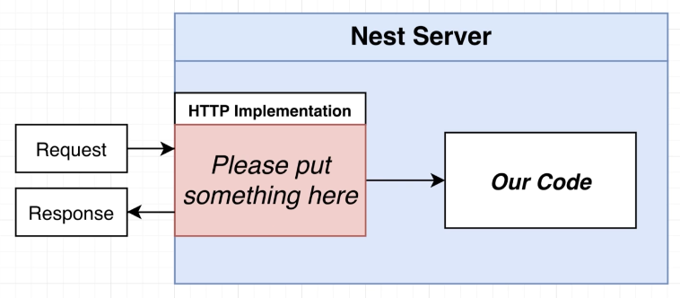
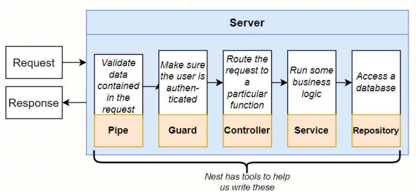
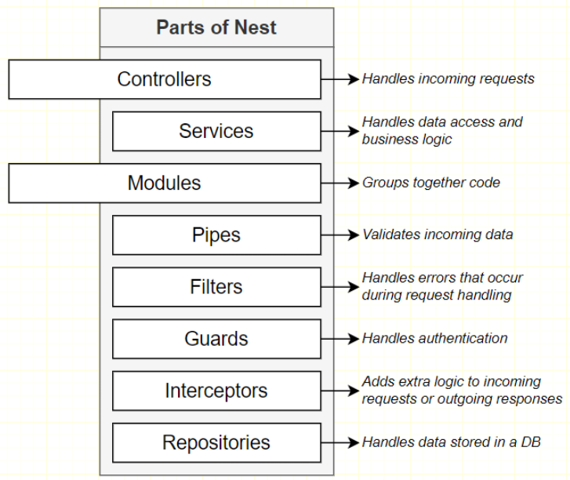

# 프로젝트 셋업

```bash
npm init -y  //package.json 생성

npm install @nestjs/common@7.6.17 @nestjs/core@7.6.17 @nestjs/platform-express@7.6.17 reflect-metadata@0.1.13 typescript@4.3.2
```

## NestJs의 패키지 구조

1. @nestjs/common : Nest 애플리케이션을 만들기 위해 사용할 대부분의 함수, 클래스가 구성되있음.

> Nest는 외부의 어떤 구현물에 의존해서, HTTP요청을 대신 처리함.
> Nest 서버 안에 HTTP 구현물을 삽입할 서버를 제공해야 함.
> 이를 통해 외부로 나가는 응답을 제공함.
> 대표적으로 Express.js,  Fastify가 있음.



2. @nestjs/platform-express : Express와 Nest간의 어댑터 / Nest로 유입되는 모든 HTTP 요청을 처리하기 위함.

3. reflect-metadata : 데코레이터

4. typescript

---

```json
// tsconfig.json

{
  "compilerOptions" : {
    "module" : "commonjs",
    "target" : "es2017",
    "experimentalDecorators" : true,
    "emitDecoratorMetadata" : true
  }
}
```
> `experimentalDecorators` 와 `emitDecoratorMetadata`가 Nest가 실제로 동작하게 만들어주는 핵심중의 핵심

---

## 모듈 & 컨트롤러

> 요청-응답 사이클은 내부에 거의 항상 같은 단계를 가지고 있음.</br>
> 데이터 확인 > 권한 확인 > 요청 처리 > 로직수행 > DB 저장




간단한 Nest 애플리케이션을 만들기 위해서는 최소한 `모듈`과 `컨트롤러`가 필요함.

> 일반적으로는 모듈과 컨트롤러를 별도의 파일에서 만듬.

### 컨트롤러

```typescript
import { Controller, Module, Get } from "@nestjs/common";

@Controller() // 데코레이터 : Nest에게 컨트롤러 역할을 할 클래스를 생성하려 한다고 알림
class AppController {
  @Get() // Get 데코레이터
  getRootRoute() {
    return 'hi there!'
  }
}
```

### 모듈

모듈은 컨트롤러를 감싸게 됨.

모든 애플리케이션에는 반드시 모듈이 하나 있어야 함.

```typescript
@Module({
  controllers : [AppController]
})
class AppModule {

}
```

Nest는 실행될 때마다, AppModule을 확인하고 나열된 모든 컨트롤러를 검색후 인스턴스를 자동으로 생성하고, 데코레이터를 확인하며 라우트 핸들러를 설정한다.

---

```typescript
// 대부분 @nestjs/common에서 import함
import { Controller, Module, Get } from "@nestjs/common";
import {NestFactory} from "@nestjs/core";

@Controller()
class AppController {
  @Get()
  getRootRoute() {
    return 'hi there!'
  }
}

@Module({
  controllers : [AppController]
})
class AppModule {

}

async function bootstrap() {
  const app = await  NestFactory.create(AppModule)

  await app.listen(3000); // Port : 3000
}

bootstrap()
```

> `bootstarp 함수`는 애플리케이션의 인스턴스를 생성함.

---

```bash
npx ts-node-dev src/main.ts

// Nest 실행

```

## 파일 명명 규칙

컨트롤러 : `app.controller.ts`

모듈 : `app.module.ts`

> Filename template : `name.type_of_thing.ts`

---

## 라우팅 데코레이터

```typescript
@Controller('/app')
export class AppController {
  @Get('/asdf') // path : /app/asdf
  getRootRoute() {
    return 'hi there!'
  }

  @Get('/bye') // path : /app/bye
  getByThere() {
    return 'bye there!'
  }
}
```

데코레이터의 함수의 첫번째 매개변수에 문자열을 통해 라우팅 규칙을 적용할 수 있다.