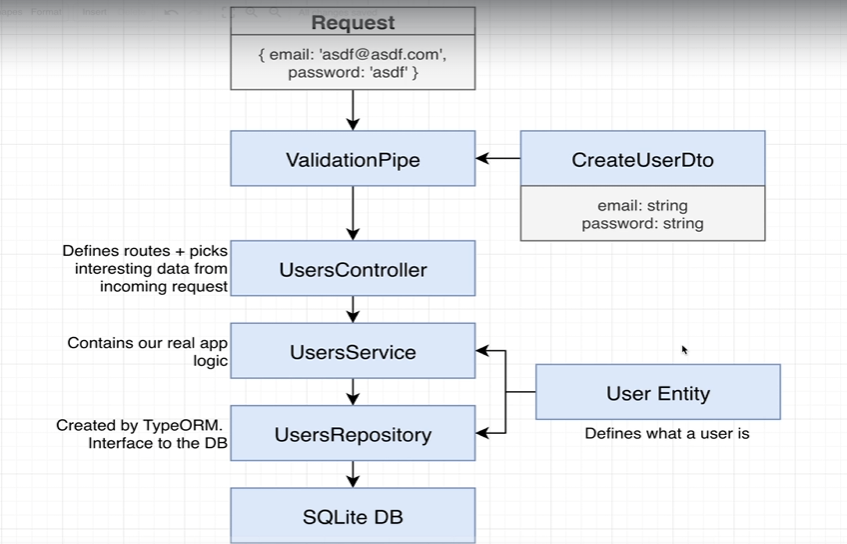

# 데이터의 생성 및 저장

```typescript
// users.service.ts

import { Injectable } from '@nestjs/common';
import { Repository } from 'typeorm'
import { InjectRepository, TypeOrmModule } from '@nestjs/typeorm';
import { User } from './user.entity';


@Injectable()
export class UsersService {
  constructor(@InjectRepository(User) private repo : Repository<User>) {

  }

  create (email : string, password: string) {
    const user  = this.repo.create({ email, password});
    // create를 이용하여 user 인스턴스를 생성하고, save를 통해 DB에 반영
    // 이부분에서 validation로직을 넣을 수 있음. 
    return this.repo.save(user);
  }
}

```

```typescript
// users.controller.ts
import { Body, Controller, Post } from '@nestjs/common';
import { CreateUserDto } from './dtos/create-user.dto';
import { UsersService } from './users.service';


@Controller('auth')
export class UsersController {
  constructor(private userService : UsersService) {} 
  // 인스턴스가 생성될 때, userService를 생성

  @Post('/signup')
  createUser(@Body() body : CreateUserDto) {
    this.userService.create(body.email, body.password)
  }
}

```



---

## 후크 데코레이터

```typescript
import { Entity, Column, PrimaryGeneratedColumn, AfterInsert, AfterUpdate, AfterRemove } from 'typeorm'

@Entity()
export class User {
  @PrimaryGeneratedColumn()
  id : number;

  @Column()
  email : string;

  @Column()
  password : string;

  @AfterInsert()
  logInsert() {
    console.log('Inserted User with id', this.id)
  }

  @AfterUpdate()
  logUpdate(){
    console.log('Updated User with id', this.id)
  }

  @AfterRemove()
  logRemove(){
    console.log('Removed User with id', this.id)
  }
}

```

> 바로 객체를 사용해 버리면 Hook가 실행되지 않음에 따라, 로그 추적이 어렵다.

```typescript
// 추적이 안됨.
 create (email : string, password: string) {
    const user  = this.repo.create({ email, password});

    return this.repo.save({ email, password});
  }
```

```typescript
// 추적이 됨.
 create (email : string, password: string) {
    const user  = this.repo.create({ email, password});

    return this.repo.save(user);
  }
```

`insert`, `update`, `delete`를 사용해서 레코드를 직접 입력하면 바로 업데이트, 삭제를 실행하고 후크가 실행되지 않음.

그러므로 `save`, `remove`를 사용
