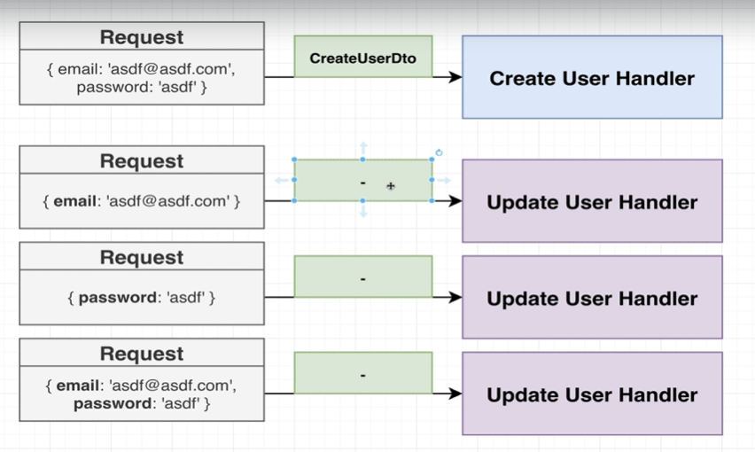

# 데이터 쿼리(데이터 조회, 수정, 삭제 등)

```typescript
// users.service.ts
  ...
  findOne(id : number) {
    return this.repo.findOne({
      where : {
        id
      }
    })
  }

 async update(id : number, attrs : Partial<User>) {
    // 1. 사용자를 가져오기
    const user = await this.findOne(id)
    if(!user) {
      throw new Error('user not found')
    }
    // 2. Object를 덮어씌우기
    Object.assign(user, attrs);
    // 3. 저장
    return this.repo.save(user)
  }

  async remove(id : number) {
    const user = await this.findOne(id)
    if(!user) {
      throw new Error('user not found')
    }
    return this.repo.remove(user)
  }


```

> `Partial`은 타입스크립트 자체에 정의된 타입헬퍼이다.

> 특정 타입의 부분 집합을 만족하는 타입을 정의

log에 기록을 남기기 위해,  findOne을 통해 `엔티티 인스턴스`를 가져와 `save`를 한다.


```typescript
// user.controller.ts

  @Get('/:id')
  findUser(@Param('id') id : string) {
    return this.userService.findOne(parseInt(id))
  }

  @Get('/:email')
  find(@Query('email') email : string) {
    return this.userService.find(email)
  }

   @Delete('/:id')
  remove(@Param('id') id : string) {
    return this.userService.remove(parseInt(id))
  }
  ...
```

## Patch



생성과 마찬가지로 데이터 검증을 위해 DTO(Data Transfer Object)가 필요함.

> UpdateUserDto

1. email만 바꾸고 싶은 경우
2. password만 바꾸고 싶은 경우
3. email, password 모두 바꾸고 싶으 경우

```typescript
// users/dtos/update-user.dto.ts
import {IsEmail, IsString, IsOptional} from 'class-validator'
export class UpdateUserDto {
  @IsEmail()
  @IsOptional()
  email : string

  @IsString()
  @IsOptional()
  password : string
}
```

```typescript
// users.controller.ts
  ...
  @Patch('/:id')
  updateUser(@Param('id') id:string, @Body() body : UpdateUserDto) {
    return this.userService.update(parseInt(id), body)
  }
  ...
```