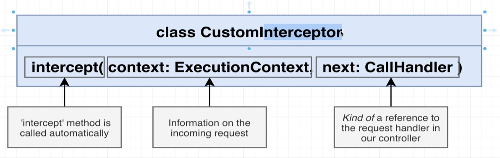

# 인터셉터


[Nest Interceptor](https://docs.nestjs.com/interceptors)

> 인터셉터란 ? 응답이나 요청을 가로챔.(미들웨어 개념과 유사함)




```typescript
// interceptors/serialize.interceptor.ts

import { UseInterceptors, NestInterceptor, ExecutionContext, CallHandler } from "@nestjs/common";
import { Observable } from "rxjs";
import { map } from 'rxjs/operators';
import { plainToClass } from "class-transformer";

export class SerializeInterceptor implements NestInterceptor {
  intercept(context : ExecutionContext, handler : CallHandler) : Observable<any> {
    console.log('running before the handler', context)
    return handler.handle().pipe(
      map((data : any) => {
        console.log('running before response send out', data)
      })
    )
  }
}

```


## implements

class의 interface에 만족하는지 여부를 체크할 때 사용됨.

implements한 interface의 타입이 없다면 에러를 반환


```typescript
// user.controller.ts
...

import { SerializeInterceptor } from 'src/interceptors/serialize.interceptor';


...
  @UseInterceptors(SerializeInterceptor)
  @Get('/:id')
  async findUser(@Param('id') id : string) {
    const user = await this.userService.findOne(parseInt(id))
    if(!user) {
      throw new NotFoundException('user not found')
    }
    return user
  }
...

```

Controller에 Interceptor를 추가한다.

---

## 인터셉터 엔티티 DTO 인스턴스로 변환

인터셉터에서 반환할 DTO를 선언해준다.

```typescript
// user.dto.ts

import { Expose } from 'class-transformer'

export class UserDto {
  @Expose()
  id : number;

  @Expose()
  email : string;
}

```

`Expose`는 속성을 공유하겠다는 데코레이터이다.

```typescript
// serialize.interceptor.ts

import { UseInterceptors, NestInterceptor, ExecutionContext, CallHandler } from "@nestjs/common";
import { Observable } from "rxjs";
import { map } from 'rxjs/operators';
import { plainToClass } from "class-transformer";
import { UserDto } from "src/users/dtos/user.dto";

export class SerializeInterceptor implements NestInterceptor {
  intercept(context : ExecutionContext, handler : CallHandler) : Observable<any> {

    return handler.handle().pipe(
      map((data : any) => {
        return plainToClass(UserDto, data, {
          excludeExtraneousValues : true
        })
      })
    )
  }
}
```

> 위 방법은 DTO를 하드코딩하였기 때문에, 인자를 받을 수 있도록 해야 한다.

## 인터셉터에 DTO를 인자로 받기

```typescript
// users.controller.ts

import {UserDto} from './dtos/user.dto'
...

  @UseInterceptors(new SerializeInterceptor(UserDto))
  @Get('/:id')
  async findUser(@Param('id') id : string) {
    const user = await this.userService.findOne(parseInt(id))
    if(!user) {
      throw new NotFoundException('user not found')
    }
    return user
  }

...

```

```typescript
// serialize.interceptor.ts

export class SerializeInterceptor implements NestInterceptor {
  constructor (private dto : any) {}

  intercept(context : ExecutionContext, handler : CallHandler) : Observable<any> {

    return handler.handle().pipe(
      map((data : any) => {
        return plainToClass(this.dto, data, {
          excludeExtraneousValues : true
        })
      })
    )
  }
}
```

--- 