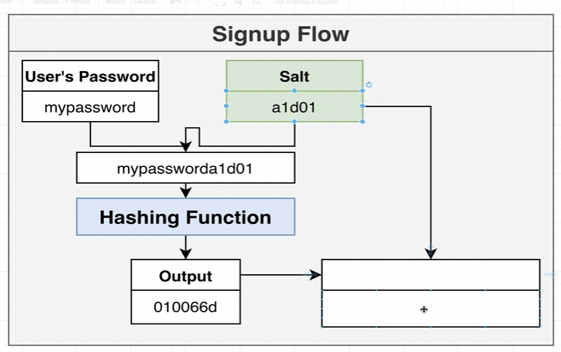

# 인증

`User Module`에 대한 구조는 다음과 같다.


---

## 비밀번호 해쉬 만들기


비밀번호를 일반 텍스트로 저장해서는 안된다.
이 암호화를 위하여 , 해쉬(Hash) 처리를 한다.

해쉬는 입력값이 해쉬 암호화 되면, 원본의 입력값이 뭔지 알 수 없다.

---

암호의 경우, 테이블에 해쉬처리한 값을 저장한다.


---

## 레인보우 테이블 공격(Rainbow Table Attack)

해커가 목록을 가지고  전 세계적으로 잘 사용하는 목록으로 미리 해시값으로 만들어 둔 후, DB에 접근하여 탈취 하는 공격

> 방어 방법으로 솔트(Salt) 가 있다.

`사용자가 입력한 암호와 솔트를 함쳐 문자열을 해쉬처리한다.`



이후, 저장된 해쉬값을 찾을때에는 테이블에 저장된 솔트와 사용자가 입력한 암호를 조합하여 다시 해쉬처리를 하여 매칭한다.

```typescript
import { BadRequestException, Injectable } from "@nestjs/common";
import { UsersService } from "./users.service";
import { randomBytes, scrypt as _scrypt } from "crypto";
import { promisify } from "util"; 
// promisify를 통해 비동기로 돌리려는 함수를 promise로 감싸주지 않고 사용할 수 있다.
// scrypt를 이용하여 해쉬 처리를 한다.


const scrypt = promisify(_scrypt)

@Injectable()
export class AuthService {
  constructor(private usersService : UsersService){}

  async signup (email : string, password : string) {
    /*
      1. 이메일이 사용중인지 확인
      2. 비밀번호를 해쉬로 변환
      3. 유저 생성
      4. 유저를 리턴
    */

    const users = await this.usersService.find(email)
    if(users) {
      throw new BadRequestException('이메일이 이미 존재합니다.')
    }

    // 암호를 해쉬화, Salt 생성
    const salt = randomBytes(8).toString('hex')
    // Salt와 암호를 혼합하여 해쉬 처리
    const hash = (await scrypt(password, salt, 32)) as Buffer

    // 해쉬처리된 값들을 혼합하여, DB에 저장
    const result = salt + '.' + hash.toString('hex')
  }

  signin() {

  }
}
```

