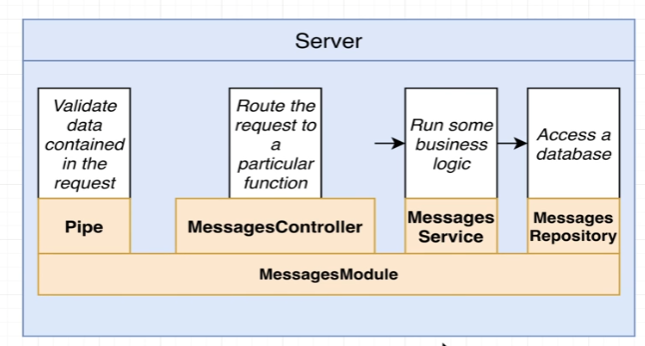

# Nest CLI 프로젝트 생성하기

```bash
// nestjs 설치
npm install -g @nestjs/cli 

// nestjs 프로젝트 생성
nest new project-name
```

```json
"start:dev" : "nest start --watch" 
```
> 개발모드에서 프로젝트를 시작하게 됨

---

## eslintrc.js

Nest는 기본적으로 eslint를 사용함.

자동으로 코드를 확인하고, 발생 가능한 오류나 이슈를 하이라이트 해줌.


## 프로젝트 구조 


--

##  Nest CLI

```bash
nest generate module messages
// CREATE src/messages/messages.module.ts 모듈이 생성됨.
```

모듈을 생성하는 NestCLI : `nest generate module module_name`

```bash
nest generate controller messages/messages --flat
```

생성된 모듈에 컨트롤러가 연결됨

```typescript
import { Module } from '@nestjs/common';
import { MessagesController } from './messages.controller';

@Module({
  controllers: [MessagesController]
})
export class MessagesModule {

}

```