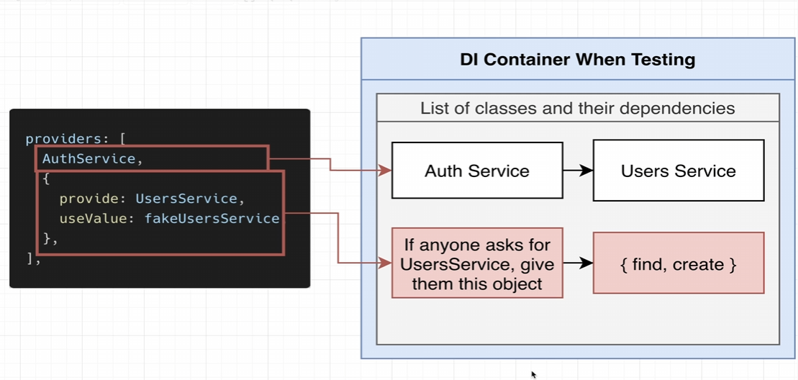

# 테스트

## 단위 테스트

한 번에 클래스 하나만 살펴보고 해당 클래스의 모든 메서드가 예상대로 동작하는지 테스트


## 통합 테스트, E2E (엔드 투 엔드)테스트

애플리케이션 전체 테스트를 실행

### 단위 테스트 실습

테스트시 DB에 접근하거나 서비스에 의존적이지 않도록 트릭을 사용.

```typescript
// auth.service.spec.ts

import {Test} from '@nestjs/testing'
import { AuthService } from './auth.service'
import { UsersService } from './users.service'

it('AuthService를 만들 수 있습니다.', async () => {
  // Fake 서비스 생성

  const fakeUsersService = {
    find : () => Promise.resolve([]),
    create: (email : string, password : string) => Promise.resolve({id : 1,  email, password})
  }
  // Test DI Container 생성
  const module = await Test.createTestingModule({
    providers : [
      AuthService,
      {
        provide : UsersService,
        useValue : fakeUsersService
      }
    ]
  }).compile()

  // 모듈에서 AuthService 인스턴스 생성
  const service = module.get(AuthService)

  expect(service).toBeDefined()
})
```

```bash
npm run test:watch
```



---

### 타입 스크립트 사용하기

```typescript
import {Test} from '@nestjs/testing'
import { AuthService } from './auth.service'
import { UsersService } from './users.service'
import { User } from './user.entity'

it('AuthService를 만들 수 있습니다.', async () => {
 

  expect(service).toBeDefined()
})

```

TypeScript를 사용하여, 테스트의 매개변수와 반환값이 올바르게 나올 수 있도록 타입 시그니처를 갖추도록 할 수 있다.

---

### Typescript - Partial

특정 타입의 부분 집합을 만족하는 타입을 정의

---

### 테스트 속도 향상 참고사항

```json
// package.json

"test:watch": "jest --watch --maxWorkers=1",
```