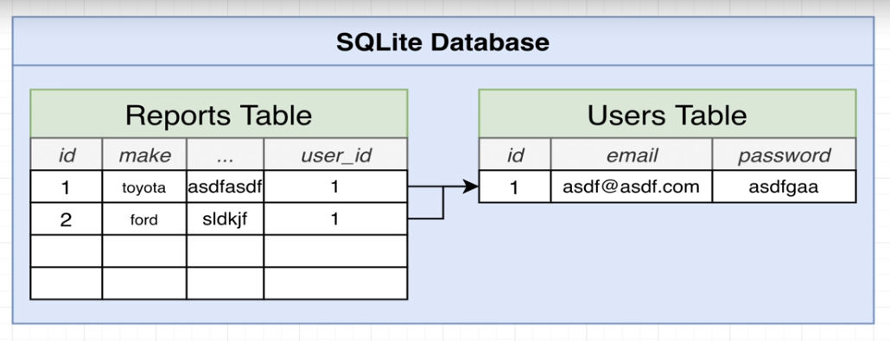
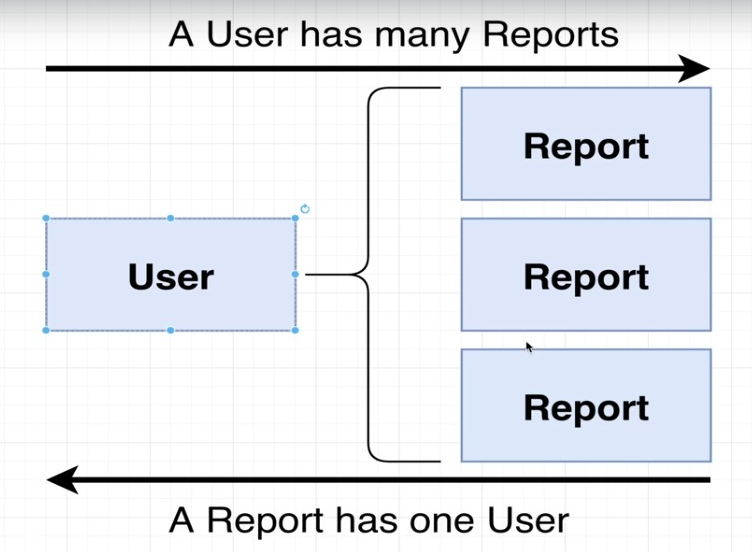

# TypeORM

> TypeORM을 하기 전에, Report의 Controller > DTO > Service 프로세스를 한번 더 정리한다.


## Report Module

```typescript
import { Module } from '@nestjs/common';
import { ReportsController } from './reports.controller';
import { ReportsService } from './reports.service';
import { TypeOrmModule } from '@nestjs/typeorm';
import { Report } from './report.entirty'

@Module({
  imports : [TypeOrmModule.forFeature([Report])],
  controllers: [ReportsController],
  providers: [ReportsService]
})
export class ReportsModule {}

```

## Report Controller

```typescript
import { Controller, Post, Body, UseGuards } from '@nestjs/common';
import { CreateReportDto } from './dtos/create-report.dto';
import { ReportsService } from './reports.service';
import { AuthGuard } from 'src/guards/auth.guard';


@Controller('reports')
export class ReportsController {
  constructor (private reposrtService : ReportsService) {}

  @Post()
  @UseGuards(AuthGuard)
  createReport(@Body() body : CreateReportDto) {
    return this.reposrtService.create(body)
  }
}
```

`AuthGuard`에 의해, 로그인 정보 없이 POST를 보낼경우 아래와 같은 오류가 반환된다.

```
{
    "message": "Forbidden resource",
    "error": "Forbidden",
    "statusCode": 403
}
```

## DTO(Create Dto)

```typescript
import {IsNumber, IsString, Min, Max, IsLongitude, IsLatitude} from 'class-validator'
export class CreateReportDto {
  @IsString()
  make : string;

  @IsNumber()
  @Min(0)
  @Max(1000000)
  price : number


  @IsString()
  model : string

  @IsNumber()
  @Min(1930)
  @Max(2050)
  year : number

  @IsLongitude()
  lng :number

  @IsLatitude()
  lat : number

  @IsNumber()
  @Min(0)
  @Max(1000000)
  mileage : number
}
```

## ReportService

```typescript
import { Injectable } from '@nestjs/common';
import { InjectRepository } from '@nestjs/typeorm/dist/common';
import { Repository } from 'typeorm'
import { Report } from './report.entirty';
import { CreateReportDto } from './dtos/create-report.dto';


@Injectable()
export class ReportsService {
  constructor(@InjectRepository(Report) private repo : Repository<Report>) {}

  create (reportDto : CreateReportDto) {
    const report  = this.repo.create(reportDto);
    return this.repo.save(report);
  }
}
```

## 관계 만들기

보고서를 만든 사용자와 보고서를 연결을 해야 함.



## 관계 유형

> Nest와 TypeORM에서 관계를 만들떄에는 항상 다음과 같은 단계를 거친다.

1. 모델링하려는 연관의 종류를 파악
2. 관련 엔티티에 적절한 데코레이터를 추가
3. 하나의 레코드가 생성될 때 연관을 설정
3. 공유되는 정보를 제한하기 위해 직렬화를 적용

```
관계 유형

1:1 관계
1:N 관계, N:1관계
N:N 관계

```




## TypeORM 데코레이터 적용

유저와 리포트의 관계는 1:N이므로 유저에는 `OneToMany` 데토레이터를 엔티티에 적용해야 한다.<br/>
리포트와 유저의 관계는 N:1이므로 리포트에는 `ManyToOne` 데코레이터를 엔티티에 적용해야 한다.

```typescript
//user.entity.ts

import { Entity, Column, PrimaryGeneratedColumn, AfterInsert, AfterUpdate, AfterRemove, OneToMany } from 'typeorm'
import { Report } from 'src/reports/report.entirty';

@Entity()
export class User {
  @PrimaryGeneratedColumn()
  id : number;

  @Column()
  email : string;

  @Column()
  password : string;

  @OneToMany(() => Report, (report) => report.user)
  reporst : Report[]

  @AfterInsert()
  logInsert() {
    console.log('Inserted User with id', this.id)
  }

  @AfterUpdate()
  logUpdate(){
    console.log('Updated User with id', this.id)
  }

  @AfterRemove()
  logRemove(){
    console.log('Removed User with id', this.id)
  }
}
```

```typescript
//report.entity.ts

import { Entity, Column, PrimaryGeneratedColumn, ManyToOne } from 'typeorm'
import { User } from 'src/users/user.entity';

@Entity()
export class Report {
  @PrimaryGeneratedColumn()
  id : number

  @Column()
  price : number;

  @Column()
  make : string;

  @Column()
  model : string

  @Column()
  year : number

  @Column()
  lng :number

  @Column()
  lat : number

  @Column()
  mileage : number

  @ManyToOne(() => User, (user) => user.reports)
  user : User
}
```