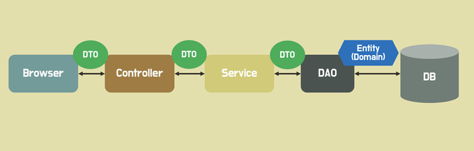

# 파이프로 요청 데이터 검증하기

## 요청과 관련된 데코레이터


`@Body`와 `@Param()`은 인수 데코레이터라고 부름.

```typescript
import { Controller, Get, Post, Body, Param } from "@nestjs/common";

@Controller('messages')
export class MessagesController {
  @Get('/')
  listMessages () {
    return 'hi'
  }

  @Post()
  createMessages(@Body() body : any) {
    console.log(body)
  }

  @Get('/:id')
  getMessages(@Param('id') id : string) {
    console.log(id)
  }

}
```

> POSTMAN을 이용하여, `localhost:3000/messages`를 해보면 값이 찍히는 것을 볼 수 있다.


`Pipe`를 이용하여, 데이터를 검증한다.

> Pipe를 직접 구현할수도 있지만, NestJs에서 제공하는 `ValidationPipe`를 사용

```typescript
// main.ts
import { NestFactory } from '@nestjs/core';
import { ValidationPipe } from "@nestjs/common";
import { MessagesModule } from "./messages/messages.module";

async function bootstrap() {
  const app = await NestFactory.create(MessagesModule);
  app.useGlobalPipes(
    new ValidationPipe()
  )
  await app.listen(3000);
}
bootstrap();
```


`ValidationPipe`를 import하고 인스턴스를 생성

```bash
npm install class-validator
```

```typescript
// create-message.dto.ts
import { IsString } from 'class-validator'

export class CreateMessageDto {
  @IsString()
  content : string
}
```

`class-validator`로부터 받은 `@IsString` 데코레이터를 실행해준다.

`@IsString 데코레이터`가 인스턴스가 생성될때마다 클래스의 값을 검증한다.

```typescript
...
import { CreateMessageDto } from './dtos/create-message.dto';

...

  @Post()
  createMessage(@Body() body : CreateMessageDto) {
    ...
  }

...

```

API요청을 할때 

```json

// Request
{
  "content" : 123
}


// Response
{
    "message": [
        "content must be a string"
    ],
    "error": "Bad Request",
    "statusCode": 400
}

```

Body에 들어온 data를 검증하여, 에러를 반환한다.


---

### DTO(Data Trasfer Object)



DTO는 `Data Transfer Object`의 약자로, `계층 간 데이터 전송을 위해 도메인 모델 대신 사용되는 객체`이다.

이때의 객체란 `Presentation(View, Controller), Business(Service), Persistence(DAO, Repository) 등을 의미`

DTO는 순수하게 데이터를 저장하고, 데이터에 대한 getter, setter 만을 가져야한다고 한다. 위키피디아에 따르면 DTO는 어떠한 비즈니스 로직을 가져서는 안되며, 저장, 검색, 직렬화, 역직렬화 로직만을 가져야 한다고 한다.

> 직렬화는 DTO를 Byte, Json, Xml 등의 형태로 변환하는 것을 의미한다. 역직렬화는 그 반대를 의미한다.

#### 도메인 대신 DTO를 사용하면 좋은 이유

DTO 대신 도메인 모델을 계층간 전달에 사용하면, UI 계층에서 도메인 모델의 메소드를 호출하거나 상태를 변경시킬 수 있다. 또한 UI화면마다 사용하는 도메인 모델의 정보는 상이하다. 하지만 도메인 모델은 UI에 필요하지 않은 정보까지 가지고 있다.

모든 도메인 모델 속성이 외부에 노출되면 보안 문제가 발생할 수 있다. 즉, 도메인 모델을 캡슐화 하여 보호할 수 있다.

도메인 모델을 계층간 전송에 사용하면, 모델과 뷰가 강하게 결합될 수 있다. 뷰의 요구사항 변화로 도메인의 코드를 변경해야할 일이 생기는 것은 좋지 않다. DTO를 사용하면 이 결합을 느슨하게 만들 수 있다.

---

### class-validator & class-transformer

[class-validator](https://github.com/typestack/class-validator)
[class-transformer](https://github.com/typestack/class-transformer)

