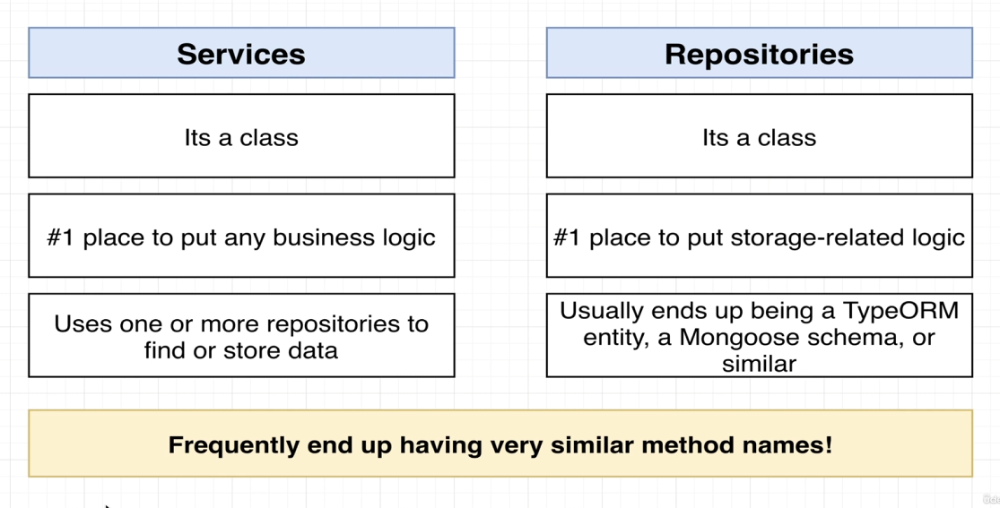

# 서비스와 레파지토리



## 서비스

비즈니스 로직을 작성할 때 항상 서비스를 만듬

계산을 실행하거나 레파지토리로부터 데이터를 가져올 때에도 언제나 서비스를 사용

데이터를 찾고 저장하기 위해 하나 또는 다수의 레파지토리를 사용


---

## 레파지토리 

스토리지 관련 로직을 작성할 때 사용

데이터베이스와 상호작용을 하거나 정보를 파일에 작성을 할때의 작업을 할때 사용

---

> 서비스 파일에 있는 모든 것들은 결국 레파지토리에 의존하게 된다.

```typescript
// message.repository.ts

import {readFile, writeFile} from 'fs/promises'
// readFile, writeFile은 파일시스템에 접근하기 위해 import 한다.

export class MessagesRepository {
  async findOne(id : string) {
    const contents = await readFile("messages.json", 'utf-8')
    const messages = JSON.parse(contents)
    return messages[id]
  }

  async findAll() {
    const contents = await readFile("messages.json", 'utf-8')
    const messages = JSON.parse(contents)

    return messages
  }

  async create(content : string) {
    const contents = await readFile("messages.json", 'utf-8')
    const messages = JSON.parse(contents)

    const id = Math.floor(Math.random() * 999)

    messages[id] = {id, content}

    await writeFile('messages.json', JSON.stringify(messages))
  }
}
```

```typescript
// message.service.ts

import { MessagesRepository } from "./messages.repository";

export class MessagesService {
  messagesRepo : MessagesRepository

  constructor() {
    // 서비스가 자체적인 의존성을 생성
    // 리포지토리가 없으면 서비스는 정상 작동하지 않음.
    this.messagesRepo = new MessagesRepository()
  }

  findOne(id : string){
    return this.messagesRepo.findOne(id)
  }

  findAll() {
    return this.messagesRepo.findAll()
  }

  create(content : string) {
      return this.messagesRepo.create(content)
  }
}

```

```typescript
// messages.controller.ts
import { Controller, Get, Post, Body, Param } from "@nestjs/common";
import { CreateMessageDto } from "./dtos/create-message.dto";
import { MessagesService } from "./messages.service";


@Controller('messages')
export class MessagesController {
  messagesService : MessagesService;

  constructor() {
    // 이렇게 의존성을 넣는것은 좋은 방법이 아님
    this.messagesService = new MessagesService()
  }
  @Get('/')
  listMessages () {
    return this.messagesService.findAll()
  }

  @Post()
  createMessages(@Body() body : CreateMessageDto) {
    return this.messagesService.create(body.content)
  }

  @Get('/:id')
  getMessages(@Param('id') id : string) {
    return this.messagesService.findOne(id)
  }

}
```

---

## 에러 처리

```typescript
import { ... NotFoundException } from 'nestjs/common'

@Controller('messages')
export class MessagesController {
  messagesService : MessagesService;
  ...
  @Get('/:id')
  async getMessages(@Param('id') id : string) {
    const message = await this.messagesService.findOne(id)
    if(!message) {
      throw new NotFoundException('message not found')
    }

    
    return message
  }
}
```

### NotFoundException

> Nest 자체에서 정의된 일종의 요류

[Exception Filters](https://docs.nestjs.com/exception-filters)