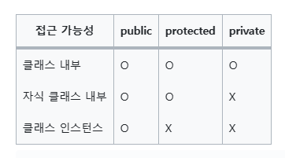

# 제어역전

`제어 역전의 원칙`은 더 쉽게 재사용 가능한 코드를 빌드하거나 작성할 수 있다는 엔지니어링 개념

> 클래스 안에서 클래스 자체의 의존성을 생성해서는 안된다.


```typescript
// Bad : MessageService가 내부에 MessagesRepository에 대한 의존성을 가짐.
export class MessagesService {
  messagesRepo : MessagesRepository;

  constructor () {
    this.messagesRepo = new MessageRepository 
  }
}
```

```typescript
// Better : MessageService가 의존성 받도록 함.
export class MessagesService {
  messagesRepo : MessagesRepository;

  constructor ( repo : MessagesRepository) {
    this.messagesRepo = repo
  }
}
```

```typescript
// Best : MessageRepository에 종속되어 있지 않고, Repository 인터페이스에 충족하는 객체를 제공하면 충족되도록 하였음.
interface Respository {
  findOne ( id : string );
  findAll();
  create(content : string);
}

export class MessagesService {
  messagesRepo : Repository;

  constructor ( repo : Repository) {
    this.messagesRepo = repo
  }
}
```

---

## 의존성 주입(Dependency Injection)

> 의존성 주입이 작동하는 데 있어 가장 핵심이 되는 것은 컨테이너이다.

다시한번 정리하면 다음과 같다.

제어의 역전 : 개발자가 제어할 영역을 프레임워크에 넘기는 것
의존성 주입 : 개발자가 필요한 외부 자원(클래스, 함수)을 제공받을 수 있도록 하는 것

---

## 리팩토링

 ```typescript
 // AS-IS
 export class MessagesController {
  messagesRepo : MessagesRepository

  constructor(){
    this.messagesRepo = new MessagesRepository()
  }

  ...

// TO-BE
 export class MessagesController {
  constructor(public messagesRepo : MessageRepository){}

 ```

 

 > public키워드를 이용하여 코드를 더 줄임

---

## Injectable 데코레이터

```typescript
import { Injectable } from 'next/common'

@Injectable()
export class MessageRepository {
  ...
}
```

의존성 주입의 대상임을 알려주는 데코레이터

주입할 Provider에 `@Injectable`을 붙이면 Nest IoC 컨테이너가 해당 프로바이더를 관리할 수 있다.

> 컨트롤러는 등록하지 않고, 일반적으로 우리가 만드는 서비스와 리포지토리를 등록한다.

---

## Provider vs Service

Service : 제품
Provider : 공급자
Controller : 소비자

> 공급자가 제품을 제공해야, 소비자가 사용할 수 있듯이<br/>
> Provicer가 Service를 등록해주어야 Controller에서 주입받아 사용이 가능하다.

모듈에 providers를 등록한다.

```typescript
import { Module } from '@nestjs/common';
import { MessagesController } from './messages.controller';
import { MessagesService } from "./messages.service";
import { MessagesRepository } from "./messages.repository";

@Module({
  controllers: [MessagesController]
  providers : [MessagesService, MessagesRepository]
})
export class MessagesModule {

}

```

---

### 의존성 주입이 필요한 이유

애플리케이션을 테스트할 때 의존성 주입과 제어 역전을 사용하면 테스트하기가 용이해짐.