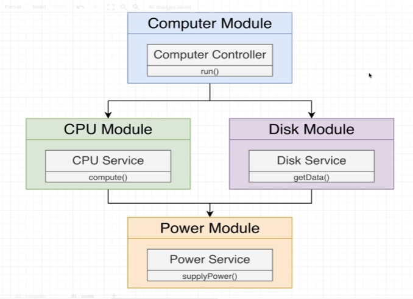
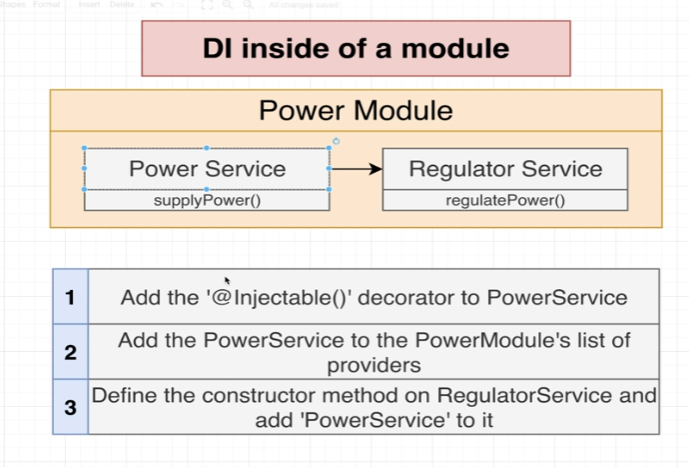

# 모듈로 코드 정리하기

> 모듈과 의존성 주입 간의 작용원리를 이해하기



컴퓨터, CPU, Disk, Power 모듈을 이용하여, DI에 대해서 이해하기



의존성 주입 시스템을 이용하여 Power Service를 Regular Service로 공유하기.

1. PowerService에 `@Injectable` 데코레이터를 추가
2. PowerSeirve를 `PowerModules`에 추가
3. RegularServce에 constructor메서드를 정의하고, PowerService를 인수 목로에 넣음.

---

```typescript
// power.module.ts
@Module({
  providers: [PowerService],
  exports: [PowerService],
})
export class PowerModule {}
```
모듈에 연결해서 프로바이더 배열안에 나열하는 서비스들은 `private`이 기본 값임.

export를 이용하여, 다른 서비스에서도 사용할 수 있게 함.

```typescript
// cpu.module.ts

@Module({
  imports: [PowerModule],
  providers: [CpuService],
})
export class CpuModule {}
```

export한 PowerService를 사용할 수 있도록, PowerModule을 import

```typescript
// cpu.service.ts
import { Injectable } from '@nestjs/common';
import { PowerService } from 'src/power/power.service';


@Injectable()
export class CpuService {
  constructor(private powerService : PowerService) {}
}
```
CpuService에 import한 PowerService를 추가

Nest가 CpuService 인스턴스를 생성할 때마다, PowerService를 생성한 후 CPU생성자에게 공급