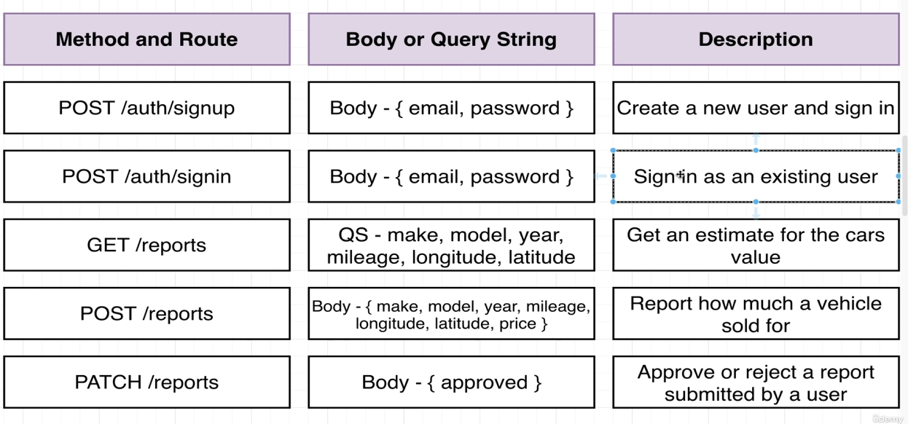
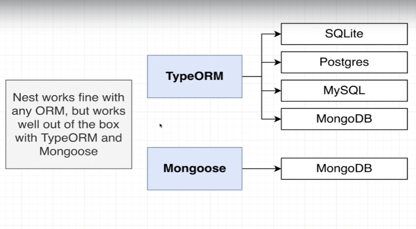
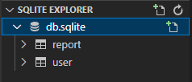

# API 설계, TypeORM, 데이터베이스

## API 설계


## TypeORM

Next와 잘 동작하면서 별도 설치가 필요없는 솔루션은 2가지가 있다.



- TypeORM은 여러 데이터베이스와의 연결이 원활함.
- Mongoose는 MongoDB와만 작동함.

---

### TypeORM 설치

```bash
yarn add nest/typeorm sqlite3
```

> 엔티티 파일 : 애플리케이션 내부에 저장하려는 리소스 중 하나의 종류만 정의

엔티티 파일을 생성하고 Nest에 집어넣으면 보이지 않는 곳에서 Nest와 TypeORM이 협동해서, 리포지토리를 생성함.

> TypeORM을 사용하면 리포지토리 파일을 수동으로 만들 필요가 없음.

```typescript
import { Module } from '@nestjs/common';
import { TypeOrmModule } from '@nestjs/typeorm'; // TypeOrm을 import
import { AppController } from './app.controller';
import { AppService } from './app.service';
import { UsersModule } from './users/users.module';
import { ReportsModule } from './reports/reports.module';

@Module({
  // TypeOrmModule 기본값 선언
  imports: [TypeOrmModule.forRoot({ 
    type : 'sqlite', // 데이터베이스 타입
    database : 'db.sqlite', // 데이터베이스명
    entities : [], // 엔티티
    synchronize : true // 동기여부

  }), UsersModule, ReportsModule],
  controllers: [AppController],
  providers: [AppService],
})
export class AppModule {}

```

```bash
npm run start:dev
```

> 실행시, db.sqlite가 생성됨

SQLite는 파일형 데이터베이스로서, 데이터베이스와 관련된 모든 정보를 파일 하나에 저장함.

---

### Entity 생성

```typescript
import { Entity, Column, PrimaryGeneratedColumn } from 'typeorm'

@Entity()
export class User {
  @PrimaryGeneratedColumn()
  id : number;

  @Column()
  email : string;

  @Column()
  password : string;
}
```

```typescript
//users.module.ts

import { Module } from '@nestjs/common';
import { TypeOrmModule } from '@nestjs/typeorm';
import { UsersController } from './users.controller';
import { UsersService } from './users.service';
import { User } from './user.entity';

@Module({
  imports : [TypeOrmModule.forFeature([User])],
  controllers: [UsersController],
  providers: [UsersService]
})
export class UsersModule {}

```

@Module에 TypeOrmModule을 import하므로 리포지토리를 생성한다.

이후 app.module.ts에도 Entity를 import한다.

```typescript
// app.module.ts

import { Module } from '@nestjs/common';
import { TypeOrmModule } from '@nestjs/typeorm';
import { AppController } from './app.controller';
import { AppService } from './app.service';
import { UsersModule } from './users/users.module';
import { ReportsModule } from './reports/reports.module';
import { User } from './users/user.entity';

@Module({
  imports: [TypeOrmModule.forRoot({
    type : 'sqlite',
    database : 'db.sqlite',
    entities : [User],
    synchronize : true

  }), UsersModule, ReportsModule],
  controllers: [AppController],
  providers: [AppService],
})
export class AppModule {}

```

---

## SQLite

vscode SQLite extension을 설치하고, SQLite의 Entity를 확인한다.

