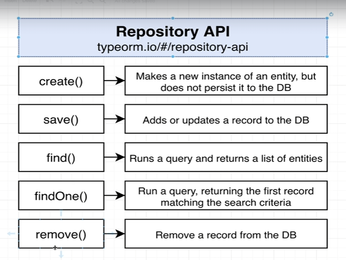

# 리포지토리



## Body 검증

```typescript
// main.ts
import { NestFactory } from '@nestjs/core';
import { ValidationPipe } from '@nestjs/common';
import { AppModule } from './app.module';

async function bootstrap() {
  const app = await NestFactory.create(AppModule);
  // 검증하기 위한 GlobalPipes를 설정
  app.useGlobalPipes(
    new ValidationPipe({
      whitelist : true
    })
  )
  await app.listen(3000);
}
bootstrap();

```

`whitelist`는 허가한 속성만 요청받을 수 있도록 설정한다. 즉, API에서 허용되지 않은 속성이 들어왔을 때 무시하는 것이다,

```typescript
// user.controller.ts
import { Body, Controller, Post } from '@nestjs/common';
import { CreateUserDto } from './dtos/create-user.dto';

@Controller('auth') // auth로 들어올 때, User Controller를 거치게 된다.
export class UsersController {
  @Post('/signup')
  createUser(@Body() body : CreateUserDto) {
    console.log(body)
  }
}

```

```typescript
// users/dtos/create-users.dto.ts
import {IsEmail, IsString} from 'class-validator'

// clss-validator를 이용하여, Dto의 값을 검증한다.
export class CreateUserDto {
  @IsEmail()
  email : string

  @IsString()
  password : string
}
```

