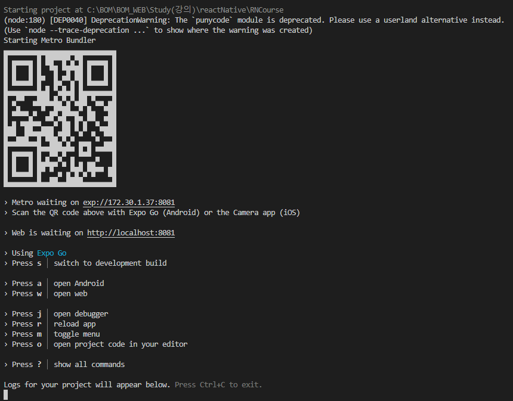

# React Native

iOS + Android 플랫폼을 위해 컴파일됨.

1. React : 웹 개발을 위함
2. React Native : 앱 개발을 위함.

## React Native 원리

1. View 요소
2. Text 요소

```tsx
  const App = props => {
    return (
      <View>
        <Text>Hello there!</Text>
      </View>
    )
  }
```

위 코드는 각 플랫폼의 네이티브 요소로 컴파일됨.

> JavaScript 로직들은 컴파일되지 않고, React Native가 호스트한대로 JavaScript 쓰레드에서 실행됨.

## React Native Setting

1. Expo CLI("Expo")

- 정리된 앱 개발이 가능
  - 기능활용이 용이함.
  - 훨씬 편리하고 과정이 수월함.
  - 언제든지 Expo방식에서 React Native CLI방식으로 전환이 가능

2. React Native CLI

- React Native팀과 관련 커뮤니티들이 개발 설정을 제공
  - Expo보다 작업이 번거로움
  - Java, Object-C, Swift, Kotlin 네이티브 소스 코드와 통합이 비교적 쉬움


```bash
npx create-expo-app
```

> 기본 설치 요구 파일
> - NPM(LTS)

---

## 네이티브 앱 미리보기

```bash
npm start
```
실행시 다음과 같이 `터미널`에 나타남



- 구글 플레이스토어에서 `Expo Go`를 검색하여 실행
- QR코드 스캔
