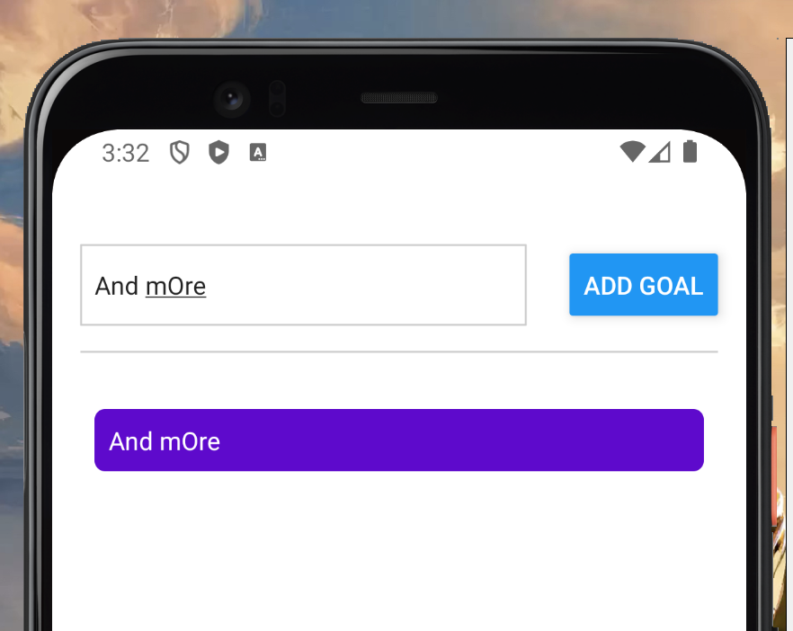
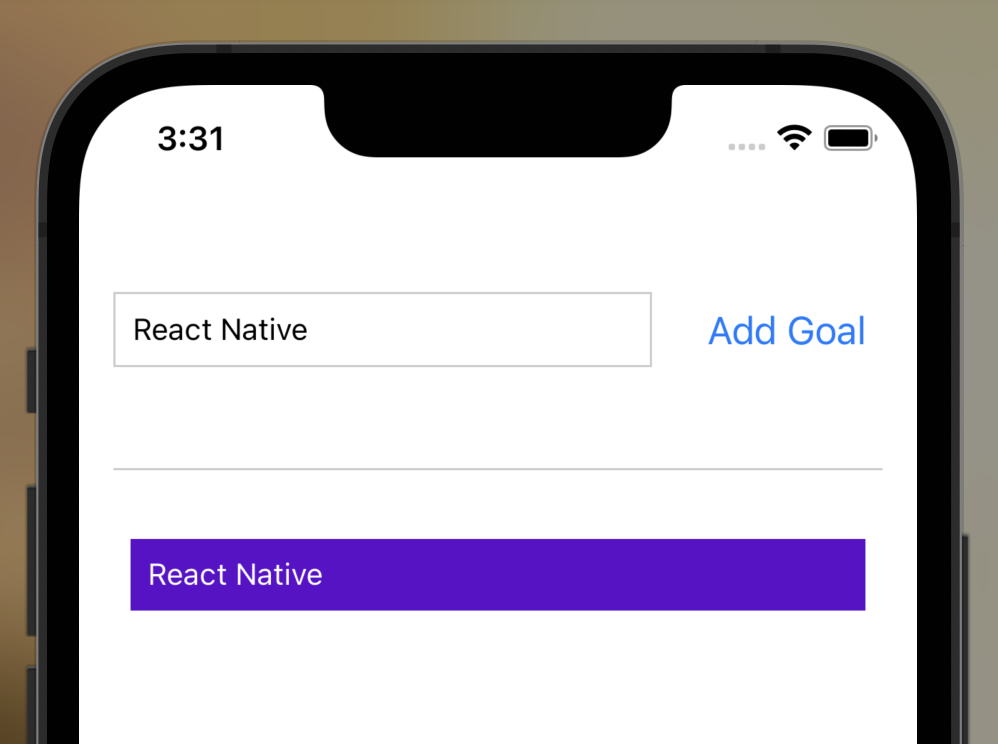

# iOS & 안드로이드 스타일링의 차이점

```tsx
const styles = StyleSheet.create({
  goalItem: {
    margin: 8,
    padding: 8,
    borderRadius: 6,
    backgroundColor : '#5e0acc',
    color: '#fff'
  }
})
```




안드로이드와 아이폰은 스타일이 차이가 난다.
이에 대한 해결책으로는 다음과 같다.

```tsx
 {courseGoals.map((goal : string, goalIndex : number) =>
  <View style={styles.goalItem} key={`goal_${goalIndex}`} >
    <Text style={styles.goalText}>{goal}</Text>
  </View>
)}

```

`<Text>`에 스타일을 주지 않고 `<View>`에 스타일을 적용한다.

그리고 스타일은 `CSS와 달리 연속적으로 적용되지 않는다.`

그러므로, `<Text>`에도 스타일을 별도로 적용해주어야 한다.

```tsx
{courseGoals.map((goal : string, goalIndex : number) =>
  <View style={styles.goalItem} key={`goal_${goalIndex}`} >
    <Text style={styles.goalText}>{goal}</Text>
  </View>
)}

const styles = StyleSheet.create({
  ...
  goalItem: {
    margin: 8,
    padding: 8,
    borderRadius: 6,
    backgroundColor : '#5e0acc',
  },
  goalText : {
    color: '#fff'
  }
})
```