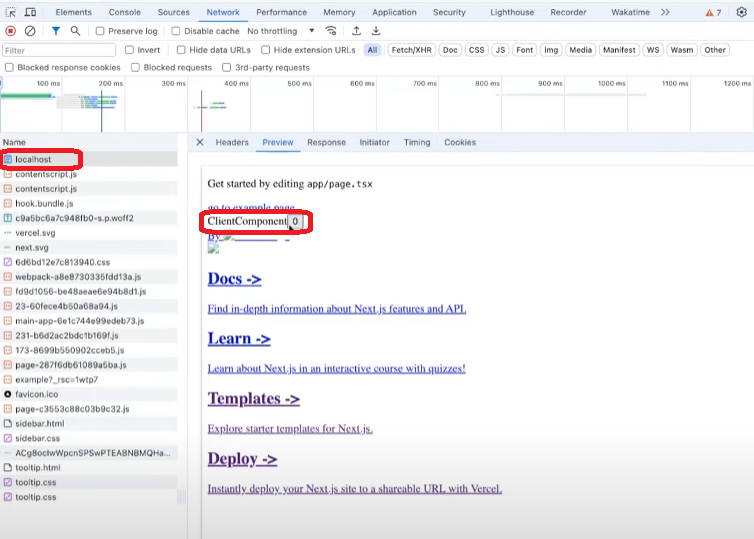

# React Server Component

서버에서 실행되는 컴포넌트

## Rendering Work

React Server Components는 다음과 같은 기준에 따라 chunk로 분할됨.

1. Route Segment
2. Suspense

---

### 서버에서 벌어지는 일

1. 리액트가 RSC(React Server Component)로 렌더링.

> RSC Payload란? 
> - 특별한 데이터 포맷으로, 서버 컴포넌트의 렌더링 결과물입니다. 
> - 클라이언트 컴포넌트가 렌더링될 위치와 해당 클라이언트 컴포넌트의 JavaScript 파일 위치를 빈자리로 표시합니다. 
> - 서버 컴포넌트가 클라이언트 컴포넌트에게 전달할 props를 포함합니다.

2. RSC Payload가 클라이언트로 전송됩니다. 이 때, 클라이언트는 HTML과 함께 Client Component를 위한 JavaScript Instructions를 사용하여 렌더링을 준비

### 클라이언트에서 벌어지는 일

1. HTML을 가져와서 HTML을 즉시 보여줌. : Preview (Preivew of the routes)

- localhost의 preview를 보면 `Component 0`이라고 되어있다.

- localhost의 preview에서 Component 0이라고 되어 있는 부분은 RSC가 서버에서 제공한 초기 HTML이고, 이는 `useState(0)`으로 표시된 Client Component의 자리

2. RSC Payload가 사용됨(reconcile `재조정`)

- 클라이언트가 RSC Payload를 사용하여 서버와 클라이언트 컴포넌트를 재조정합니다(Reconcile).  이 과정에서 Virtual DOM을 이용해 변경 사항을 반영합니다.

3. Hydrate(수화) 과정

- 빈자리로 표시된 컴포넌트가 인터랙션이 가능하도록 JavaScript Instructions를 사용해 Hydrate됩니다.

- static/chunks/*.js 형태로 이루어진 파일에 이벤트 핸들러와 상태 업데이트 로직이 포함되어 있습니다.