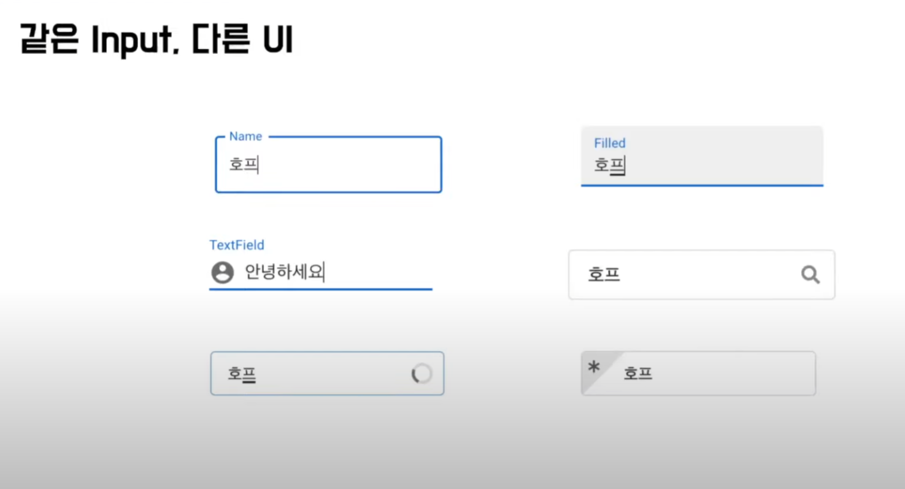
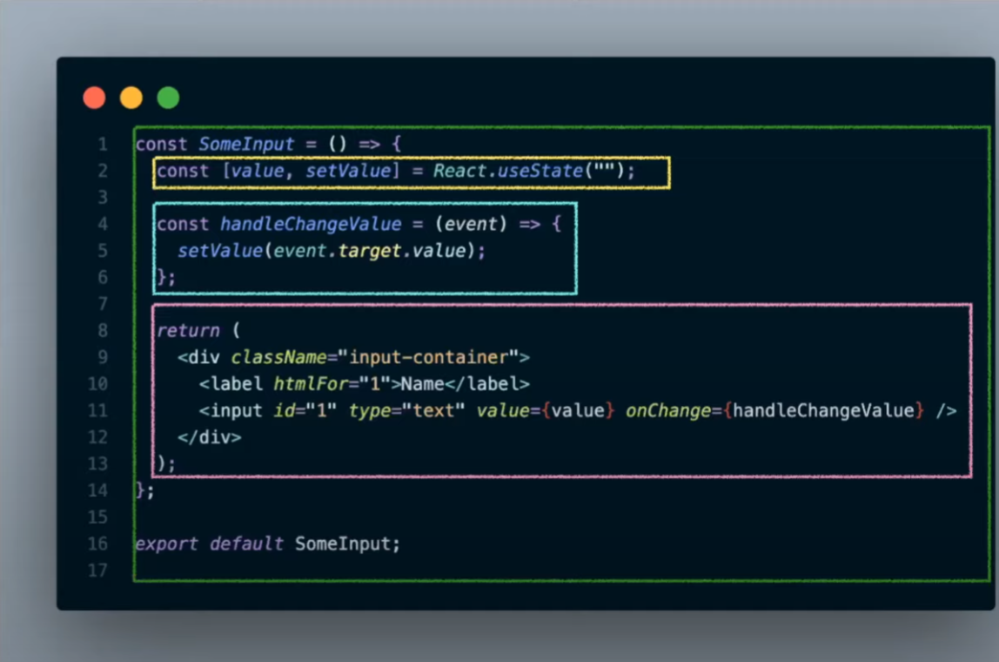
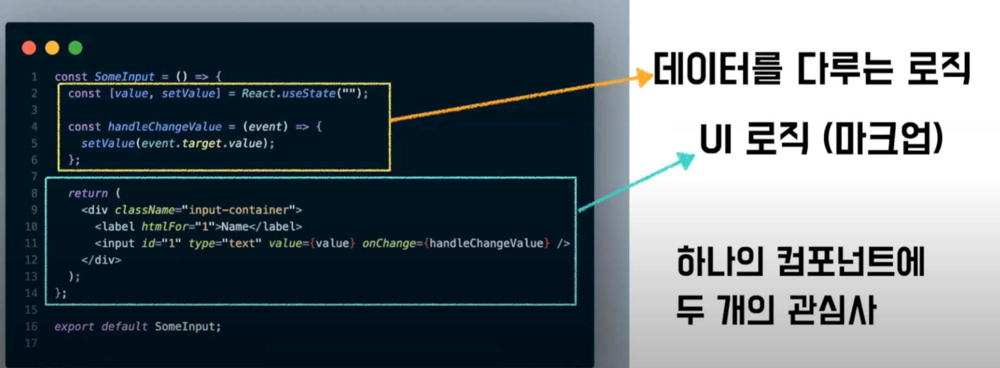
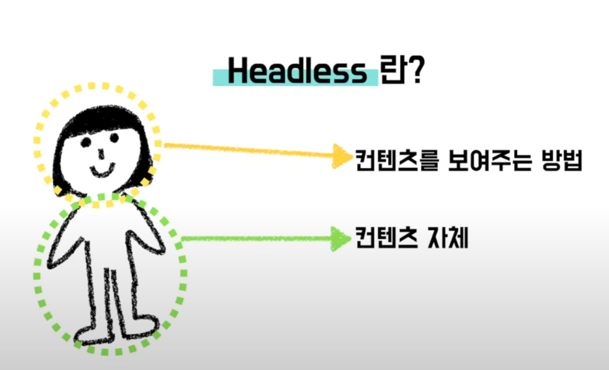
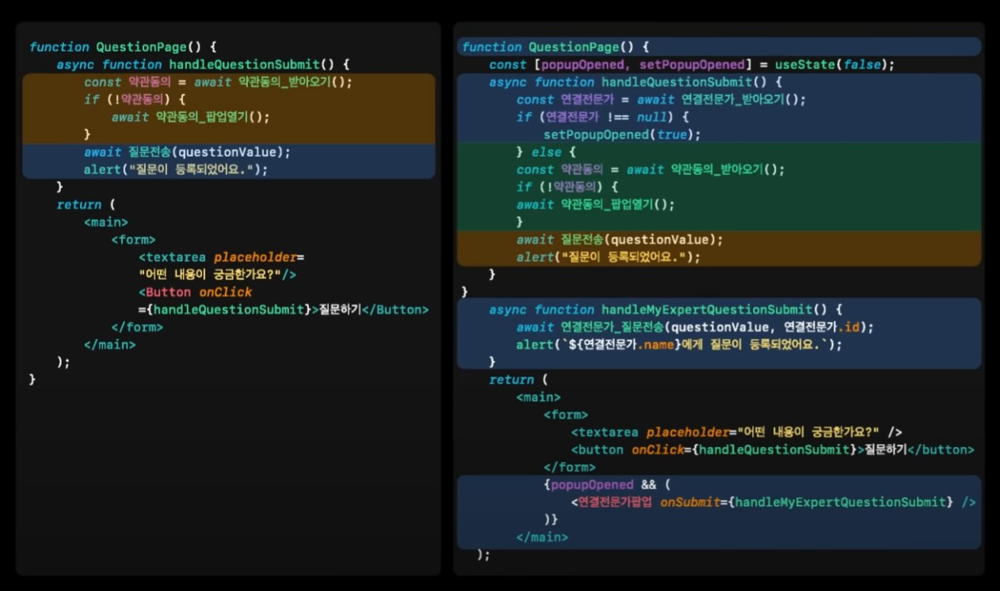
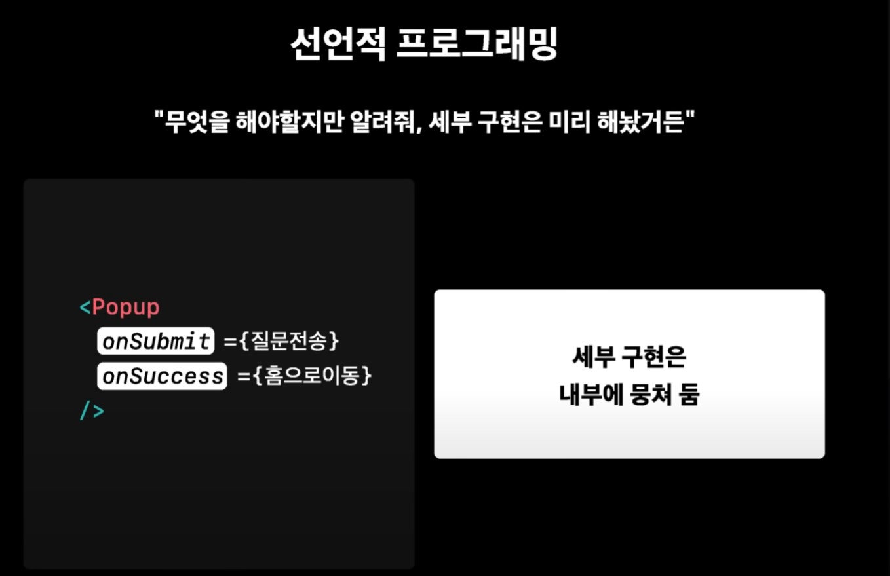
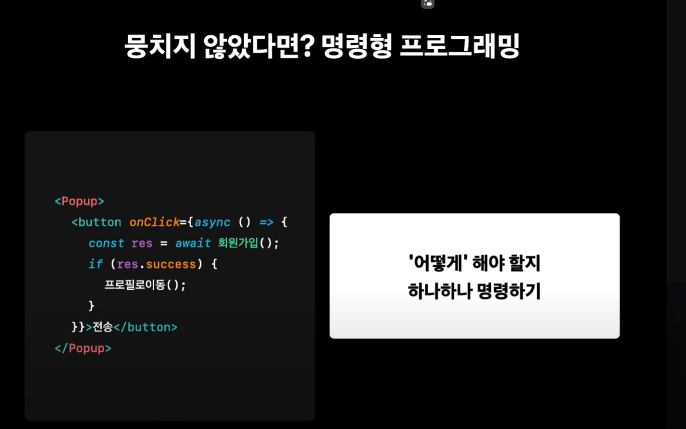
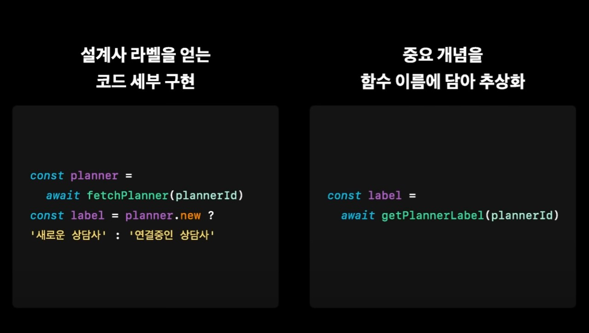

# 컴포넌트 잘 만들기

## Headless 컴포넌트

> 해결하고자 하는 문제
>
> 1. 재사용 가능한 컴포넌트 만들기
>
> 2. 변경에 따른 부수효과 최소화 하기

관심사가 분리된 재사용성이 높고 유지보수하기 용이한 컴포넌트 만들기

변경할때마다 새로운 컴포넌트를 만들어야 하나?

props를 이용해서 분기 처리를 해야 하나?

---

## Headless하게 만들기

> Headless > UI를 없앤 상태에서, Data만 생각하기

Compound Component 패턴

1. 

2. Funtion as Childre Component 패턴

   

3. Custom Hook

---

## Front-end Clean Code

> 실무에서 클린 코드의 의의 = 유지보수 시간의 단축

- 하나의 목적인 코드가 흩뿌려져 있음.

- 하나의 함수가 여러가지 일을 하고있음.

- 코드를 지래짐작 하게 하면 안됨.

---

> 클린코드 != 짧은코드 == 원하는 로직을 빠르게 찾을 수 있는 코드

1. 하나의 목적을 가진 코드가 흩뿌려져 있음

   > 같은 목적을 가진 코드는 뭉쳐두자  > **응집도**

   

   

   

   > 두방법 모두 유동적으로 사용하면 된다.

2. 함수가 여러가지 일을 하고 있음

   >    하나의 일을 하는 뚜렷한 이름의 함수를 만들자 > **단일책임**

##### 리팩토링 Tip

   1. 한가지 일만 하는, 명확한 이름의 함수

   2. 한가지 일만 하는, 기능성 컴포넌트

   3. 조건이 많아지면 한글 이름도 유용함

3. 함수의 세부규현 단계가 제각각

   > 핵심 개념을 뽑아내자

   

---

1. 담대하게 기존 코드 수정하기

   - 두려워하지 말고, 기존 코드를 씹고 뜯고 맛보고 즐기자

2. 큰 그림 보는 연습하기

   - 그 때는 맞고 지금은 틀리다. 기능 추가 자체는 클린해도, 전체적으로는 어지러울 수 있다.

3. 팀과 함께 공감대 형성하기

   - 코드에 정답은 없습니다. 명시적으로 이야기를 하는 시간이 필요합니다.

4. 문서로 적어 보기

   - 글로 적어야 명확해집니다.
