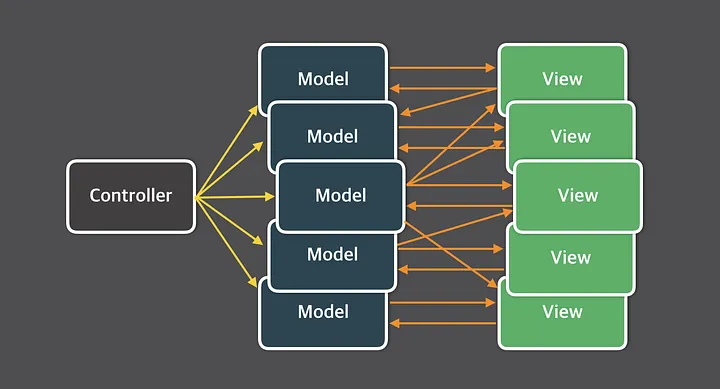
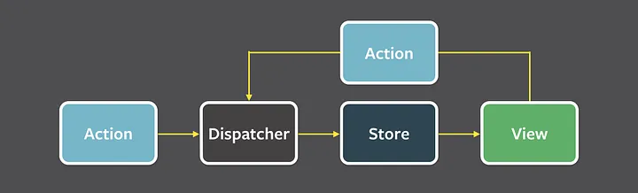

# 리액트의 상태관리

- `상태`
  - 어떤 의미를 가진 값
  - 애플리케이션의 시나리오에 따라 지속적으로 변경될 수 있는 값

- 예
  - UI
    - 상호 작용이 가능한 모든 현재 값
    - 다크/라이트 모드
    - 라디오를 비롯한 각종 input
    - 알림창의 노출 여부등

  - URL
    - 브라우저에서 관리되고 있는 상태 값
    - 라우팅에 따라 변경됨

  - 폼
    - 로딩 여부
    - 제출 여부
    - 값의 유효성등

  - 서버에서 가져온 값 

## 리액트의 상태 관리

### MVC 패턴과 Flux 패턴

#### MVC Pattern



복잡한 애플리케이션에서 한계가 나타남

##### MVC 패턴의 문제점

- 양방향 데이터 바인딩의 복잡성

- MVC에서는 View와 Model 간에 양방향 데이터 바인딩이 이루어지는 경우가 많음.
  - 데이터가 변경되면 View가 업데이트되고, 반대로 View의 변경이 Model을 변경할 수도 있음.
    규모가 커질수록 어떤 변경이 어떤 영향을 미칠지 예측하기 어려워지고, 디버깅도 복잡해짐.

  - 컴포넌트 간의 의존성 증가
    - Controller는 Model과 View를 모두 제어하기 때문에 의존성이 증가함.
    - 여러 Controller가 서로 다른 Model과 View를 공유하면서 구조가 얽히고설켜 유지보수가 어려워짐.

- 전역 상태 관리의 부재
  - 애플리케이션 전반의 상태를 중앙에서 관리하지 못함.
  - 상태가 여러 Model에 분산되어 있으면 데이터 흐름을 추적하기 어려워짐.

- 확장성의 부족
  - 애플리케이션이 커질수록 MVC는 새로운 기능을 추가하거나 기존 기능을 수정하기 어려움.
  - View와 Model의 강한 결합으로 인해 변경의 파급 효과가 큼.

```javascript
//Model
class TodoModel {
  constructor() {
    this.todos = [];
  }

  addTodo(todo) {
    this.todos.push(todo);
    this.notify();
  }

  toggleComplete(id) {
    const todo = this.todos.find(t => t.id === id);
    if (todo) {
        todo.completed = !todo.completed;
        this.notify();
    }
  }

  getCompletedTodos() {
    return this.todos.filter(t => t.completed);
  }

  // View에 변경 사항 알림
  subscribe(callback) {
    this.notify = callback;
  }
}

// View

class TodoView {
  render(todos) {
    console.clear();
    console.log('Todo List:');
    todos.forEach(todo => {
        console.log(`${todo.id}: ${todo.text} [${todo.completed ? 'X' : ' '}]`);
    });
  }
}

// Controller

class TodoController {
  constructor(model, view) {
      this.model = model;
      this.view = view;

      this.model.subscribe(() => this.view.render(this.model.todos));
  }

  addTodo(text) {
      const id = Date.now();
      this.model.addTodo({ id, text, completed: false });
  }

  toggleComplete(id) {
      this.model.toggleComplete(id);
  }
}

```

- 애플리케이션이 커질 때의 복잡성
  - 새로운 요구사항 추가:
    - Todo를 삭제하는 기능.
  -   특정 사용자만 Todo를 관리하는 기능.

  - 결과:
    - Model, View, Controller가 모두 수정되어야 함.
    - TodoModel에 deleteTodo 메서드를 추가하면, 이를 View에서 반영하고 Controller에서 호출하도록 변경해야 함.

  - 양방향 데이터 바인딩 증가
    - 사용자가 UI에서 직접 데이터를 수정할 수 있는 상황을 처리하려면, View에서 Model을 업데이트하고, Model이 다시 View를 업데이트하는 식의 상호작용이 필요해짐.
    - 예: 사용자가 Todo의 텍스트를 수정 → View → Model → View의 순환 구조가 생김.

  - 의존성의 증가
    - Model, View, Controller 간의 의존성이 복잡하게 얽히게 됨.
    - 필터링 상태가 추가되면, View와 Controller가 상태를 관리하는 Model을 각각 참조하게 되고, 데이터 변경의 흐름이 혼란스러워집니다.

  - 이벤트의 증가
    - 모델에 여러 변경 이벤트가 추가되면서 이벤트 관리가 어려워집니다.
    - 예: Model에서 필터링된 Todo만 제공해야 할 경우, 어떤 이벤트가 발생했는지 구분해야 합니다.

#### Flux 패턴


##### Flux Pattern의 구조

- 단방향 데이터 흐름을 도입하여, `MVC 패턴`의 복잡성을 해결
  - 상태를 Store에서 중앙 집중 관리하여 데이터 변경을 쉽게 추적.
  - Action을 통한 명시적 변경으로 상태 변경의 출처를 명확히 함.
  - View는 단순히 상태를 구독하고 렌더링만 담당하여 역할을 분리.

##### Flux Pattern의 구성요소

- Action
  - 작업을 처리할 액션과 액션 발생 시, 포함할 데이터
  - 액션 타입과 데이터를 각각 정의하여 디스패처로 전달.
- Dispatcher
  - 액션을 스토에서 보내는 역할
- Store
  - 상태에 따른 값과 상태를 변경할 수 있음.
- View
  - `리액트의 컴포넌트`
  - 스토어에서 만들어진 데이터를 가져와 하면을 렌더링하는 역할



```tsx
type StoreState = {
  count : number
}

type Action = { type : 'add'; payload : number }

function reducer(prevState : StoreState, action : Action) {
  const { type : ActionType } = action
  if ( ActionType === 'add' ) {
    return {
      count : prevState.count + action.payload
    }
  }
  throw new Error(`Unexpected Action [${ActionType}]`)
}

export default function App () {
  const [state, dispatcher] = useReducer(reducer, { count : 0 })

  function handleClick () {
    dispatcher({type : 'add', payload: 1})
  }

  return (
    <div>
      <h1>{state.count}</h1>
      <button onClick={handleClick}>+</button>
    </div>
  )
}
```

## Context API(전역 상태 관리)

전역 상태를 하위 컴포넌트에 주입할 수 있음

> Props Drilling을 피할 수 있음.

```jsx
import React, { createContext, useContext } from 'react';
import './style.css';
const themeDefault = { border: '10px solid red' };
const themeContext = createContext(themeDefault);
export default function App() {
  const theme = useContext(themeContext);
  return (
    <themeContext.Provider value={{ border: '10px solid blue' }}>
      <div className="root" style={theme}>
        <h1>Hello World</h1>
        <Sub />
      </div>
    </themeContext.Provider>
  );
}

function Sub() {
  const theme = useContext(themeContext);
  return (
    <themeContext.Provider value={{ border: '10px solid green' }}>
      <div style={theme}>
        <h1>Sub</h1>
      </div>
    </themeContext.Provider>
  );
}

```

### Context API 단점

```jsx
// Playground.tsx

function PostComponent() {
  console.log("PostComponent render");
  const { actions } = useUserContext();

  return (
    <div>
      <button onClick={() => actions.change("id", "ckstn0778")}>
        change userId
      </button>
    </div>
  );
}

function UserComponent() {
  console.log("UserComponent render");
  const { state: user } = useUserContext();

  return (
    <div>
      <h2>user id : {user.id}</h2>
      <h2>user nickname : {user.nickname}</h2>
    </div>
  );
}

export default function Playground() {
  const [count, setCount] = useState(0);

  return (
    <>
      <UserProvider>
        <UserComponent />
        <PostComponent />
      </UserProvider>

      <button onClick={() => setCount(count + 1)}>count : {count}</button>
    </>
  );
}
```

PostComponent와 UserComponent는 서로 필요로 하는 데이터가 다름. 
change userId 버튼을 클릭 시에 둘 다 리렌더링 됨

> selector가 없는 React의 context API를 사용할 경우 최상단 state를 업데이트하면 하위의 모든 컴포넌트가 리렌더링된다는 꽤나 치명적인 성능 이슈가 발생합니다.” <br/><br/>
> **[인프랩 기술블로그 참고](https://tech.inflab.com/202207-rallit-form-refactoring/colocation/)**

```tsx
// 참고 : https://yrnana.dev/post/2021-08-21-context-api-redux

const ModalProvider = ({ children }) => {
  const [show, setShow] = useState(false);
  
  return (
    <ModalStateContext.Provider value={show}>
      <ModalDispatchContext.Provider value={setShow}>
        {children}
      </ModalDispatchContext.Provider>
    </ModalStateContext>
  )
}
```

> 매번 Context를 나누면 컨텍스트를 추가할 때마다 프로바이더로 매번 감싸줘야하기 때문에 Provider hell을 야기할 수 음.