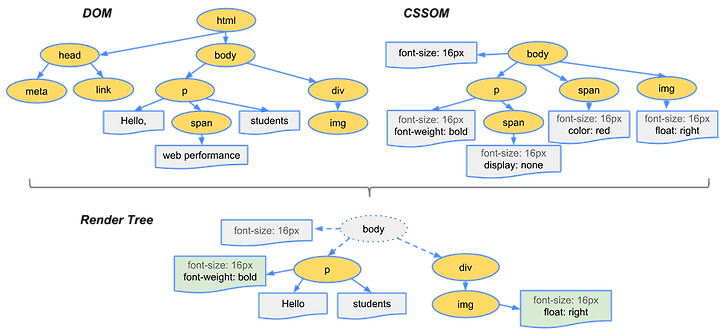
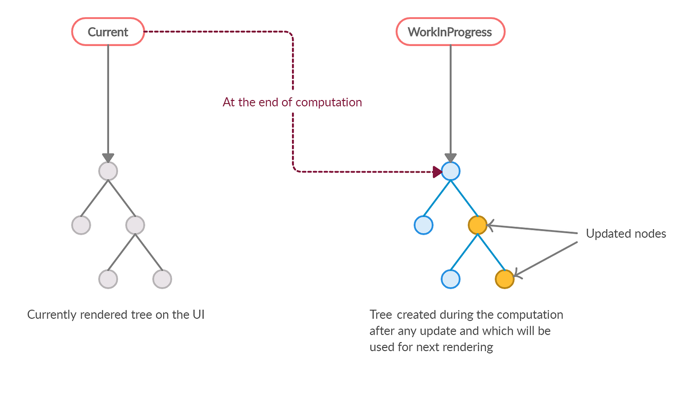

# 가상 DOM과 리액트 파이버

## DOM(Document Object Model)

> 브라우저가 웹 사이트의 접근 요청을 받고 화면을 그리는 과정

1. 브라우저가 사용자가 요청한 주소를 방문해 HTML 파일을 다운로드
2. HTML을 파싱해 DOM 노드로 구성된 트리`(DOM)`를 구성
3. 2번 과정에서 CSS파일을 만나면 CSS파일 다운로드
4. CSS를 파싱해 CSS노드로 구성된 트리`(CSSOM)`를 구성
5. DOM트리를 순회하며, 시각적으로 보이는 노드만 방문한다.

   > 트리 분석 과정을 빠르게 하기 위함.
6. 5번에서 제외된 노드에 대한 CSSOM 정보를 찾고 CSS스타일 정보를 노드에 적용

### CSS를 DOM노드에 적용하는 과정

- 레이아웃(layout, reflow) : 각 노드가 브라우저 화면의 어느 좌표에 나타나야 하는지 계산하는 과정, `레이아웃을 거치면 반드시 페인팅 단계도 거침`

  - **크기 관련 속성**: width, height, padding, margin, border, display, position, top, left, right, bottom
  - **텍스트 관련 속성**: font-size, font-weight, line-height, text-align
  - **레이아웃에 영향을 주는 속성**: overflow, white-space, float, clear

- 페인팅(painting) : 레이아웃 단계를 거친 노드에 색과 같은 유효한 모습을 그리는 과정

  - **색상 관련 속성**: color, background, border-color
  - **시각적 스타일 관련 속성**: visibility, text-decoration, box-shadow

[CSS Trigger](https://csstriggers.com/)



## 가상 DOM의 탄생 배경

SPA(Single Page Application)에서는 하나의 페이지에서 계속해서 요소의 위치를 재계산을 하게 됨에 따라, `비용이 커졌다.`

이를 개선하기 위해, `가상DOM(Virtual DOM)`이 나오게 되었다.

표시해야 할 DOM을 메모리에 저장하고 실제 변경에 대한 준비가 완료되었을 때 실제 DOM에 반영한다.
이러한 계산을 브라우저가 아닌, 메모리에서 계산을 하게 됨에 따라 렌더링 과정을 최소화할 수 있다.

> **가상DOM의 오해**<br/>
> 가상 DOM이 DOM보다 빠르다는 사실<br/>
> 무조건 빠른 것이 아니라, 대부분의 상황에서 웬만한 애플리케이션을 만들수 있을 정도로 충분히 빠르다.<br/><br/>
>리액트 개발자 댄 아브라모프(dan_abramov)

## 리액트 파이버

> 리액트에서 관리하는 자바스크립트 객체

가상 DOM과 실제 DOM을 비교해 변경 사항을 수집하고, 둘 사이에 차이가 있으면 변경에 관련된 정보를 가지고 있는 파이버를 기준으로 화면에 렌더링을 요청

> 재조정(reconciliation) 어떤 부분을 새롭게 렌더링 해야 하는지 가상 DOM과 실제 DOM을 비교하는 작업(알고리즘)

### 리액트 파이버의 목표

- 작업을 작은 단위로 분할, 우선순위를 선정
- 작업을 일시중지하고, 나중에 다시 시작할 수 있음.
- 이전에 했던 작업을 다시 사용하거나, 필요하지 않은 경우 폐기

#### 리액트 조정 알고리즘

과거에는 `스택 조정자`로 이루어져 있었다.

하나의 스택에 렌더링에 필요한 작업들이 쌓이면 이 스택이 빌 때까지 `동기적`으로 작업이 이루어졌다.
자바스크립트의 특징인 싱글 스레드라는 점으로 인해 이 동기 작업은 중단될 수 없고, 다른 작업이 수행되고 싶어도 중단할 수 없음.

---

현재는 `파이버(fiber)`로 이루어져 있다.<br/>
파이버는 아래와 같은 단계로 이루어져 있다.

- 렌더 단계
  - 사용자에게 노출되지 않는 모든 비동기 동작 수행
  - 우선순위를 지정, 중지시키거나 버리는 작업

- 커밋 단계
  - DOM에 실제 변경 사항을 반영하기 위한 작업
  - commitWork()가 실행
  - 동기적으로 일어나고 중단될 수 없음

[facebook/react-Github](https://github.com/facebook/react)
> react/packages/react-reconciler/src
/ReactFiber.js

---

**파이버는 state가 변경되거나 생명주기 메서드가 실행되거나 DOM의 변경이 필요한 시점등에 실행됨.**

리액트가 파이버를 처리할 때마다 이러한 작업을 직접 바로 처맇기도 하고, 스케쥴링을 하기도 한다.

**작은 단위로 나뉘어 처리할 수도, 애니메이션과 같이 우선순위가 높은 작업은 가능한 한 빠르게 처리하거나, 낮은 작업을 연기시킨는 등 유연하게 처리됨.**

## 파이버 트리

파이버 트리는 내부에 두개가 존재함.

1. 현재모습을 담은 `파이버 트리`
2. 작업 중인 상태를 나타내는 `workInProgress 트리`

리액트 파이버의 작업이 끝나면, 리액트는 단순히 포인터만 변경해 workInProgress 트리를 현재 트리로 바꾼다.
이를 `더블 버퍼링`라고 한다.

> 더블 버퍼링(Double Buffering)<br/><br/>
> 컴퓨터 그래픽 분야에서 사용되는 용어<br/><br/>
> 그래픽을 통해 화면에 표시되는 것을 그리기 위해 내부적으로 처리를 거쳐야 하는데, 이러한 처리를 거칠 때 사용자에게 미처 다 그리지 못하는 모습을 보이는 경우가 있다.
> 이를 방지하기 위해, 보이지 않는 곳에서 미리 그린다음에 완성되면 현재상태를 새로운 그림으로 바꾸는 기법



`더블버퍼링`작업은 `커밋`단계에서 수행된다.

### 파이버의 작업 순서

1. 리액트는 beginWork()함수를 실행하여 파이버 작업을 수행, 더 이상 자식이 없는 파이버를 만날 떄까지 트리 형식으로 시작

2. 1번에서 작업이 끝나면 completeWork()함수를 실행해 파이버 작업을 완료

3. 형제가 있다면 형제로 넘어감.

4. 2~3번 이 모두 끝낫다면 return으로 돌아가 자신의 작업이 완료되었음을 알림

```jsx
function App () {
  return (
    <div>
      <h2>Title</h2>

      <p>Hello World</p>
    </div>
  )
}
```


setState등으로 업데이트가 발생 시, 업데이트 요청을 받아 workInProgress트리를 다시 빌드한다.

빌드과정은 트리를 만드는 과정과 동일하다.

최초 렌더링 시에는 모든 파이버를 새롭게 만들어야 했지만, 이비 파이버가 존재하므로 새로 생성하지 않고 기존 파이버에서 업데이트된 props를 받아 파이버 내부에서 처리한다.

기존 객체를 재활용하기 위해 내부 속성값만
초기화하거나 바꾸는 형태로 트리를 업데이트한다.
