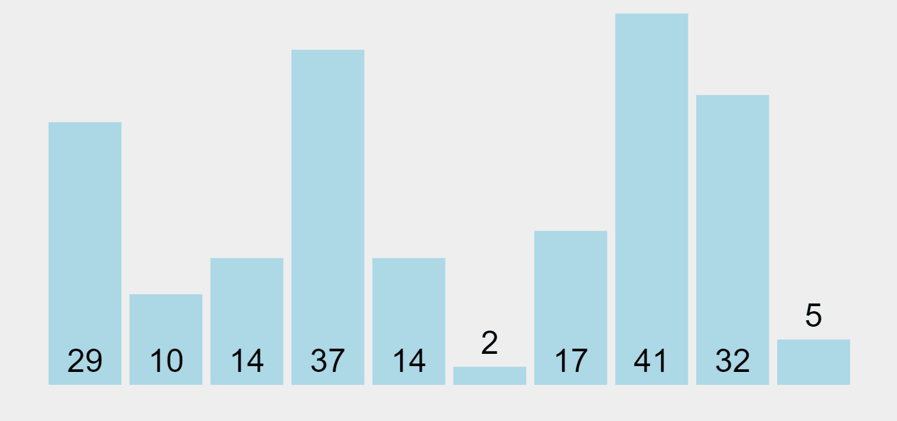

# 버블정렬(Bubble Sort)



```javascript
function bubbleSort(list) {
  // 정렬되지 않은 부분의 끝 인덱스를 저장
  let unsortedUntilIndex = list.length - 1;
  // 리스트가 정렬되었는지 여부를 확인하는 변수
  let sorted = false;

  // 리스트가 정렬될 때까지 반복
  while (!sorted) {
    // 처음에는 리스트가 정렬되었다고 가정
    sorted = true;

    // 정렬되지 않은 부분의 요소들을 비교하면서 반복
    for (let i = 0; i < unsortedUntilIndex; i++) {
      // 현재 요소가 다음 요소보다 크면 두 요소를 교환
      if (list[i] > list[i + 1]) {
        // 두 요소를 교환
        let temp = list[i];
        list[i] = list[i + 1];
        list[i + 1] = temp;
        // 교환이 일어났으므로 아직 정렬되지 않았음을 표시
        sorted = false;
      }
    }
    // 마지막 요소는 정렬되었으므로 정렬되지 않은 부분의 범위를 줄임
    unsortedUntilIndex -= 1;
  }

  // 정렬된 리스트 반환
  return list;
}

const sampleList = [5, 3, 8, 4, 2];
console.log(bubbleSort(sampleList)); // 출력: [2, 3, 4, 5, 8]
```

최선의 경우 (Best Case): O(N) — 이미 정렬된 경우, 단 한 번의 패스만 필요 (sorted 플래그로 인해)<br/>
평균 및 최악의 경우 (Average and Worst Case): O(N²) — 거의 모든 경우에 각 요소마다 반복적인 비교와 교환이 필요
