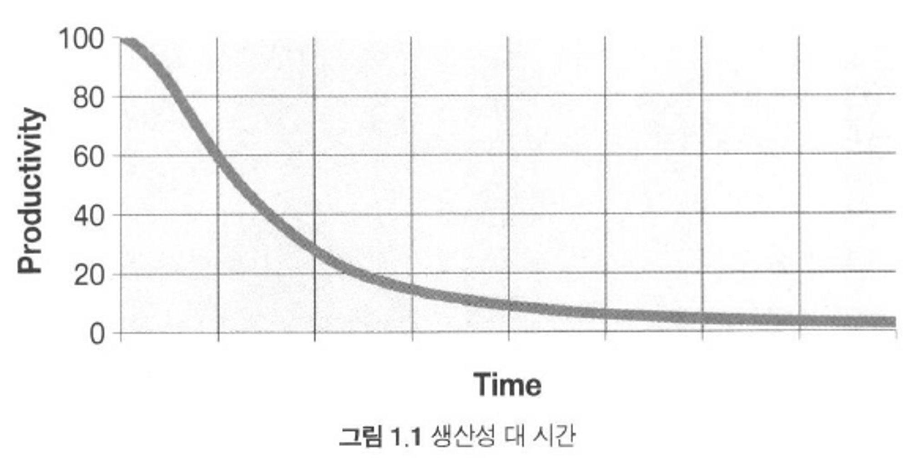

# 깨끗한 코드

> 코드는 요구사항을 표현하는 언어이다.

---

우리 모두는 대충 짠 프로그램이 돌아간다는 사실에 안도감을 느끼며, 그래도 안 돌아가는 프로그램보다 돌아가는 쓰레기가 좋다고 스스로를 위로한 경험이 있다. 다시 돌아와 나중에 정리하겠다고 다짐했었다

> 나중은 결코 오지 않는다. : 르블랑의 법칙

---

## 나쁜코드가 쌓일수록 생산성이 떨어짐



---

## 태도

관리자 : 일정에 쫓기더라도 좋은 코드를 원한다.

> 좋은 코드는 우리의 책임<br/>
> 나쁜 코드의 위험을 이해하지 못하는 관리자의 말을 그대로 따르는 행동은 전문가답지 못하다.

---

## 원초적 난제

기한을 맞추려면 나쁜 코드를 양산할 수밖에 없다고 느낀다.
> 진짜 전문가는 언제나 코드를 깨끗하게 유지함으로서 기한을 맞춘다.

---

## 깨끗한 코드란

```text
나는 우아하고, 효율적인 코드를 좋아한다.
논리가 간단해야 버그가 숨어들지 못하고, 의존성을 최대한 줄여야 유지보수가 쉬워진다.
오류는 명백한 전략에 의거해 철저히 처리하고, 성능은 최적으로 유지해야 사람들이 원칙 없는 최적화로 코드를 망치려는 유혹에 빠지지 않는다.
깨끗한 코드는 한가지 일을 제대로 수행한다. 

바야네 스트롭스트룹 - C++ 창시자이자 C++ programming language 저자
```

```text
깨끗한 코드는 단순하고 직접적이다. 깨끗한 코드는 잘 쓴 문장처럼 읽힌다. 깨끗한 코드는 결코 설계자의 의도를 숨기지 않는다. 오히려 명쾌한 추상화와 단순한 제어문으로 가득하다.

그래디 부치 - 객체지향적 분석과 디자인 저자
```

```text
깨끗한 코드는 작성자가 아닌 사람도 읽기 쉽고 고치기 쉽다. 단위 테스트 케이스와 인수 테스트 케이스가 존재한다. 깨끗한 코드에는 의미 있는 이름이 붙는다. 특정 목적을 달성하는 방법은 여러 가지가 아닌 하나만 제공한다. 의존성은 최소이며 각 의존성을 명확히 정의한다. API는 명확하며 최소로 줄였다. 언어에 따라 필요한 모든 정보를 코드만으로 명확히 표현할 수 없기에 코드는 문학적으로 표현해야 마땅하다.

데이브 토마스 - OTI 설립자이자 이클립스 전략의 대부
```

```text
깨끗한 코드의 특징은 많지만 그중에서도 모두를 아우르는 특징이 하나 있다. 깨끗한 코드는 언제나 누군가 주의 깊게 짰다는 느낌을 준다. 고치려고 살펴봐도 딱히 손댈 곳이 없다. 작성자가 이미 모든 사항을 고려했으므로, 고칠 궁리를 하다 보면 언제나 제자리로 돌아온다. 그리고는 누군가 남겨준 코드, 누군가 주의 깊게 짜놓은 작품에 감사를 느낀다.

마이클 페더스 - 레거시 코드 활용 전략 저자
```

```text
최근 들어 나는 켄트 벡이 제안한 단순한 코드 규칙으로 구현을 시작한다. (그리고 같은 규칙으로 구현을 거의 끝낸다.) 중요한 순으로 나열하자면 간단한 코드는

- 모든 테스트를 통과한다.
- 중복이 없다.
- 시스템 내 모든 설계 아이디어를 표현한다.
- 클래스, 메서드, 함수 등을 최대한 줄인다. 

...(생략)

중복 줄이기, 표현력 높이기, 초반부터 간단한 추상화 고려하기. 
내게는 이 세가지가 꺠끗한 코드를 만드는 비결이다.

론 제프리스 - Extreme Programming Installed와 Extreme Programming Adventures in C# 저자
```

```text
코드를 읽으면서 짐작했던 기능을 각 루틴이 그대로 수행한다면 깨끗한 코드라 불러도 되겠다. 코드가 그 문제를 풀기 위한 언어처럼 보인다면 아름다운 코드라 불러도 되겠다.


워드 커닝햄 - 위키(Wiki), 피트(Fit) 창시자, XP 공동 창시자, 디자인 패턴 전문가
```

---

## 정리

다른 사람이 이해하기 쉬운 코드<br/>
중복이 없는 코드<br/>
클래스, 메서드, 함수 등의 내용을 최소화한 코드<br/>
단위 테스트가 작성된 코드

즉, 간단명료하고 중복이 없으며 의도한 대로 잘 돌아가는 코드를 말한다.

> 잘 짠 코드가 전부는 아니다.<br/> 
> 시간이 지나도 언제나 깨끗하게 유지해야 한다.<br/>
> 우리는 적극적으로 코드의 퇴보를 막아야 한다.<br/> 
> "캠프장은 처음 왔을 때보다 더 깨끗하게 해놓고 떠나라"
>
> `보이스카우트 원칙`