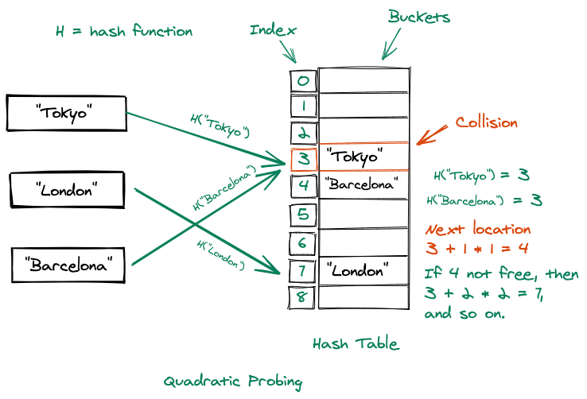

# 해시 테이블(Hash Table)



해시 테이블(Hash Table)은 데이터를 효율적으로 저장하고 검색하기 위해 사용하는 자료구조임. 해시 테이블은 키(Key)와 값(Value)의 쌍으로 데이터를 저장하며, 키를 해시 함수(Hash Function)를 통해 해시값으로 변환하고, 이 해시값을 기반으로 데이터를 저장할 위치를 결정.

## 구성 요소

- 해시 함수 (Hash Function)

  - 키를 입력으로 받아 해시값을 생성하는 함수.
  - 해시 함수는 입력된 키를 일정한 크기의 정수(인덱스)로 변환하여 해시 테이블의 특정 위치를 가리킴.

- 버킷 (Bucket)

  - 해시 테이블에서 데이터를 저장하는 공간.
  - 각 버킷은 여러 개의 값을 저장할 수 있으며, 해시 함수에 의해 인덱싱된 위치에 데이터를 저장함.

- 충돌 (Collision)
  - 서로 다른 키들이 동일한 해시값을 가질 때 발생하는 현상.
  - 충돌을 처리하기 위해 다양한 방법이 사용됨.

### 충돌 해결 방법

- 체이닝 (Chaining)

  - 각 버킷에 연결 리스트(Linked List) 등을 사용해 여러 개의 값을 저장하여 충돌을 해결하는 방법.
  - 같은 인덱스에 여러 값이 저장될 수 있으며, 충돌이 발생하면 새로운 값을 리스트에 추가

- 오픈 어드레싱 (Open Addressing)
  - 충돌이 발생하면 다른 빈 버킷을 찾아 값을 저장하는 방법.
  - 선형 탐사(Linear Probing), 이차 탐사(Quadratic Probing), 이중 해싱(Double Hashing) 등의 방식이 있음.

## 장점과 단점

- 장점

  - 평균적으로 빠른 검색, 삽입, 삭제 성능 (O(1))
  - 효율적인 메모리 사용.

- 단점

  - 해시 함수의 품질에 따라 성능이 크게 좌우될 수 있음.
  - 충돌 발생 시 성능이 저하될 수 있음.
  - 데이터의 순서를 유지하지 않음.

## 사용 예시

해시 테이블은 주로 데이터베이스, 캐싱 시스템, 키-값 저장소, 그리고 중복 검출과 같은 다양한 분야에서 널리 사용됨.

해시 테이블은 매우 효율적이지만 해시 함수의 선택과 충돌 처리 방법에 따라 성능이 크게 달라질 수 있으므로 상황에 맞게 설계하는 것이 중요함.

## 코드

```javascript
class HashTable {
  constructor(size = 53) {
    this.table = new Array(size); // 해시 테이블의 크기를 설정
    this.size = size;
  }

  // 간단한 해시 함수: 문자열 키를 정수 인덱스로 변환
  _hash(key) {
    let total = 0;
    const WEIRD_PRIME = 31; // 소수를 사용하여 해시 충돌을 줄임
    for (let i = 0; i < Math.min(key.length, 100); i++) {
      const char = key[i];
      const value = char.charCodeAt(0) - 96; // 알파벳을 숫자로 변환
      total = (total * WEIRD_PRIME + value) % this.size;
    }
    return total;
  }

  // 데이터를 해시 테이블에 삽입
  set(key, value) {
    const index = this._hash(key); // 키를 해시값으로 변환하여 인덱스 찾기
    if (!this.table[index]) {
      this.table[index] = [];
    }
    // 기존 키-값 쌍이 있는지 확인하고 업데이트
    for (let i = 0; i < this.table[index].length; i++) {
      if (this.table[index][i][0] === key) {
        this.table[index][i][1] = value; // 값 업데이트
        return;
      }
    }
    this.table[index].push([key, value]); // 새로운 키-값 쌍 추가
  }

  // 데이터를 해시 테이블에서 검색
  get(key) {
    const index = this._hash(key);
    if (this.table[index]) {
      for (let pair of this.table[index]) {
        if (pair[0] === key) {
          return pair[1]; // 키와 일치하는 값을 반환
        }
      }
    }
    return undefined; // 키가 없으면 undefined 반환
  }

  // 해시 테이블에서 데이터 삭제
  remove(key) {
    const index = this._hash(key);
    if (this.table[index]) {
      this.table[index] = this.table[index].filter((pair) => pair[0] !== key); // 키에 해당하는 쌍을 제거
    }
  }
}

// 사용 예시
const ht = new HashTable();
ht.set("apple", 10);
ht.set("banana", 20);
console.log(ht.get("apple")); // 10
console.log(ht.get("banana")); // 20
ht.remove("apple");
console.log(ht.get("apple")); // undefined
```

```javascript
// Set사용
class HashTable {
  constructor() {
    this.table = new Set(); // Set을 사용하여 데이터 저장
  }

  // 데이터를 삽입하는 메서드
  set(key, value) {
    // 동일한 키가 있으면 기존 쌍을 삭제하고 새로운 값으로 업데이트
    this.table.forEach((pair) => {
      if (pair[0] === key) {
        this.table.delete(pair);
      }
    });
    this.table.add([key, value]); // 새로운 키-값 쌍을 추가
  }

  // 데이터를 검색하는 메서드
  get(key) {
    for (let [k, v] of this.table) {
      if (k === key) {
        return v; // 키에 해당하는 값을 반환
      }
    }
    return undefined; // 키가 없으면 undefined 반환
  }

  // 데이터를 삭제하는 메서드
  remove(key) {
    for (let pair of this.table) {
      if (pair[0] === key) {
        this.table.delete(pair); // 키에 해당하는 쌍을 삭제
        return;
      }
    }
  }
}

// 사용 예시
const ht = new HashTable();
ht.set("apple", 10);
ht.set("banana", 20);
console.log(ht.get("apple")); // 10
console.log(ht.get("banana")); // 20
ht.remove("apple");
console.log(ht.get("apple")); // undefined

// Set의 고유한 특성을 활용한 간단한 해시 테이블 구현 방법이지만, Set은 본래 키-값 쌍의 해시 테이블보다는 Map에 가까운 데이터 구조임. Set을 활용하는 방식은 간단한 저장, 검색, 삭제 기능을 구현할 수 있지만, 실제 해시 테이블의 충돌 처리와 같은 고급 기능은 제공하지 않음.
```
