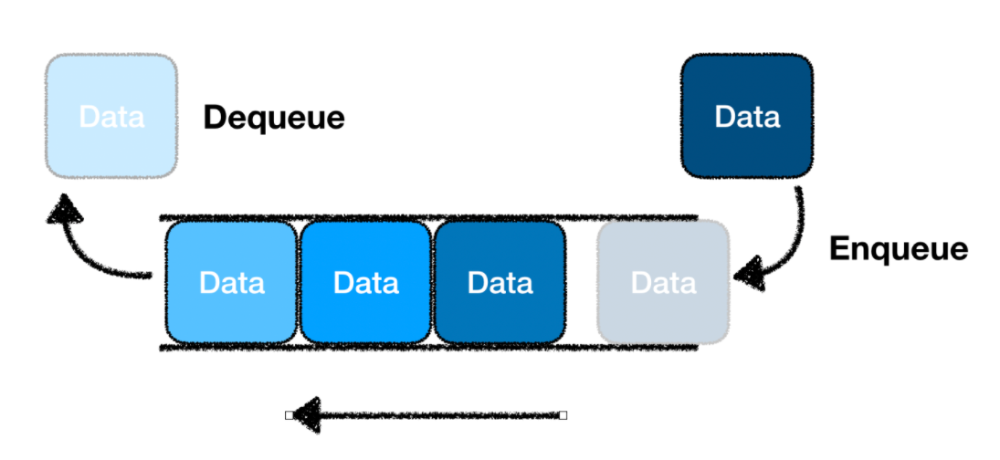

# 큐(Queue)



큐(Queue)는 데이터를 순서대로 처리하기 위한 선형 자료구조 중 하나로, "FIFO(First In, First Out)" 즉, "선입선출" 방식으로 동작함. 이는 먼저 삽입된 데이터가 가장 먼저 제거되는 구조를 의미함. 큐는 일상생활의 줄 서기와 비슷한 개념으로, 다양한 컴퓨터 시스템과 알고리즘에서 중요한 역할을 함.

## 구성 요소

- 큐의 요소(Element): 큐에 저장되는 개별 데이터 항목임.
- 프런트(Front): 큐에서 가장 먼저 들어간 요소를 가리키는 위치임.
- 리어(Rear): 큐에서 가장 마지막에 추가된 요소를 가리키는 위치임.

## 주요 연산

- enqueue(item): 큐의 맨 뒤에 새로운 요소를 추가함.
- dequeue(): 큐의 맨 앞에 있는 요소를 제거하고 반환함. 큐가 비어 있으면 오류를 발생시킬 수 있음.
- peek(): 큐의 맨 앞에 있는 요소를 반환하지만 제거하지 않음.
- isEmpty(): 큐가 비어 있는지 확인하여, 비어 있으면 true를, 아니면 false를 반환함.
- size(): 큐에 있는 요소의 개수를 반환함.

## 큐의 사용 예시

- 작업 스케줄링: 프로세스 관리, 인쇄 대기열 등에서 작업을 순서대로 처리할 때 사용함.
- 데이터 버퍼링: 네트워크 데이터, 키보드 입력 등의 데이터가 순서대로 처리될 때 큐를 사용함.
- BFS(너비 우선 탐색): 그래프 탐색에서 큐를 이용해 탐색 순서를 관리함.
- 캐시 구현: 최근 사용한 데이터를 앞에서 제거하고 뒤에 추가하여 캐시를 관리할 때 사용함.

## 장점과 단점

- 장점

  - 데이터가 들어온 순서대로 처리할 수 있어 흐름 제어가 간단함.
  - FIFO 구조로 인해 대기열 관리가 용이함.

- 단점

  - 큐의 중간 요소에 접근이 어렵고, 데이터를 삭제하려면 앞에서부터 순서대로 처리해야 함.
  - 크기가 고정된 경우, 메모리 오버플로우 문제가 발생할 수 있음.

```javascript
class Queue {
  constructor() {
    this.items = []; // 큐 요소를 저장할 배열
  }

  // 큐에 요소 추가
  enqueue(element) {
    this.items.push(element);
  }

  // 큐에서 요소 제거 및 반환
  dequeue() {
    if (this.isEmpty()) {
      throw new Error("Queue is empty"); // 큐가 비어 있을 때 오류 처리
    }
    return this.items.shift();
  }

  // 큐의 맨 앞 요소를 반환 (제거하지 않음)
  peek() {
    if (this.isEmpty()) {
      throw new Error("Queue is empty");
    }
    return this.items[0];
  }

  // 큐가 비어 있는지 확인
  isEmpty() {
    return this.items.length === 0;
  }

  // 큐의 크기를 반환
  size() {
    return this.items.length;
  }
}

// 사용 예시
const queue = new Queue();
queue.enqueue(1);
queue.enqueue(2);
queue.enqueue(3);
console.log(queue.peek()); // 1
console.log(queue.dequeue()); // 1
console.log(queue.size()); // 2
console.log(queue.isEmpty()); // false
```
