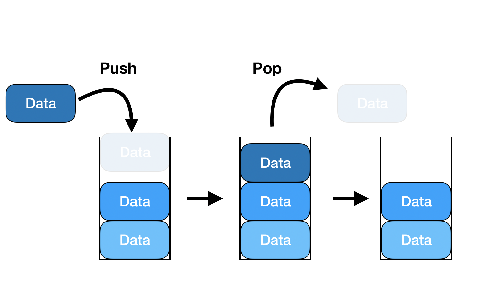

# 스택



스택(Stack)은 데이터를 순서대로 저장하고 꺼내는 선형 자료구조 중 하나로, "LIFO(Last In, First Out)" 즉, "후입선출" 방식으로 동작함. 이는 가장 최근에 삽입된 데이터가 가장 먼저 제거되는 구조를 의미함. 스택은 컴퓨터 과학의 다양한 영역에서 활용되며, 알고리즘, 재귀 호출, 브라우저의 뒤로 가기 기능 등 여러 상황에서 중요한 역할을 함.

## 구성 요소

- 스택의 요소(Element): 스택에 저장되는 개별 데이터 항목임.
- 위(Top): 현재 스택의 가장 위에 있는 요소를 가리킴.
- 밑(Bottom): 스택의 가장 아래에 있는 첫 번째 요소를 가리킴.

## 주요 연산:

- push(item): 스택의 맨 위에 새로운 요소를 추가함.
- pop(): 스택의 맨 위에 있는 요소를 제거하고 반환함. 스택이 비어 있으면 오류를 발생시킬 수 있음.
- peek(): 스택의 맨 위에 있는 요소를 반환하지만 제거하지 않음.
- isEmpty(): 스택이 비어 있는지 확인하여, 비어 있으면 true를, 아니면 false를 반환함.
- size(): 스택에 있는 요소의 개수를 반환함.

## 스택의 사용 예시

- 재귀 알고리즘: 함수 호출의 스택 구조로 재귀 호출의 흐름을 관리함.
- 문자열 뒤집기: 문자열의 문자들을 스택에 쌓아 역순으로 꺼내면서 뒤집기 가능함.
- 괄호 검사: 코드에서 괄호의 유효성을 검사할 때 사용됨.
- 브라우저 히스토리 관리: 방문 기록을 스택에 저장하여 뒤로 가기 기능을 구현함.

## 장점과 단점

- 장점

  - 간단한 구현과 직관적인 데이터 관리가 가능함.
  - 메모리 관리가 효율적이며, 데이터의 추가와 제거가 빠름.

- 단점

  - 접근은 오직 맨 위 요소만 가능하여, 중간 데이터에 접근하려면 비효율적임.
  - 크기가 고정된 스택에서는 메모리 초과 문제(오버플로우)가 발생할 수 있음.

## 코드

```javascript
class Stack {
  constructor() {
    this.items = []; // 스택 요소를 저장할 배열
  }

  // 스택에 요소 추가
  push(element) {
    this.items.push(element);
  }

  // 스택에서 요소 제거 및 반환
  pop() {
    if (this.isEmpty()) {
      throw new Error("Stack is empty"); // 스택이 비어 있을 때 오류 처리
    }
    return this.items.pop();
  }

  // 스택의 맨 위 요소를 반환 (제거하지 않음)
  peek() {
    if (this.isEmpty()) {
      throw new Error("Stack is empty");
    }
    return this.items[this.items.length - 1];
  }

  // 스택이 비어 있는지 확인
  isEmpty() {
    return this.items.length === 0;
  }

  // 스택의 크기를 반환
  size() {
    return this.items.length;
  }
}

// 사용 예시
const stack = new Stack();
stack.push(1);
stack.push(2);
stack.push(3);
console.log(stack.peek()); // 3
console.log(stack.pop()); // 3
console.log(stack.size()); // 2
console.log(stack.isEmpty()); // false
```

> ### 제약을 갖는 데이터 구조의 중요성
>
> 1. 잠재적 버그를 막을 수 있다.
> 2. 문제를 해결하는 새로운 사고 모델(mental model)을 제공한다.
>    예를 들어, 스택은 후입선출(LIFO) 프로세스에 대한 전반적인 아이디어를 제공한다.
