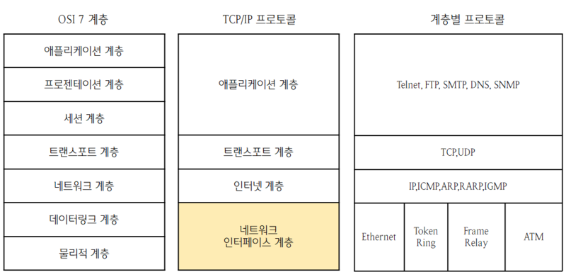
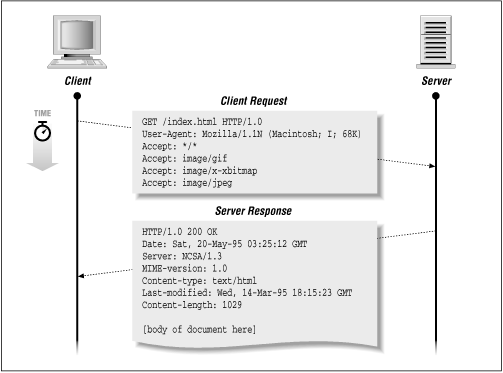
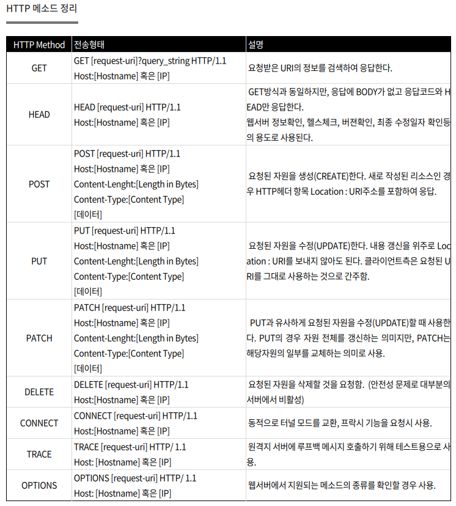
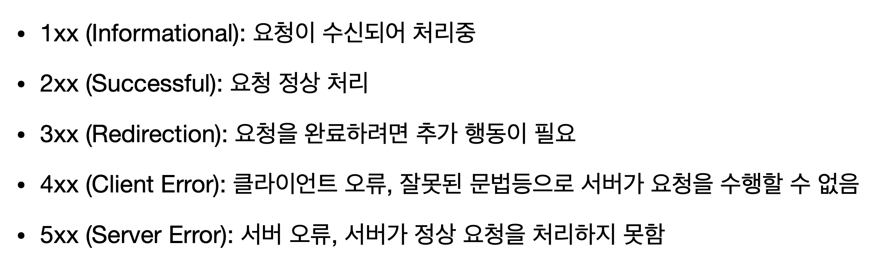

# HTTP

웹 애플리케이션은 서버가 보낸 HTML, CSS, 이미지 등의 리소스 데이터를 통해 구성된다.

HTTP 통신 프로토콜에 따라 서버와 통신해 리소스를 가져오거나 데이터를 생성하며 삭제한다.

## URL(Uniform Resource Locator)

인터넷에서 리소스가 위치하는 장소를 나타내는 문자열

## DNS(Domain Name Server)

웹 브라우저에 도메인 이름을 입력하면 컴퓨터는 해당 IP 주소를 얻기 위해 DNS 서버에 요청을 보냅니다.

DNS 서버는 데이터베이스를 검색하거나 다른 DNS 서버에 연결하여 도메인 이름과 연결된 IP 
주소를 찾습니다.

IP 주소를 찾으면 컴퓨터로 반환되어 요청된 웹사이트 또는 서비스에 연결할 수 있습니다.

## TCP/IP

---

## HTTP Request & Response

### HTTP Request 구성

- 요청 라인(request line) : 1행
- 헤더(header) : 2행 ~ 공백행 이전까지
- 바디(body) : 공백행 이후의 행

### HTTP Response 구성

- 상태 라인(response line) : 1행
- 헤더(header) : 2행 ~ 공백행 이전까지
- 바디(body) : 공백행 이후의 행

## HTTP Method

- GET, HEAD, OPTIONS, TRACE는 서버에서 리소스를 변경하는 부작용이 없으므로 안전한 메서드로 간주한다.

- POST, PUT, DELETE는 부작용이 가능한 메서드이다. 잘못 이용하염 서버 상태와 리소스에 영향이 있을 수 있음.

- CONNECT 메서드는 프록시 서버가 통신 데이터를 볼 수 없을 때, 데이터를 그대로 전달하는 메서드이다. 프록시 서버를 통해 HTTPS 통신을 할 때는 수신자를 제한하지 않으면 공격자가 악용할 수 있어 반드시 주의해야 한다.

- TRACE는 XST(cross site tracing)을 통한 정보 유출의 위험이 있어 거의 모든 브라우저가 지원하지 않음

## HTTP Status Code

