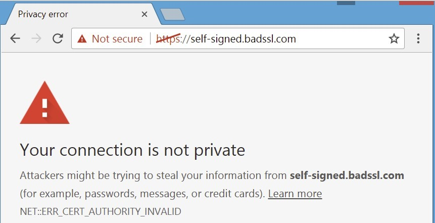

# HTTPS(HTTP over TLS)

HTTP 프로토콜은 HTML 문서를 전송하기 위해 고안된 통신 프로토콜이므로, 보안이 고려되지 않아 안전하지 않다.

## HTTP 약점

1. 통신 데이터 도청이 가능함

공격자가 통신 경로의 도청이 가능하다면, 사용자가 주고 받는 데이터를 훔쳐 볼 수 있다.

2. 통신 상대의 진위 여부 확인이 어려움

HTTP 통신 경로는 공격자가 요청 URL로 서버인 척할 수 있다. 브라우저는 URL로 통신 상대를 특정하므로 통신 상대의 진위 여부를 알 수 없다.

3. 통신 과정에서 데이터 수정 여부가 확인이 안됨

상대가 전송한 데이터와 전송받은 데이터가 일치하는지 검증할 수 없기 때문에, 통신과정에서 공격자가 데이터 내용을 수정하더라도 알 수 없다.

---

## TLS

HTTP 통신을 하기 전에 TLS 핸드셰이크(handshake)라고 하는 암호 통신 과정을 진행한다.

1. 통신 데이터 암호화

평문 데이터를 암호화하여 전송하면, 상대는 암호화를 복호화하여 데이터의 내용을 볼 수 있다. 암호화와 복호화에 필요한 키는 브라우저와 서버의 통신을 통해 안전하게 공유되며, 키를 가지고 있을 때만 암호문을 복호화 할 수 있다.

2. 통신 상대 검증

TSL는 전자 인증서로 통신 상대를 확인하며, 전자 인증서는 신뢰 가능한 기관인CA(certificate authority)에서 발행한다.
서버에서 전송된 인증서는 브라우저가 검증하고 다시 브라우저와 OS에 있는 인증서와 대조한다.
CA에서 발행되지 않은 인증서가 사용되면 브라우저는 경고를 표시한다.



3. 통신 데이터 변경 체크

TSL은 데이터 변조를 체크하는 기능을 제공한다.

`인증 태그`라는 검증용 데이터를 사용하는데, 데이터의 암호화와 동시에 작성되어 상대에게 전송되며, 수신자는 복호화와 동시에 인증 태그를 사용해 암호문의 변조를 체크한다.

변조가 발생한 경우에는 에러로 통신을 종료한다.

변조의 체크는 HTTP통신뿐만 아니라 TLS 핸드셰이크 중에도 진행된다.

---

## 안전한 콘텍스트만 이용 가능한 API

웹의 기능이 더 다양해짐에 따라, 공격자가 악용할 수 있는 여지가 더 많아지게 되었다.

그래서 이와 같은 공격으로부터 사용자를 보호하기 위해 Secure Content(안전한 콘텍스트)에서만 이용하도록 제한한다.

다음 조건이 만족하면, Secure Context라고 볼 수 있다.

```text

https:// 또는 wss://의 암호와 통신 사용
http://localhost, http://127.0.0.1, file://의 URL로 시작하는 로컬 호스트 통신

```

[MDN Secure Context](https://developer.mozilla.org/ko/docs/Web/Security/Secure_Contexts)

---

## Mixed Content의 위험성

HTTPS를 사용한 웹 애플리케이션 안에서 HTTP 통신을 사용하는 리소스가 혼재되어 있는 상태를 `Mixed Content`라고 한다.

HTTPS로 사용되고 있다고 하더라도, 하위 리소스들이 HTTP일 경우 파일 변경 여부를 감지할 수 없으므로 위험하다.

---

## HSTS를 사용해 HTTPS 통신 강제하기

HSTS(HTTP strict transport security) 구조를 적용하면, 사용자가 HTTPS 통신을 사용하도록 강제할 수 있다,

HSTS를 유효화하려면 응답 헤더에 `Strict-Transport-Security 헤더`를 추가한다.
브라우저는 `Strict-Transport-Secruity`헤더를 받으면 이후의 웹 애플리케이션 요청은 HTTPS를 사용한다.
