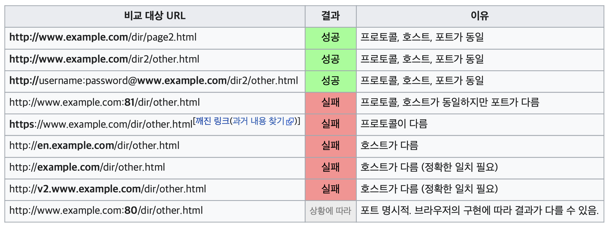
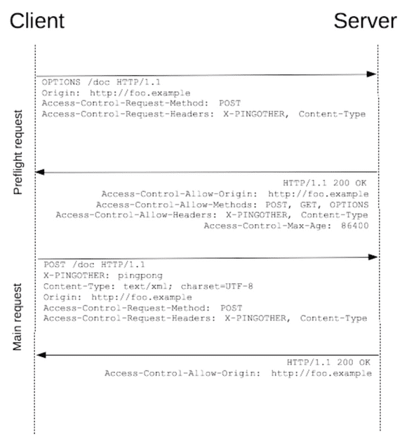

# CORS

## 필요성

인터넷에서 공개된 콘텐츠는 어디서 이용되는지 알 수 없으므로, 민간한 정보가 포함된 데이터가 설정 실수로 인해 노출될 위험성이 있다.

웹 애플리케이션에서 개인정보를 보호하려면 다른 웹 애플리케이션에서의 접속을 제한해야 한다.

## 동일 출처 정책에 의한 보호

> 브라우저에 내장된 접근 제한 방식

브라우저는 웹 애플리케이션 사이에 `출처(origin)`라는 경계를 설정하여 서로의 접근을 제한한다.

이러한 제한을 통해, 다른 웹 애플리케이션에서의 접근을 제한할 수 있다.

## 출처


웹 애플리케이션의 출처가 같으면, `동일 출처(same origin)`
웹 애플리케이션의 출처가 다르면, `교차 출처(cross origin)`



## 동일 출처 정책

교차 출처 리소스에 접근을 제한하는 방식

1. 자바스크립트를 사용한 교차 출처로 요청 전송 제한
2. 자바스크립트를 사용한 iframe의 페이지에 접근 제한  
iframe 내부 교차 출처 페이지에 자바스크립트를 사용해 접근하면, 에러가 발생한다.  
`postMessage`함수를 사용하면 교차 출처의 iframe 간에도 데이터를 주고 받을 수 있음.

3. `<canvas>`요소 데이터에 접근 제한
canvas요소에 교차 출처의 이미지를 불러 올 때에는, 오염된 상태(tainted) 로 간주되어 불러오기가 실패함.  
데이터를 가져오는 메서드등은 출처 정책에 따라 제한됨.

4. Web Storage와 IndexedDB에 저장된 교차 출처 데이터에 접근 제한  
브라우저에 내장된 데이터 저장 기능으로 Web Storage(localStorage, sessionStorage), indexedDB등이 있음.  
sessionStorage는 출처 뿐 아니라, 새로 연 탭과 윈도우 간의 접근도 제한된다.

## 동일 출처에 의해 접근되지 않는 사례

- `<script>`요소에서 자바스크립트 등을 불러오기
- `<link>` 요소에서 CSS등을 불러오기
- `` 요소에서 불러오는 이미지
- `<video>` 요소와 `<audio>` 요소에서 미디어 파일을 불러오기
- `<form>` 요소로 폼 전송하기
- `<iframe>` 요소와 `<frame>` 요소에서 페이지 불러오기
- `<object>` 요소와 `<embed>` 요소에서 리소스 불러오기
- `@font-face`를 사용해 CSS에서 폰트 불러오기

---

## CORS(Cross Origin Resource Sharing) : 출처 간 리소스 공유

동일 출처 정책은 웹 애플리케이션을 외부에서 안전하게 보호가기 위해 중요한 경계 역할을 하지만, 제한이 엄격하면 개발에 방해가 되기도 한다.

### CORS 방식

`CORS`는 교차 출처로 요청을 전송할 수 있는 방식

`XML`과 `fetch`함수는 교차 출처로 요청을 전송하는 것은 동일 출처 정책에 따라 금지되어 있다. 하지만, HTTP헤더에 접속해도 좋다는 허가가 있는 경우에는 접속할 수 있다.
이를 `CORS 헤더`한다.

조건이 만족하면 브라우저는 접근을 허가하며, 조건이 일치하지 않으면 접근에 대한 응답을 파기한다.

### 단순 요청

``요소와 `<link>`요소 등 리소스를 가져오는 `GET`요청과 `<form>` 요소를 사용해 `GET` 또는 `POST`로 전송하는 브라우저의 기본요청을 `단순 요청(simple request)` 라고 한다.

CORS의 스펙이 기재된 [Fetch Standard](https://fetch.spec.whatwg.org/)에서 `CORS-safelisted`로 간주되는 `HTTP 메서드`와 `HTTP 헤더`만을 전송하는 것을 의미한다.

#### CORS-safelisted method

- GET
- HEAD
- POST

#### CORS-safelisted request-header

- Accept
- Accept-Language
- Content-Language
- Content-Type의 값이
  - application/x-www-form-urlencoded
  - multipart/form-data
  - text/plain

접근을 허가하는 출처를 브라우저에 전달하려면 `Access-Control-Allow-Origin 헤더`를 사용한다.

```bash
Access-Control-Allow-Origin : https://site.example
```

`Access-Control-Allow-Origin` 헤더에 하나 이상 출처를 지정할 수 없다. 하지만 `*(와일드 카드)`를 이용하면, 모든 출처의 접근을 허용할 수 있다.

```bash
Access-Control-Allow-Origin : *
```

#### Preflight Request

PUT, DELETE로 서버의 리소스를 변경, 삭제하는 HTTP메서드는 안전하지 않다.

이와 같은 요청은 브라우저와 서버 간의 합의된 요청을 허가한 상태에서만 전송하는 이 요청을  `Preflight Request`라고 한다.

브라우저는 서버의 리소스와 데이터를 변경, 삭제하기 전에 전송하는 요청이 괜찮은지 `Preflight Request`를 전송한다.



#### Preflight Request에서 전송되는 HTTP 헤더

| 헤더명 | 헤더 내용 |
|---|------|
|Origin|요청을 전송하는 출처 보완|
|Access-Control-Request-Method|전송하는 요청의 HTTP 메서드 보관|
|Access-Control-Request-Headers|전송하는 요청에 포함된 HTTP 헤더 보관|

#### Preflight Request에서 응답에 포함되는 HTTP 헤더

| 헤더명 | 헤더 설정 값 |
|---|------|
|Access-Control-Allow-Origin|접근을 허가하는 출처|
|Access-Control-Allow-Methods|요청으로 사용할 수 있는 HTTP 메서드 리스트|
|Access-Control-Allow-Headers|요청으로 사용할 수 있는 HTTP 헤더 리스트|
|Access-Control-Max-Aag|Preflight Request 결과를 캐싱하는 시간(초)|

---

### 쿠키를 포함하는 요청 전송

HTTP는 상태를 유지할 수 없으므로, 로그인 상태를 유지하려면 쿠키에 데이터를 저장해야 한다.

페이지 전환과 폼 전송 요청 시에는 브라우저가 쿠키를 서버로 전송한다. 그러나 자바스크립트를 사용하여 교차 출처로 통신할 때에는 쿠키를 서버로 전송하지 않는데, 이는 외부 서버에 보안 정보가 유출되는 리스크를 줄이기 위해서이다.

교차 출처의 서버로 쿠키를 전송할 때에는 쿠키를 포함하는 요청을 전송한다고 명시해야 함.

> credentioals

```typescript
fetch('https://example', {
  method :'GET',
  credentials : 'include'
})
```

| 설정 가능한 값 | 의미 |
|---|------|
|omit|쿠키를 전송하지 않는다. (기본값)|
|same-origin|동일 출처만 쿠키를 전송함.|
|include|출처에 상관없이 항상 쿠키를 전송|

서버에도 CORS 설정을 해야 한다.  
`Access-Control-Allow-Credentials 헤더`를 전송해야 한다.

`Access-Control-Allow-Credentials : true`가 없을 경우, 쿠키를 포함한 요청 결과는 파기된다.

---

### CORS 요청 모드

자바스크립트에서 CORS를 설정할 수있으며, 브라우저에서 CORS를 사용하지 않도록도 지정할 수 있다.

```typescript
fetch(url, {mode : 'cors'})
```

| 요청 모드 | 의미 |
|---|------|
|same-origin|교차 출처에 요청이 전송되지 않고 에러가 발생|
|cors|CORS를 위반할 경우, 에러가 발생(기본값)|
|no-cors|교차출처의 요청을 단순 요청으로만 제한|

### HTML에서의 crossorigin속성의 사용

``와 `<script>`등의 HTML 요소의 기본요청은 CORS를 사용하지 않는다.  
하지만, HTML요소에서 CORS 속성을 통해, 출처 설정을 할 수 있다.

| crossorigin 지정 | fetch 함수의 credentials | 쿠키의 전송범위 |
|---|------|---|
|crossorigin=""|same-origin|동일 출처만 전송|
|crossorigin="anonymous"|omit|전송하지 않음|
|crossorigin="use-credentials"|include|모든 출처 전송|

> cors모드를 지정하면, 교차 출처 이미지를 canvas로 불러오는 것이 가능하다.

```typescript
const img = new Image();
img.src = 'https://sample.com/sample.jpg'
img.crossOrigin = 'anonymous'
```

---

## Iframe postMessage

iframe 내 교차 출처 페이지와 데이터를 송수신하는 것은 동일 출처 정책에 따라 제한된다.
하지만, iframe의 페이지가 신뢰할 수 있을 때에는 `postMessage`를 이용하여, 데이터를 전송할 수 있다.

```typescript
// 메세지 전송
const iFrame = document.querySelector('iframe');

iFrame.contentWindow.postMessage('Send Post Message', iFrame.src)
```

```typescript
// 메세지 수신
window.addEventListener('message', (event) => {
  //
})
```

postMessage는 iframe뿐만 아니라, window.open 함수 등으로 오픈한 탭, 팝업에도 데이터 전송, 수신이 가능하다.

