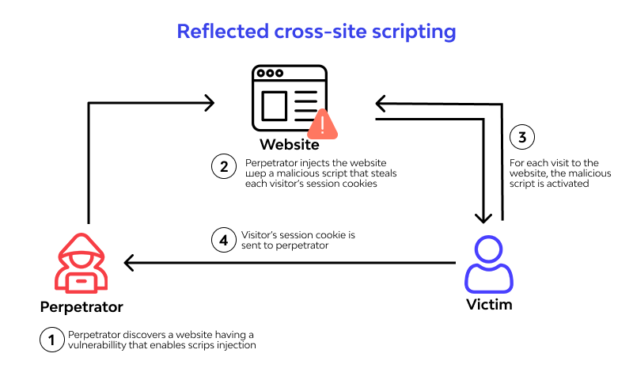
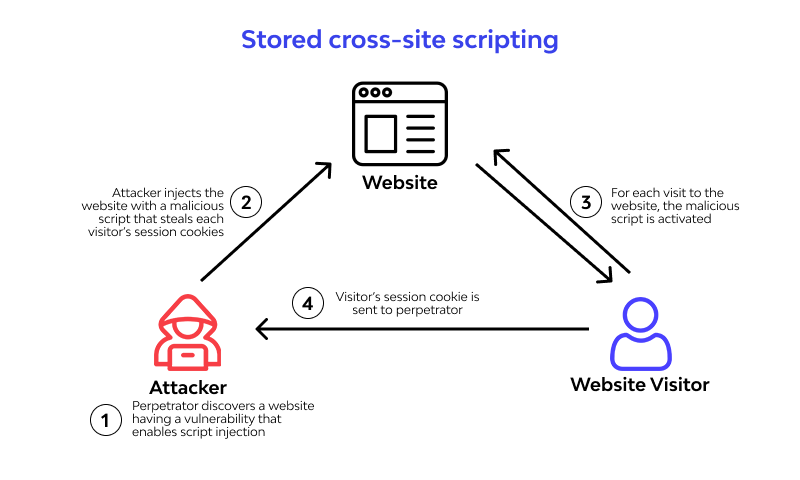

# XSS(cross site scripting)

## 능동적 공격과 수동적 공격

- 능동적 공격(active attack)
- 수동적 공격(passive attack)

## 능동적 공격

공격자가 웹 애플리케이션에 직접 공격 코드를 보내는 공격 유형

- **SQL 인젝션** : 데이터베이스를 조작하기 위해 SQL을 서버로 전송
- **OS 명령 인젝션** : OS를 조작하기 위해 명령을 서버로 전송

## 수동적 공격

공격자가 준비한 피싱 사이트를 이용해 웹 애플리케이션에 방문한 사용자가 직접 공격코드를 실행하도록 하는 방법

사용자가 스스로 공격코드를 실행하므로, 공격자가 직접 접근할 수 없는 인트라넷의 웹 애플리케이션이나 로그인 후의 페이지도 공격이 가능함

### 대표적인 수동적 공격

- XSS(cross site scripting)
- CSRF(cross site reqeust forgery)
- 클릭재킹(clickjacking)
- 오픈 리다이렉트(open redirect)

---

## XSS

웹 애플리케이션의 취약점을 이용해 악성 스크립트를 실행하는 공격

교차 출처 페이지에서 실행되는 자바스크립트 공격은 `동일 출처 정책`를 이용하여 방어할 수 있지만, XSS는 공격 대상 페이지에서 자바스크립트를 실행하므로 `동일 출처 정책`를 이용하여 막을 수 없다.

### XSS 구조

공격자가 페이지의 HTML에 악성 스크립트를 삽입해 사용자가 악성 스크립트를 실행하게 만드는 공격 방법

### XSS 위협

- 보안정보의 유출
  - 웹 애플리케이션의 보안 정보를 탈취해 공격자 서버로 전송

- 웹 애플리케이션 변조
  - 가짜 정보를 표시하기 위해 웹 애플리케이션 변조

- 의도치 않은 조작
  - 의도되지 않은 웹 애플리케이션 및 사용자의 조작 실행

- 사용자로 위장
  - 공격자가 사용자의 세션 정보를 취득해 사용자로 위장

- 피싱
  - 가짜 폼이 표시되어 사용자가 가짜 정보와 계정 정보(사용자 ID, 비밀번호 등_을 입력하고 이를 통해 중요한 개인 정보 유출)
  
## XSS 공격 중 큰 분류

> CWE(Common Weakness Enumeration : 공통 취약성 유형 리스트) 에서 분류하였음.

- 반사형 XSS(reflected XSS)
- 저장형 XSS(stored XSS)
- DOM 기반 XSS(DOM-based XSS)

### 반사형 XSS

공격자가 준비한 함정에서 발생하는 요청에 잘못된 스크립트를 포함하는 HTML을 서버에서 생성해 발생하는 XSS

요청된 코드를 응답 HTML에 그대로 출력하기 때문에 `반사형 XSS`라고 함.



### 저장형 XSS

공격자가 폼 등으로부터 제출한 악성 스크립트를 포함하는 데이터가 서버에 저장되고 데이터 내 악성 스크립트가 웹 애플리케이션 페이지에 반영되어 발생하는 XSS

악성스크립트를 포함하는 데이터가 서버에 저장되므로 `저장형 XSS`라고 함.

**등록되는 페이지를 보는 모든 사용자에게 영향을 미침**

반사형 XSS와 달리, 지속적으로 공격이 이루어 지므로, `지속형 XSS(persistent XSS)`라고도 함.

> 서버에 저장된 악성 스크립트를 포함하는 데이터를 삭제하거나, 애플리케이션의 코드를 수정해야 저장형 XSS피해를 멈출 수 있다.



### DOM 기반 XSS

자바스크립트로 DOM을 조작할 때 발생하는 XSS

`프론트엔드의 코드 결함때문에 발생`

DOM 기반 XSS는 브라우저의 기능을 사용할 때 발생된다.
브라우저의 기능은 `소스`와 `싱크`로 분류 할 수 있다.

XSS를 발생시키는 원인이 되는 것을 `소스`
소스의 문자열에서 자바스크립트를 생성하고 실행하는 것을 `싱크`라고 함.

#### 소스로 동작하는 기능의 대표적인 예

```javascript
location.hash
location.search
location.href
document.referrer
postMessage
Web Storage
indexedDB
```

#### 싱크로 동작하는 기능의 대표적인 예

```javascript
innerHTML
eval
location.href
document.write
jQuery()
```

---

### XSS 대책

1. 문자열 이스케이프 처리

문자열을 이스케이프 처리하여 HTML로 해석되지 않도록 해야 한다.

2. 속성값의 문자열을 쌍따옴표로 감싸기

쿼리 스트링안의 쌍따옴표`"`를 `&quot;`로 처리를 하면 문제가 발생하지 않도록 할 수 있다.

```html
<input type="text" value="&quot; onmouseover='alert(1)'"/>
```

3. 링크의 URL스키마를 http/https로 제한하기

쿼리 스트링의 값이 `http://` 또는 `https://`로 시작하는 지 확인하고 둘 중의 하나와 일치할 때만 값을 href 속성에 할당한다. 동적으로 할당할 때 문제가 없는지 확인해야 한다.

4. DOM 조작을 위한 메서드와 프로퍼티 사용

자바스크립트로 DOm을 조작할때 HTML로 해석하는 API 사용을 피하면 DOM 기반 XSS를 막을 수 있다.


```javascript
// innerHtml이 아닌, TextNode를 사용

const div = document.createElement('div');
div.textContent = text
document.body.appendChild(div)
```

5. 쿠키에 httpOnly 속성 추가

서버에서 쿠키를 발행할 때 httpOnly 속성을 부여하면 XSS에 의한 쿠키의 유출 위험을 줄일 수 있다.

httpOnly속성을 부여하면 자바스크립로 쿠키의 값을 가져올 수 없게 된다.

6. 프레임워크의 기능을 사용

`React, Vue.js, Angular`와 같은 프레임워크는 XSS가 발생하지 않도록 내부에서 자동으로 이스케이프를 처리한다.

7. DOMPurify 라이브러리 사용

8. Sanitizer API 사용

`Sanitizer APi`는 브라우저의 API이다.

DOMPurify와 같이, XSS의 원인이 되는 문자열을 제거한다.

---

## Content Security Policy로 XSS 대처하기

### CSP 개요

CSP는 서버에서 허용되지 않은 자바스크립트의 실행과 리소스 불러오기 등을 차단함.

CSP는 `Content-Security-Policy 헤더`를 `응답`에 포함하여 활성화 할 수 있다.

```bash
Content-Security-Policy : script-src *.trusted.example
```

`Content-Security-Policy 헤더`에 이정된 값을 `policy-directive`또는 간단하게 `directive`라고 한다.

`directive`는 콘텐츠 유형별로 리소스를 불러오는 방법을 제한한다.

```html
<head>
  <meta
    http-equv="Content-Security-Policy"
    content="script-src *.trusted.com"
  />
</head>
```

HTML에서도 `directive`를 설정할 수 있다. 그러나, HTTP 헤더에서 CSP 설정이 우선되거나 일부 설정을 사용할 수 없어 주의가 필요하다.


> CSP는 XSS등 인젝션 공격을 막기위한 브라우저의 기능이다. 강력하지만 동작시 문제가 생길 수 있으므로 모니터링을 하면서 적용해야 한다.