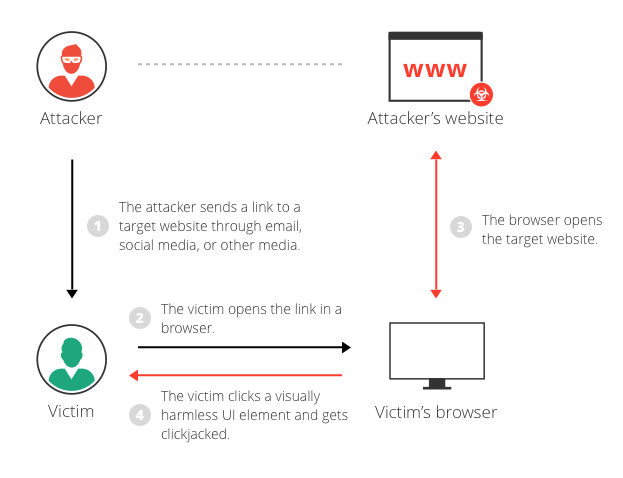

# 클릭재킹

`클릭재킹(clickjacking)`이란, 사용자의 의도와는 다르게 버튼 · 링크 등을 클릭하게 하여, 의도하지 동작이 실행되도록 하는 것이다.

## 클릭재킹의 구조

클릭재킹 공격은 iframe을 사용한 교차 출처 페이지의 삽입과 사용자에 의한 클릭에 의해 발생한다.

1. 공격 대상의 웹 애플리케이션 페이지를 iframe을 사용해 피싱 사이트와 중첩시킴

2. CSS를 사용햐 iframe을 투명하게 해 사용자에게 보이지 않게 한다.

3. 공격대상의 페이지에서 중요한 기능을 하는 버튼이 피싱 사이트의 버튼 위치와 중첩되오록 CSS로 조정

4. 피싱사 사이트에 접속한 사용자가 피싱 사이트에서 버튼을 클릭하도록 유도함.

5. 사용자가 피싱 사이트의 버튼을 클릭해도 실제로는 투명하게 겹쳐진 공격대상의 페이지 버튼이 클릭됨.

## 대책

클릭재킹을 막으려면 iframe와 같이 프레임에 페이지를 삽입하는 것을 제한해야 한다.

1. X-Frame-Options

`X-Frame-Options 헤더`를 추가하여 페이지에 프레임 내부에 삽입을 제한한다.

2. CSP frame-ancestors

`CSP`의 `frame-ancestors` directive는 프레임 내부에 삽입을 제한한다.

