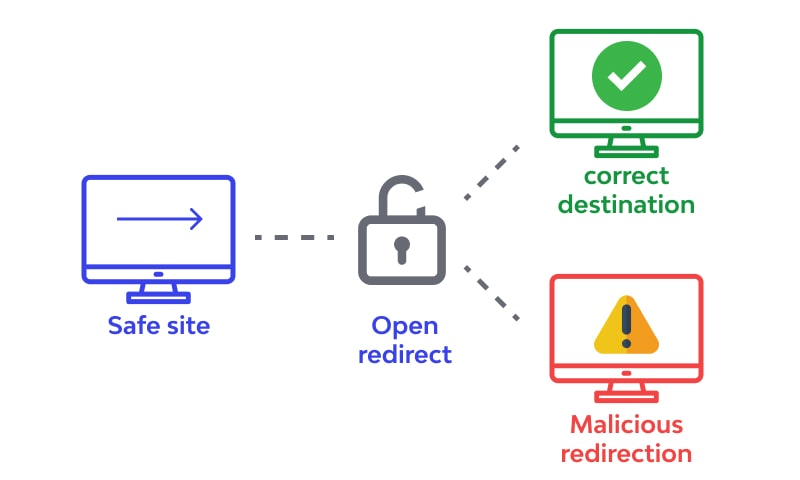

# 오픈 리다이렉트

`오픈 리다이렉트(open redirect)`란 리다이렉트 기능을 이용해 피싱 사이트 등 공격자가 준비한 페이지로 강제로 이동시키는 공격이다.

## 대책

1. URL검사를 통한 오픈 리다이렉트 대책

오픈 리다이렉트는 외부에서 파라미터에 지정된 URL을 그대로 사용해 이동함에 따라 발생하므로, 외부에서 입력한 URL을 체크해야 한다.

이동하려는 페이지가 특정 URL로 정해져 있다면 URL이 특정 URL에 해당하는지 체크해야 한다.

