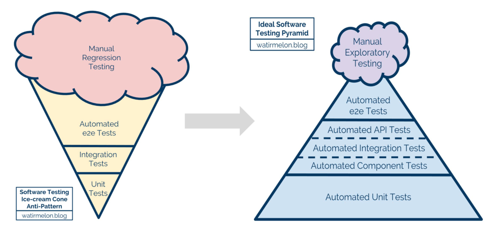
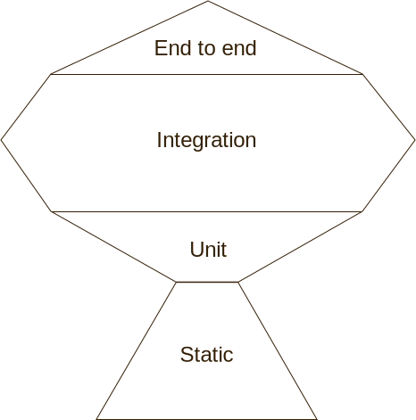

# 테스트 방법과 테스트 전략

> 웹 애플리케이션은 여러 모듈들을 조합하여 만드는데, 활용하는 모듈은 다음과 같다.

1. 라이브러리가 제공하는 함수
2. 로직을 담당하는 함수
3. UI 관련 함수
4. 웹 API 클라이언트
5. API 서버
6. 데이터베이스 서버

---

## 테스트 범위

- 정적 분석
  - 타입스크립트다 ESLint가 제공하는 기능을 활용

- 단위 테스트
  - 한 가지 모듈에 한정하여 해당 모듈이 제공하는 기능을 검증하는 테스트
  - 함수가 고려하지 못한 부분이 있는지 검증

- 통합 테스트
  - 모듈 조합으로 제공되는 기능을 검증하는 테스트
  - 테스트가 복잡해지면 범위를 좁혀서 통합 테스트를 실시해야 테스트 목적이 명확해짐

- E2E 테스트
  - 헤드리스 브라우저와 UI 자동화 도구를 결합하여 검증하는 테스트.
  - 실제로 애플리케이션을 사용할 떄와 가장 유사한 테스트

---

## 테스트 목적

- 기능 테스트(인터랙션 테스트)
  - 개발된 기능에 문제가 없는 검증하는 테스트
  - 프론트엔드의 대부분 기능은 UI 컴포넌트 조작(인터랙션)에서 시작되기 때문에 인터랙션 테스트가 기능 테스트가 될 때가 많으며 중요성이 높음.
  - 실제 브라우저 API를 사용하는 것이 중요한 테스트인 경우, 헤드리스 브라우저와 UI 자동화 도구를 사용하는 것이 좋음

- 비기능 테스트(접근성 테스트)
  - 접근성을 검증하는 테스트

- 회귀 테스트
  - 특정 시점을 기준으로 전후 차이를 비교하여 문제가 있는지 검증하는 테스트
  - 헤드리스 브라우저에 그려진 내용을 캡쳐하여 캡쳐한 이미지 간 차이를 검증
  - 초기에 렌더링 된 상태만 캡쳐하여 비교하는 것에 그치지 않고 사용자 조작으로 변경된 화면까지 캡쳐하여 비교

---

## 테스트 전략 모델

### 아이스크림 콘 모델과 테스트 피라미드 모델

단위 테스트 비중이 높을수록, 실행시간이 짧아 신속성이 높다.
신속성이 높기 때문에 자주 실행할 수 있어 안정성도 높아진다.

> 테스트 피라미드가 우수한 전략이라는 의견이 지배적

### 테스팅 트로피

---

> 테스트 코드를 너무 많이 작성하는 것은 아닌지 고민하여야 한다. 지나치게 많이 작성했을 경우 과감하게 줄여야 한다.