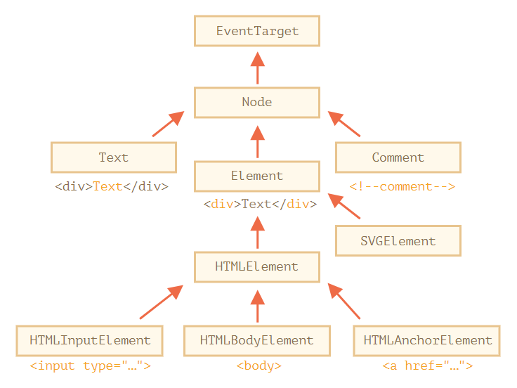

# 프론트엔드 필수 브라우저 101

# WEB APIs

Application Programming Interfaces

- DOM APIs
- Network APIs
- Graphics APIs
- Audio/Video APIs
- Devices APIs
- File APIs
- Storage ApIs

HTTPS(Hypertext Transfer Protocal Secure) - request, response

# Browser 구조 분석

- Window Object
- Document Object
- Navigator Object
- Browser Object Model

- DOM, BOM, JavaScript

# Window

- window.screen - window.screen.width, window.screen.height
- window.outer - window.outerWidth, window.outerHeight
- window.inner - window.innerWidth, window.innerHeight
- document.clientWidth

## coordinates(좌표)

좌측상단을 기준으로 (x, y) - 0, 0

- Element.getBoundingClientRect()
  - clientX, clientY : window창의 x,y의 값
  - pageX, pageY : 페이지 자체의 x, y의 값

## Window load

```jsx
// only document(html 만 로딩되면 실행)
// Tip : 리소스가 많은 경우에는 먼저 실행됨.
window.addEventListener("DOMContentLoaded", () => {
  console.log("DOMContentLoaded");
});

// after loaded(css, image 로딩이 끝난후 실행);
window.addEventListener("load", () => {
  console.log("load");
});

//before unload
window.addEventListener("beforeunload", () => {
  console.log("beforeunload");
});

// resource is being unloaded
window.addEventListener("unload", () => {
  console.log("unload");
});
```

## Window Coordinates

```jsx
special.addEventListener("click", (event) => {
  const rect = special.getBoundingClientRect();
  console.log(rect);
  console.log(`client : ${event.clientX}, ${event.clientY}`);
  console.log(`page : ${event.pageX}, ${event.pageY}`);
});

const btn = document.querySelector("ul");
btn.addEventListener("click", (event) => {
  let cl = event.target.getAttribute("class");
  console.log(cl);
  if (cl == "by") {
    window.scrollBy({
      top: 100,
      left: 0,
      behavior: "smooth",
    });
  } else if (cl == "to") {
    window.scrollTo(0, 100);
  } else {
    special.scrollIntoView();
  }
});
```

- window.scrollTo(x, y) - 창의 상대좌표를 기준으로 이동(현재 위치 기준)
- window.scrollBy(x,y) - 창의 절대좌표로 기준으로 이동(상단 모서리가 기준)
- window.scrollIntoVIew - 엘리먼트가 있는 곳으로 창의 스크롤이 이동함.

## DOM



<aside>
💡 모든 요소들의 조상은 EventTarget이다.

</aside>

## CSSON(CSS Object Model)


<aside>
💡 Render Tree에는 사용자 눈에 보이는 것들만 트리에 포함이 됨.

display:none;인 경우에는 Render Tree에 포함되지 않지만, visibility:hidden; opacity:0의 경우에는 Render Tree에 포함됨.

</aside>

## Critical Rendering Path

<aside>
💡 성능 보장 렌더링 순서

</aside>

1. HTML
2. request/response
3. loading
4. rendering(Render Tree 생성)
5. layout
6. painting

크게, Construction파트와 Operation로 나뉨

- Construction
  - DOM
  - CSSOM
  - RenderTree
- Operation

  - layout(Render Tree를 기반으로 레이아웃을 구성하는 단계)
  - paint

    - 브라우저 엔진마다 다양한 속성값에 따라 묶어서 레이어를 만듬
    - CSS는 성능개선을 위해 묶어서 레이어를 만들어 둠.
      <aside>
      💡 CSS will-change
      will-change를 너무 많이 남용하면, 브라우저가 레이어를 많이 만들게 됨.

      </aside>

  - composition

- **rendering tree 속도 개선**

  - Contruction
    - DOM 요소가 작으면 작을수록
      - 불필요한 태그 사용
      - 불필요한 div태그 남용
      - 쓸데없는 wrapping 클래스나 요소 사용
    - CSS 규칙이 작으면 작을수록 빠름
  - Operation

    - 클릭시 요소를 움직이거나, 애니메이션 사용시 paint가 적게 일어나도록 해야함.
      <aside>
      💡 애니메이션 사용시 layout단계가 다시 일어나게 되면 성능에 좋지 않음.

      </aside>

## css will-change

<aside>
💡 chrome - development tools - layers - DOM이 그리는 layer를 체크할 수 있음.

</aside>

CSS Triggers - [http://csstriggers.com/](http://csstriggers.com/) - CSS의 렌더링 단계가 나옴.

- top, left로 움직임을 제어하는 것보다 transform:translate(x,y)를 이요하는 것이 성능에 좋음.

## Performance

<aside>
💡 chrome - development tools - Performance탭을 이용해서 성능을 체크할 수 있음.

</aside>

1. Record를 눌러서 동작을 하고 Stop을 하게 되면, 프로파일링이 나타남.

   - 빨간색 : 경고
   - Summary에 Scripting, Rendering등 통계가 나타남.
   - 사용자가 부드럽다고 느끼기 위해서는 1초에 60frame이 화면에 보옂여져야 하는데.. 그렇게 하려면 한 frame이 16.67ms안에 이뤄져야 함.

     - 16ms가 넘어가는 순간 화면이 깜빡거린다고 인지할 수 있음. ( Layout shift )
       <aside>
       💡 **Warning** : Cumulative Layout Shifts can result in poor user experiences.

       </aside>

- **크롬 개발자 도구에서 Ctrl + Shift + p 를 누르면 팔레트가 나오는데, Show layout shift regions메뉴를 사용시 레이아웃이 어떻게 발생하고 있는지 나타난다.**

## DOM Control

- querySelector
- querySelectorAll
- appendChild
- insertBefore

## innerHtml vs element

```jsx
section.innerHTML = `
 

`;
```

`을 사용하면, 띄어쓰기와 줄바꿈도 적용할 수 있다.

부분적인 변화가 있을 경우에는 innerHTML을 사용시, DOM Tree와 RenderTree가 다시 그려지게 된다.

## Debugger

Source탭에서 코드가 적혀있는 숫자를 누르게 되면, BreakPoints가 생성됨.

Watch에서 현재 작동되고 있는 소스상태를 확인할 수 있음.

## 주석작성 요령

<aside>
💡 코드가 하는 것을 설명하는 주석은 불필요함.
코드를 봐도 빨리 이해할 수 있는 것들은 주석이 불필요함.
어떤 의도로 만들어졌는지, 어떻게 사용하는 것이 바람직한지.. 왜를 설명할 수 있는 주석이 좋다.

</aside>

## Event

Event Handler

```jsx
$0.addEventListner('click' () =>{console.log('clicked!')}); // 이벤트 핸들링
$0.removeEventListener('click', callback); // 이벤트 삭제
$0.dispatchEvent(new Event('click')); // 인공적으로 이벤트를 전달
```

### Event Captureing, Bubbling

대부분 bubbling을 제어하게 됨.

<aside>
💡 Event Bubbling 방지시 , event.stopPropagation() 과  stopImmediatePropagation()을 사용하는건 안좋을 수 있음. -> stopPropagation 것에서 다른사람이 이벤트 핸들링한 것에도 영향을 미칠 수 있음.

</aside>

<aside>
💡 preventDefault() 사용시 유의할 점 -

</aside>

### Event Deligation

<aside>
💡 부모컨테이너는 어떤 자식요소에서 이벤트가 발생하든 모든 이벤트를 들을 수 있음

</aside>

### 함수

```jsx
function add(num1, num2) {
  return num1 + num2;
}

const doSomething = add;
const result = doSomething(2, 3);
console.log(result); // 5;
const resutl2 = add(2, 3);
console.log(resutl2);

function surprise(operator) {
  const result = operator(2, 3); // add
  console.log(result);
}

// 매개변수로 add함수를 전달
surprise(add);
```

### boolean과 오퍼레이터 &&

```jsx
// false : 0, -0, '', null, undefined
// true : -1, 'hello, [],

let num; // undefined - false;

num && console.log(num);
// && - 앞이 true 여야 실행됨
```

### 클래스와 콜백함수

```jsx
class Counter() {
 constructor() {
  this.counter = 0;
 }

 increase() {
  this.counter++;
  console.log(this.counter);
  if (this.counter % 5 === 0) {
   console.log('yo!');
   runIf5Times(this.counter);
  }
 }
}

const collCounter = new Counter();
function printSomething(num) {
 console.log(`yo! ${num}`);
}

function alterNum(num) {
 alert(`Wow! ${num}`);
}

coolCounter.increase(printSomthing);
coolCounter.increase(alertNum);
```

```jsx
// refactoring
// constructor에 함수를 받도록 해서, 인자로 받아온것을 처리하도록 함.

class Counter() {
 constructor(runEveryFiveTimes) {
  this.counter = 0;
  this.callback = runEveryFiveTimes;
 }

 increase() {
  this.counter++;
  console.log(this.counter);
  if (this.counter % 5 === 0) {
   console.log('yo!');
   //콜백함수를 등록했을 떄에는 콜백이 없을때의 처리도 함께 해야 함
   this.callback && this.callback(this.counter);
  }
 }
}

function printSomething(num) {
 console.log(`yo! ${num}`);
}

function alterNum(num) {
 alert(`Wow! ${num}`);
}

const collCounter = new Counter(printSomething);
```
