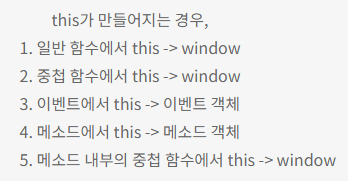

# This

<aside>
📌 함수 호출 방식에 의해 결정됨.

</aside>

- 자바스크립트 함수는 호출될 때, 매개변수로 전달되는 인자값 이외에 argument 객체와 this를 암묵적으로 전달받음.

---

- 호출방식에 의해 this에 바인딩할 객체가 결정된다.
- 함수가 선언될 떄, this에 바인딩할 객체가 정적으로 결정되는 것이 아닌, 함수를 호출할 때 함수가 어떻게 호출되었는지에 따라 바인딩할 객체가 동적으로 결정됨.

---

<aside>
⚠️ 함수의 상위 스코프를 결정하는 방식인 **렉시컬 스코프와 혼동하면 안됨.**

</aside>

