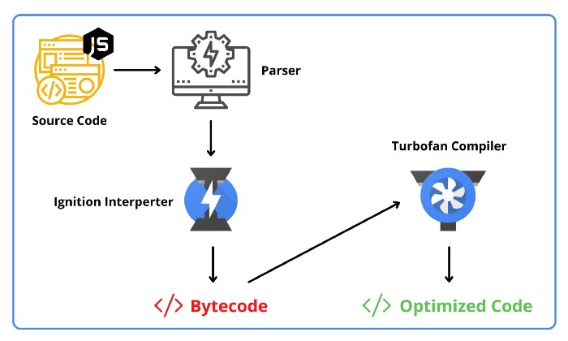
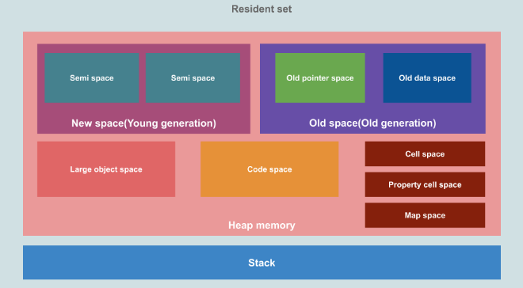

# V8 Engine

## V8 이란 ?

c++로 작성된 Google의 오픈 소스 고성능 javascript 및 웹 어셈블리 엔진이다. Chrome 및 Node.js 등에서 사용된다.

[ECMAScript](https://tc39.es/ecma262/) 및 [WebAssembly](https://webassembly.github.io/spec/core/) 를 구현 하고 x64, IA-32, ARM 또는 MIPS 프로세서를 사용하는 Windows 7 이상, macOS 10.12+ 및 Linux 시스템에서 실행됩니다. V8은 독립 실행형으로 실행되거나 모든 C++ 애플리케이션에 포함될 수 있습니다.

<aside>
🔥 - Google Chrome과 Node.js에서 사용되고 있는 구글에서 제작한 자바스크립트 엔진

- C++로 작성되었고 고성능의 자바스크립트 전용의 웹 어셈블리 엔진

</aside>

- **JIT(Just In Time) 컴파일 방식**
  - 자바스크립트를 인터프리터 하지 않고 즉시 기계어로 컴파일
    - **복잡한 최적화 과정은 바이트코드 컴파일러가 대신 해주므로 고려하지 않아도 된다.**
    - **바이트코드는 빠른 기계어 변환을 목적으로 설계되었기 때문에 일반적인 컴파일러보다 제작 과정이 수월**

- **V8 Ebgube Memory Structure**
  

  - **스택**
    - 메모리 영역
    - V8 프로세스마다 하나의 스택
    - 메서드, 함수 프레임, 원시 값, 객체 포인터를 포함한 정적 데이터가 저장
    - 호출된 함수는 스택의 맨 위에 푸시, 반환시 스택에서 제거
    - 메인 프로세스가 완료되면 힙의 객체는 스택에서 더 이상 포인터를 갖지 않고 고아가 됨.
  - **힙**

    - \*\*\*\*V8에서 객체 또는 동적인 데이터가 저장되는 공간
    - 메모리의 가장 큰 영역
    - 가비지 컬렉션이 발생됨

    - New Space(Young generation)
      - 새로운 객체가 저장되는 곳
      - 짧은 생명주기를 가짐
      - Scavenger(마이너 가비지컬렉션)에 의해 관리
    - Old space(Old generation)
      - 두 번의 마이너 가비지 컬렉션 주기동안 New space에서 살아남은 객체들이 이동되어 관리됨.
      - Major GC에 의해 관리
      - Large object space
        - 매우 큰 객체들이 존재하는 곳
        - 가비지 컬렉션에 걸리지 않음
      - Code space
        - 컴파일링된 코드를 저장하는 곳
        - 유일하게 실행 가능한 메모리가 있는 곳
      - Cell space, Property cell space, Map space
        - 각각 Cells, PropertyCells, Map를 포함
        - 각 영역은 페이지들고 구성되어 있으며, 각 페이지 크기는 Large object space를 제외하고 1MB

  - **가비지 컬렉션**

    - 스택은 운영체제에 의해 자동으로 관리되지만, 힙은 그렇지 않음.
    - 별도로 관리해야 함.
      <aside>
      🔥 참조 없는 객체(고아) 메모리를 해제하여 공간을 만듬

      </aside>

  - **Minor GC**
    - Scavenger라고도 하며, New space영역을 정리하는 역할
    - 새 객체를 위한 공간을 예약하려고 할 때마다 증가하는 할당 포인터가 있는데, 이 포인터가 공간의 끝에 도달하면 Minor GC가 트리거 됨.
    - Minor GC에서 사용한 Scavenger 알고리즘은 작은 데이터 크기에 적합함. 메모리 오버 헤드가 발생하므로 Old 영역에는 적합하지 않음.
  - **Major GC**
    - Major GC는 Old Space를 정리하는 역할
    - Old space가 공간이 부족하다고 판단할 때 트리거됨.
    - Major GC : Mark-Sweep-Compact 알고리즘을 사용하여 가비지컬렉터를 수행한다.
