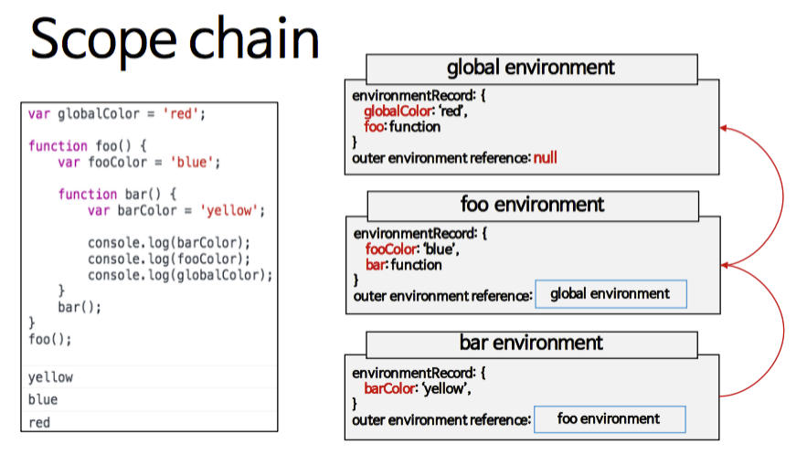

# 스코프 체인과 클로저

### 스코프 체인(Scope Chain)

- 스코프 : 유효범위
- for() {}, if{}와 같은 구문은 유효 범위가 없음. 함수만이 한 단위가 됨.
- 스코프 체인 : [[scope]]프로퍼티로 각 함수 객체 내에서 연결 리스트 형식으로 관리됨

<aside>
⚠️ 새롭게 정의된 스코프는 상위의 스코프에 접근할 수 있다.
스코프 체인은 scope의 가장 내부에서 scope chain을 따라 바깥쪽으로 검색을 하게 된다.

</aside>



참조 [: https://velog.io/@bathingape/스코프Scope와-클로저Closure-이해](https://velog.io/@bathingape/%EC%8A%A4%EC%BD%94%ED%94%84Scope%EC%99%80-%ED%81%B4%EB%A1%9C%EC%A0%80Closure-%EC%9D%B4%ED%95%B4)

```jsx
var var1 = 1;
var var2 = 2;
```

- 전역 실행 컨텍스트의 스코프 체인
  1. 전역 실행 컨텍스트 생성
  2. 변수 객체 생성

<aside>
💡 참조할 상위 컨텍스트가 없어, 자신이 최상위에 위치하는 변수 객체

</aside>

---

```jsx
var var1 = 1;
var var2 = 2;
function func() {
  var var1 = 10;
  var var2 = 20;
}

func();
```

- 함수 호출한 경우의 실행 컨텍스트의 스코프 체인
  1. 전역 실행 컨텍스트 생성
  2. 변수객체 생성
  3. func() 함수객체 생성
  4. func() 함수 실행

---

- 함수 실행에 따라 새로운 실행 컨텍스트가 생성됨.
  1. 함수 실행 컨텍스트 생성
  2. 실행된 함수의 [[scope]]프로퍼티를 복사
  3. 현재 생성된 변수 객체를 복사한 스코프 체인의 맨 앞에 추가
  4. func 변수 객체 - 전역객체

### 요약

<aside>
💡 각 함수 객체는 [[scope]]프로퍼티로 현재 컨텍스트의 스코프 체인을 참조한다.

</aside>

<aside>
💡 함수가 실행시 실행컨텍스트는 자신이 사용할 스코프 체인을 현재 실행되는 함수 객체의 [[scope]]프로퍼티를 복사하고, 새롭게 생성된 변수객체를 해당 체인의 제일 앞에 추가한다.

</aside>

<aside>
📌 스코프 체인  = 현재 실행 컨텍스트의 변수 객체 + 상위 컨텍스트의 스코프 체인

</aside>

---

## 클로저

<aside>
📌 이미 생명주기가 끝난 외부 함수의 변수를 참조하는 함수

</aside>

```jsx
function outerFunc() {
  var x = 10;
  var innerFunc = function () {
    console.log(x);
  };
  return innerFunc();
}

var inner = outerFunc();
inner();
```

1. 전역 실행 컨텍스트가 생성된다.
2. 변수객체의 inner, outerFunc가 생성되고, scope는 전역객체가 된다.
3. inner() - outerFunc()가 실행됨에 따라, outerFunc()실행 컨텍스트가 생성된다.

---

4.  outerFunc() 안의 변수 x, innerFunc가 생성되고, scope는 outerFunc 변수객체가 된다.

5.  outerFunc()가 innerFunc를 실행하며 리턴한다.

---

6.  innerFunc() 실행 컨텍스트가 생성된다.

7.  innerFunc()의 scope는 innerFunc안에 변수객체가 없음에 따라, outerFunc의 변수를 가르킨다.

    이에따라, innerFunc()의 scope는 outerFunc()가 된다.

<aside>
👉 outerFunc() 함수는 종료됐지만, innerFunc()의 실행컨텍스트는 유지되고 있다.

</aside>

<aside>
📌 JavaScript의 문구를 실행컨텍스트로 그려보는 연습을 해보는 것이 좋아보임.

</aside>
