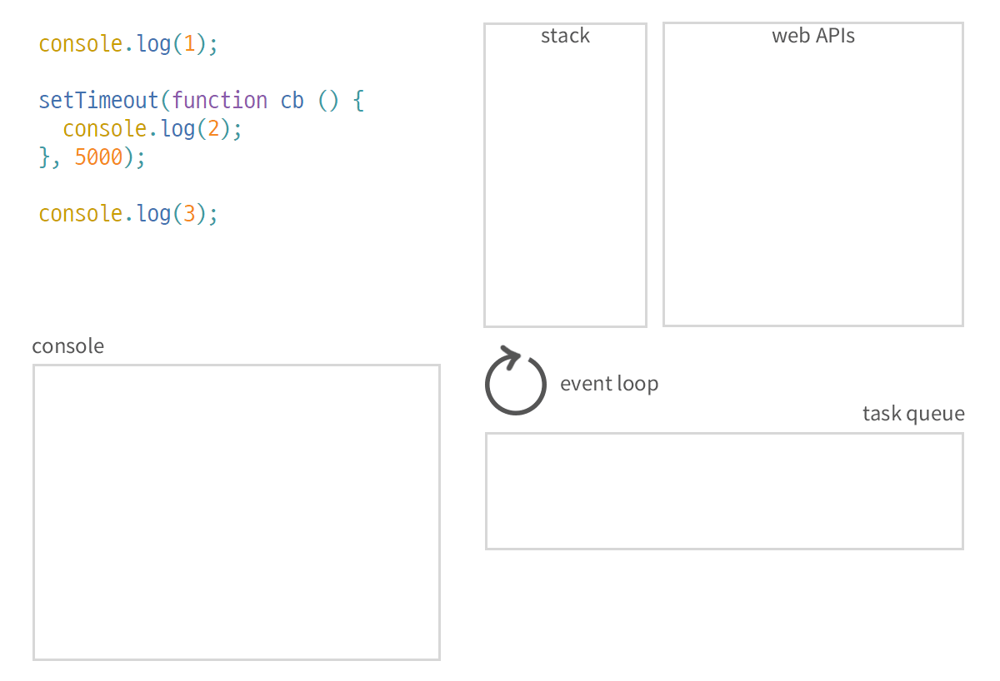

# 이벤트 루프

대부분의 자바스크립트 엔진은 크게 세가지 영역으로 나뉜다.

1. Call Stack
2. Task Queue(Event queue)
3. Heap

<aside>
📌 task queue에 줄 서 있는 callback함수들은 stack이 비어있을 때만 stack으로 이동할 수 있음.

</aside>

<aside>

자바스크립트는 오직 한번에 하나만의 작업을 수행한다.

</aside>

참고 : [https://im-developer.tistory.com/113](https://im-developer.tistory.com/113)
