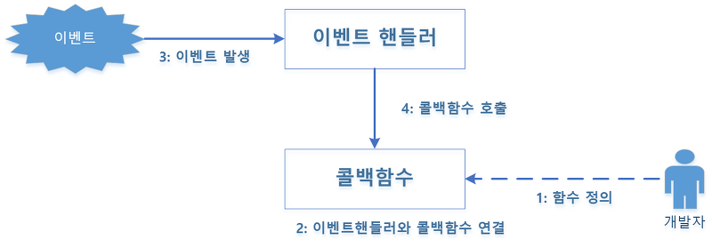

# 다양한 함수 형태

---

## 콜백 함수

<aside>
📌 명시적으로 호출하는 함수가 아닌, 특정시점에 도달했을때 시스템에서 호출되는 함수
특정 함수를 인자로 넘겨서, 코드 내부에서 호출되는 함수

**대표적으로 이벤트 핸들러 처리가 있음.**

</aside>



---

## 즉시 실행 함수(immediate functions)

<aside>
📌 함수를 정의함과 동시에 실행하는 함수

</aside>

```jsx
(function () { // statements })()
```

즉시 실행 함수의 경우, 같은 함수를 다시 호출할 수 없음에 따라, **최초 한 번의 실행만을 필요로 하는 초기화 코드 부분에 사용**할 수 있음.

---

## 내부 함수

```jsx
function parent() {
  var a = 100;
  var b = 200;

  function child() {
    var b = 300;
    console.log(a);
    console.log(b);
  }
  child();
}

parent(); // 100 , 300
child(); // Uncaught ReferenceError : child is not defined.
```

- 내부 함수에서는 자신을 둘러싼 부모 함수의 변수에 접근이 가능하다.
  - 스코프 체이닝에 의해 접근이 가능함.
- 내부 함수는 일반적으로 자신이 정의된 함수 내부에서만 호출이 가능하다.

---

### 함수를 리턴하는 함수

```jsx
var self = function () {
  console.log("a");
  return function () {
    console.log("b");
  };
};
self = self(); // a
self(); // b
```

함수를 실행하면서 변수에 재할당하여, 변수에는 return 값이 담기게 되어 b가 출력되게 된다.
