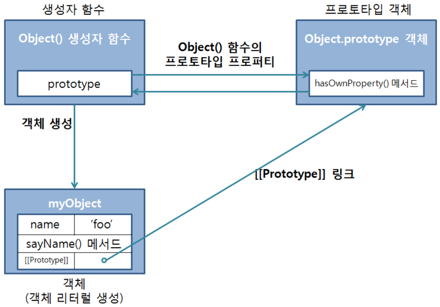

# 프로토타입 체이닝

### 프로토타입 - Prototype

<aside>
📌 객체 리터럴이나 생성자 함수로 객체를 생성했을때의 부모 객체

</aside>

### 프로토타입 링크 - [[Prototype]]

<aside>
📌 자바스크립트의 모든 객체가 가지고 있는, 자신의 부모인 프로토타입 객체를 가르키는 참조 링크 형태의 프로퍼티

</aside>

```jsx
function Person(name) {
  this.name = name;
}

var foo = new Person("foo");

console.log(Person);
console.log(foo);
```

<aside>
💡 ECMAScript에서는 [[Prototype]]를 내부적으로 사용된다고 명시하고 있지만, 크롬, 파이어폭스와 같은 브라우저들은 __**proto__** 프로퍼티로 명시적으로 제공하고 있음.
즉, [[Prototype]]과 __**proto__** 는 동일하다고 간주하면 됨.

</aside>

---

## 프로토타입 체이닝(Prototype Chaining)

<aside>
📌 자기 자신의 프로퍼티뿐만 아니라 자신의 부모 역할을 하는 프로토타입 객체의 프로퍼티에 접근가능한 것.

</aside>

---

### 1. 객체 리터럴 방식으로 생성된 프로토타입 체이닝

```jsx
var myObject = {
	name : 'foo',
	sayName : function () {
		console.log('My Name is' + this.name);
	}
};

myObject.sayName(); // My Name is foo;
console.log(myObject.hasOwnProperty('name'); // true;
console.log(myObject.hasOwnProperty('nickName'); // false;
myObject.sayNickName();
// Uncaught TypeError : Object #<Object> has no method 'sayNickName';

```


---

### 2. 생성자 함수로 생성된 객체의 프로토 타입 체이닝

```jsx
function Person(name, age, hobby) {
  this.name = name;
  this.age = age;
  this.hobby = hobby;
}

var foo = new Person("foo", 30, "tennis");

console.dir(foo.hasOwnProperty("name")); // true;
```



---

### 프로토 타입 체이닝의 종점

<aside>
📌 Object.prototype객체가 프로토타입 체이팅의 종점이다.

</aside>

- 객체 리터럴 방식이나 생성자 함수 방식에 상관없이 모든 자바스크립트 객체는 프로토타입 체이닝으로 Object.prototype 객체가 가진 프로퍼티와 메서드에 접근이 가능함.

---

---

### 프로토타입도 자바스크립트 객체

<aside>
📌 동적으로 프로퍼티를 추가 / 삭제가 가능함.

</aside>

---

### 디폴트 프로토타입은 다른 객체로 변경이 가능함.

---

### 객체의 프로퍼티 읽기나 메서드를 실행할 때만 프로토타입 체이닝이 동작함.
