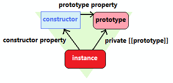

# 함수객체

<aside>
📌 자바스크립트에서는 함수도 객체다.
함수 자체가 일반 객체처럼 프로퍼티들을 가질 수 있다.

</aside>

```jsx
function add(x, y) {
  return x + y;
}

//add함수객체에 result, status프로퍼티 추가
add.result = add(3, 2); // add.resut == 5;
add.status = "OK";
```

---

<aside>
📌 일급객체(First Class)
1. 리터럴에 의해 생성
2. 변수, 배열의 요소, 객체의 프로퍼티등에 할당
3. 함수의 인자로 전달 가능
4. 함수의 리턴값으로 리턴 가능
5. 동적으로 프로퍼티를 생성 및 할당 가능

</aside>

---

### 함수 객체의 기본 프로퍼티

- length
- prototype
- name - 함수의 이름
- caller - 자신을 호출한 함수
- arguments - 호출할 때 전달된 인자값
- **proto** - 자바스크립트 객체가 자신의 프로토 타입을 가르키는 [[Prototype 내부 프로퍼티]]

---

### length 프로퍼티

함수를 작성할 때 정의한 인자 갯수를 출력함.(arguments의 갯수)

---

### prototype 프로퍼티

<aside>
📌 모든 함수는 객체로서 prototype 프로퍼티를 가지고 있음.
내부 프로퍼티인 [[Prototype]]과 혼동하면 안됨.

</aside>


