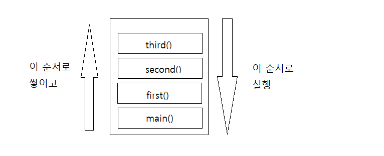

# 호출스택(Execution Stack)

<aside>
⚠️ JavaScript는 단일 쓰레드 프로그래밍 언어이므로, 단일 호출 스택이 있음. 
이는 한번에 하나의 일(Task)만 처리할 수 있다는 뜻.

</aside>

```jsx
function first() {
  second();
  console.log("첫 번째");
}
function second() {
  third();
  console.log("두 번째");
}
function third() {
  console.log("세 번째");
}
first();
third();
```



출처 -[https://www.zerocho.com/category/JavaScript/post/597f34bbb428530018e8e6e2](https://www.zerocho.com/category/JavaScript/post/597f34bbb428530018e8e6e2)

1. 자바스크립트 엔진이 script tag를 처음 만나면 전역컨텍스트를 만들고 현재 실행되고 있는 호출스택에 이를 push함.
2. 다른 함수가 호출되면 해당 함수에 대한 실행 컨텍스트를 생성하고 스택의 제일 꼭대기에 push한다.
3. 실행컨텍스트가 호출 스택에서 가장 위에 있는 함수를 실행한다. 함수가 할 일을 마치면 스택에서 제거됨.(pop)

<aside>
💡 호출 스택의 각 항목을 스택 프레임이라고 함.

</aside>

# 스택오버 플로우

- 스택의 사이즈를 초과했을 때 발생하는 오류
  재귀를 호출했을 때 일어날 수 있음.
  .png>)

  ```jsx
  function foo() {
    foo();
  }
  foo();
  ```

  foo()함수가 종료 조건없이 계속해서 호출하게 됨에 따라, 함수의 스택 프레임이 계속해서 호출스택에 쌓이게 됨.
  어떠한 시점에서 호출스택의 함수 호출 수가 호출 스택의 실제 크기를 초과하게 되고, 브라우저는 오류를 발생시키고 함수가 종료됨.

  ```jsx
  Uncaught RangeError : Maximum call stack size exceeded
  ```

# 단일 호출 스택의 문제점

<aside>
⚠️ 자바스크립트에서는 하나의 호출 스택만 있기 때문에, 하나의 함수 처리가 엄청 늘서 다른 함수 실행에 지장이 있을 수 있음.

</aside>

작업스택을 차지하고 있는 경우, 자바스크립트는 후속 작업들을 처리할 수 없음.

많은 작업을 처리하기 시작하면, 오랜시간 동안 응답을 멈출 수 있음.

## 해결방법

- 비동기 콜백(Asynchronos callbacks)
  비동기콜백은 즉시가 아닌, 특수한 시점에 실행되므로 스택안에 바로 push될 필요가 없음.
    <aside>
    ⚠️ 이벤트 큐(Event Queue)를 통해 비동기 콜백이 처리됨.
    
    </aside>
    
    출처 - [https://new93helloworld.tistory.com/358](https://new93helloworld.tistory.com/358)
