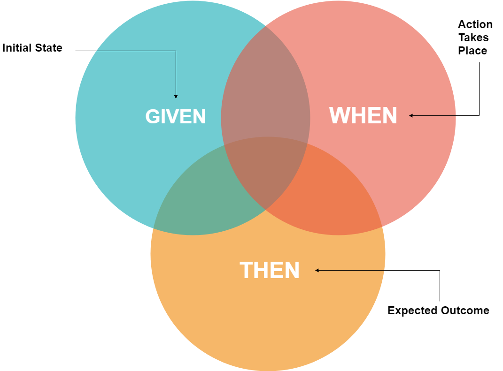

# React Testing Library

```text
키워드

- React Testing Library
- Given-When-Then 패턴
- Mocking
- Test fixture
```

> [React Testing Library](https://github.com/testing-library/react-testing-library)

> [jest-dom](https://github.com/testing-library/jest-dom)

>💡 React 컴포넌트를 사용자 입장에 가깝게 테스트할 수 있는 도구.

```typescript
import { render, screen } from '@testing-library/react';

import TextField from './TextField';

test('TextField', () => {
 const text = 'Tester';
 const setText = () => {
  // do nothing...
 };

 render((
  <TextField
   label="Name"
   placeholder="Input your name"
   text={text}
   setText={setText}
  />
 ));

 screen.getByLabelText('Name');
});
```

테스트 코드를 통해, 컴포넌트를 사용하는 코드를 작성하면서 해당 컴포넌트의 인터페이스를 점검할 수 있다.

개발하면서도 점검할 수 있지만, 테스트 코드를 먼저 작성했다면 문제를 더 빨리 발견해서 수정할 수 있다.

---

> BDD(Behavior Driven Development)


## BDD(Behavior Driven Development) : 행위주도 개발

TDD를 근간으로 파생된 개발 방법

시스템 동작의행위를 기반으로 한다.

> 테스트를 작성하기 보다는, 아직 존재하지 않은 코드에 대에 명세를 작성하는 것이라고 생각하면 쉽게 이해할 수 있다.

---

## Given-When-Then 패턴

- Given : 준비
- When : 실행
- Then : 검증

### Given

테스트를 준비하는 과정 : 테스트에 사용하는 변수, 입력 값을 정의하거나, Mock 객체를 정의한다.

### When

실제로 액션을 하는 테스트를 실행하는 과정

### Then

테스트를 검증하는 과정 : 예상한 값, 실제 실행을 통해서 나온 값을 검증한다.

---

## Desribe-Context-It

Describe : 설명할 테스트 대상을 명시. 테스트 대상이 되는 클래스, 메소드 이름을 명시.
Context :테스트의 대상이 놓인 상황을 설명. 테스트할 메소드에 입력할 파라미터를 설명.
It : 테스트 대상의 행동을 설명. 테스트 대상 메소드가 무엇을 리턴하는지 설명.

```typescript
// Jest

// jest에는 context가 별도로 없으므로, 알아볼 수 있게 별도의 변수 선언 및 할당

const context = describe;

describe('테스트 대상 : Given', () => {
  context('테스트 대상이 놓인 상황 : When', () => {
    it('테스트의 행동 : Then', () => {
      expect('예상' )
    })
  })
})
```

---

## Mocking

> mocking은 단위 테스트를 작성할 때, 해당 코드가 의존하는 부분을 가짜(mock)로 대체하는 기법

```typescript

// jest 에서 가짜 함수(mock function)을 생성할 수 있도록 제공

jest.fn()
```

---

외부 의존성이 큰 코드를 작성한다면, 해당 부분만 가짜로 구현할 수 있다.

```typescript
import { render, screen } from '@testing-library/react';

import App from './App';

jest.mock('./hooks/useFetchProducts', () => () => [
 {
  category: 'Fruits', price: '$1', stocked: true, name: 'Apple',
 },
]);

test('App', () => {
 render(<App />);

 screen.getByText('Apple');
});
```

일반적으로, 백엔드와 소통하는 부분이 차지하는 비중이 큰데, 이 부분을 하나씩 가짜 구현으로 바꾸다 보면 어려울 때가 있다. 이럴 땐 MSW 등 다른 대안을 고려해 봐야 한다.
