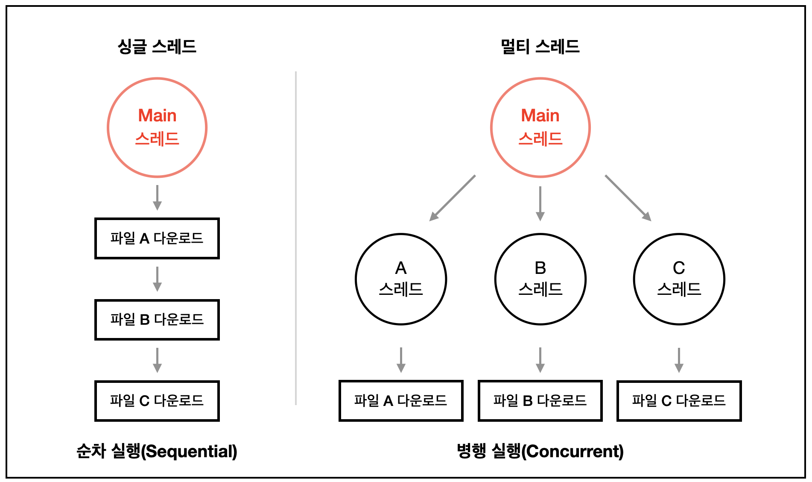

# Node.js

Node.js는 오픈소스 크로스 플랫폼 JavaScript 런타임 환경이다.

`V8 JavaScript`엔진으로 실행됨.

## Node.js의 특징

1. 싱글 스레드(Single Thread)

2. 비동기 I/O

---

## 스레드(Thread)

- 싱글 스레드(Single Thread)

  - 하나의 메인스레드만으로 작업을 처리

- 멀티 스레드(Multi Thread)

  - 두 개 이상의 스레드를 동시에 실행하여 처리

---

## 동기, 비동기 I/O

- 동기 I/O

  - 스레드가 행동에 들어가면, I/O요청이 완료될 때까지 기다려야 함.

- 비동기 I/O

  - 스레드는 커널의 도움을 받아 I/O 작업을 처리
  - 스레드는 요청을 커널에 즉시 전달하고 계속해서 다른 작업을 처리
  - 커널은 작업이 처리되었을 때, 스레드에 신호를 보내고, 스레드는 현재 작업을 중단하고 I/O 작업의 데이터를 필요한대로 처리하는 것으로 이 신호에 답함.

---
