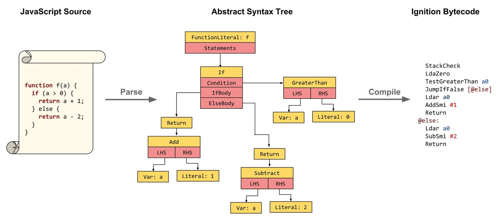

# [V8 JavaScript Engine](https://v8.dev/)

> C++로 작성된 Google의 오픈소스 고성능 JavaScript 및 WebAssembly 엔진

JavaScript는 실행 속도를 높이기 위해 `JIT(Just-In-Time) 컴파일`을 사용하여, 내주적으로 컴파일 됨.

>  ‌‌JIT 컴파일은 스크립트 실행 직전에 파싱 & 컴파일하기 때문에 오버헤드가 우려될 수 있습니다. 이에 대비해서 캐싱을 활용합니다.
 첫 컴파일 땐 캐시 데이터를 만듭니다. 나중에 똑같은 스크립트를 컴파일하려고 하면 인스턴스에서 캐시를 찾아 재사용합니다. ‌
‌...
 ‌‌캐시 생성도 비용이 요구됩니다. 그래서 이틀 내에 동일한 스크립트를 봤을 때 캐시를 만듭니다. 이렇게 하면 스크립트 파일을 평균 2배 이상 빠른 코드로 바꾸기 때문에 페이지 로딩 시 유저의 시간을 아낄 수 있습니다. 
-V8 블로그-

> 어떨 땐 메모리 할당 없이 실행하는 게 바람직할 수 있는데요. 일부 플랫폼(iOS, 스마트 TV, 게임 콘솔 등)은 가용 메모리에 접근할 수 없습니다. V8을 사용할 수 없단 얘기죠. 가용 메모리 작성을 금지하면 어플 악용을 위한 공격 표면(attack surface)을 줄일 수 있습니다.‌‌
...‌
 ‌V8의 JIT-less 모드는 이를 위한 모드입니다. jitless 플래그로 V8을 시작하면 런타임에 가용 메모리를 할당하지 않고 사용합니다. 
-V8 블로그-

## V8 엔진의 동작방식

1. V8엔진은 JS 소스 코드를 가져와 Parser에게 전달한다.
2. Parser는 소스 코드를 추상 구문 트리(AST)로 변환한다.
3. Parser는 Lexical Analysis 과정을 통해 코드를 토큰으로 분해한다.
이어서 Parser는 Syntax Analysis 과정을 진행한다. (이 때 문법 에러가 발견될 경우 에러 메세지 출력)
4. Parser는 위 두 과정을 거쳐 소스 코드를 추상 구문 트리(AST)로 만들어낸다.
Parser는 AST를 Ignition으로 전달한다.
5. Ignition은 전달받은 AST를 기반으로 ByteCode를 생성한다. (이 때 실행 컨텍스트가 생성됨)
6. Ignition은 ByteCode를 실행하고, 이 때 실제 JS 코드가 실행된다.
7. Ignition은 코드를 실행하면서 프로파일링 및 피드백 데이터를 수집하며, 수집된 정보들을 바탕으로 반복 사용 여부, 코드의 양, 그 외 여러 조건에 따라 TurboFan 컴파일러가 컴파일할지, SparkPlug 컴파일러가 컴파일 할 지 결정된다.

### Pharser

V8엔진이 JS 소스 코드를 가져와서 Parser에게 전달하면, Parser는 Lexical Analysis(어휘 분석)과정과 Syntax Analysis(구문 분석)과정을 거쳐 AST를 만들어내고, AST를 Ignition에 전달

### Lexical Analysis(어휘 분석)

> 파싱을 위해 낱말로 나눔

- 특수 토큰은 나누기, 정규 표현식 리터럴// 등이 있는데 소수이고, 나머지는 일반 토큰입니다.
- 예약어는 식별자로 못 씁니다. (변수명으로 사용 불가능)
- 지정어(keyword)는 그 언어체계에서 특별한 의미를 가진 단어. (if, while 등은 - 지정어 & 예약어다. 지정어 전부가 예약어는 아닙니다.)
- 예약어는 아주 특별한 경우에는 식별자로 사용할 수 있다. await는 async 함수 내에서만 예약어다. async 함수 밖에서는 변수명으로 아무런 문제 없이 사용할 수 있습니다. 의외로 let은 예약어가 아닙니다.
- 예약어는 아니지만 strict 모드에서는 식별자로 못 쓰는 말 : let, static, implements, interface, package, private, protected, public
- implements, private 같은 몇몇 단어는 future reserved words(예약 예정어).

### 문법 분석(Syntax Analysis)

> AST를 만듬. 
> 이 과정에서 문법 오류를 찾으면 `SyntaxError`가 나타남.

검사를 통과하면 토큰들로 구조체를 만드는데, 이를 ATS(abstract syntax tree, 추상 구문 트리)라고 부름 

### 바이트 코드 생성

>  “바이트 코드 생성 중에 BytecodeGenerator는 context object pointers(클로저 전반에 걸쳐 상태 유지에 사용) 등을 위해 함수 레지스터 파일에 레지스터를 할당합니다.” 
> 이그니션: V8 인터프리터 문서

바이트 코드는 나중에 실행할 때 `힙에 보관`

이 때 클로저 생성에 대한 준비를 미리 함.
클로저 자체는 함수를 실행해야 생김

### 컴파일

#### SparkPlug - 비최적화 컴파일러

파이프라인에서 Ignition과 TurboFan 컴파일러 사이에 존재하는 SparkPlug 컴파일러는 Ignition이 생성한 ByteCode를 기반으로 기계어 코드를 만들어낸다. 따라서 AST 분석에서 수행되는 변수 확인, 화살표 함수 확인, Desugaring(문법적 설탕을 제거한다는 뜻으로, ES6+ 문법을 이전 문법으로 변환, 전개연산자나 구조분해할당의 변환 등의 작업)등 작업들을 수행할 필요가 없다. AST 분석에서 수행되는 여러 과정들을 생략하므로 SparkPlug는 좀 더 빨리 컴파일을 수행할 수 있다. 파이프라인 상 SparkPlug 다음에 TurboFan 컴파일러가 존재하기 때문에 SparkPlug는 과도한 최적화를 수행할 필요가 없다.

#### TurboFan - 최적화 컴파일러

TurboFan 컴파일러 또한 AST 대신 Ignition이 생성한 ByteCode를 기반으로 하며, Ignition이 ByteCode를 실행하며 수집한 프로파일링과 피드백 데이터를 이용하여 히든 클래스, 인라인 캐싱 등 여러 최적화 기법을 적용한 기계어 코드로 변환한다. 또한 최적화가 더 이상 필요하지 않다고 판단되는 코드는 역최적화(Deoptimization)하여 다시 원래의 코드로 되돌리기도 한다.

#### 참고

- [웨일 브라우저 성능 및 메모리 최적화](https://www.slideshare.net/slideshow/ss-80845715/80845715#1)
- [Js는 인터프리터 언어일까, 컴파일 언어일까?](https://ryankim.hashnode.dev/js)
- 자바스크립트와 JIT컴파일(https://blog.cinntiq.synology.me/jit/)