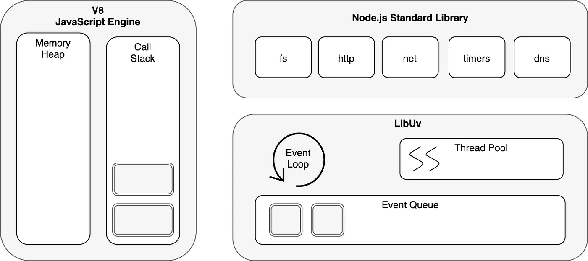
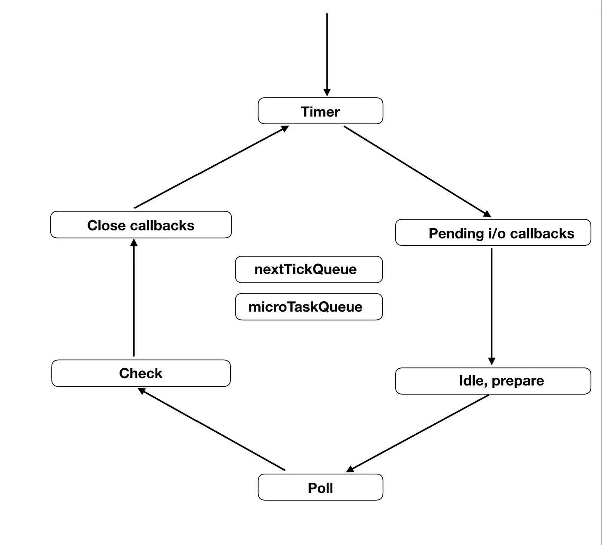

# Event Loop

> 브라우저에서의 이벤트 루프와 NodeJs의 이벤트 루프는 동작 차이가 있으므로, 이 부분도 공부가 필요해 보인다.

##  브라우저 이벤트 루프와 NodeJs의 이벤트 루프의 차이

- 브라우저

- NodeJs

[Difference between the Event Loop in Browser and Node Js?](https://dev.to/jasmin/difference-between-the-event-loop-in-browser-and-node-js-1113)

브라우저의 Context(컨텍스트)에서 이벤트는 웹페이지 에서 사용자 상호 작용(예: 클릭, 마우스 이동, 키보드 이벤트)이지만 노드의 컨텍스트에서는 비동기 서버 작업(예: File I/O 접근, Network I/O)을 말한다.

크롬브라우저는 libevent를 이벤트 루프 구현체로 사용하며 노드는 libuv를 사용한다. 그러므로 크롬, 노드의 이벤트 루프는 다른 라이브러리 라서 차이점도 있지만 이벤트 루프라는 프로그래밍 패턴의 유사점도 공유한다.

---

## Nodejs Event Loop

1. 요청이 들어오면 Event Loop가 해당 요청이 Blocking I/O인지 아닌지 판별합니다.
2. 커널의 비동기 I/O (윈도우의 IOCP, 리눅스의 AIO)의 지원을 받을 수 있는 Non-Blocking I/O 요청이면 커널의 interface로 해당 요청을 처리 한 후Event Queue에 callback을 등록합니다.
3. Blocking I/O라면 (예를 들면 File / Network 작업들) libuv 내의 별도의 Thread Pool에서 Worker Thread를 선택하여 작업을 위임합니다. Worker Thread는 작업을 완료한 후 Event Queue로 callback을 등록합니다.
4. Event Loop는 주기적으로 call stack이 비어있는지 체크하고 Event Queue에 실행 대기중인 callback이 있다면 callback들을 call stack으로 이동시켜 Main Thread에 의해 실행될 수 있게 만들어줍니다.

![[출처]: https://sjh836.tistory.com/149 (빨간색코딩 님)](./src/nodejs_eventloop.webp)

1. Timer
Timer 단계는 Event Loop의 시작 단계 입니다. 이 단계에서는 setInterval, setTimeout과 같은 타이머에 관련된 callback을 처리합니다. 타이머들이 호출 되자마자 Event Queue에 들어가는 아니고 내부적으로 min-heap 형태로 타이머를 구성하고 있다가 발동 단계가 되면 그때 Event Queue로 callback을 이동시킵니다.

2. Pending Callbacks
이 단계에서는 pending_queue에 들어있는 callback들을 실행합니다. pending_queue에는 이전 루프에서 완료된 callback (예를 들면, Network I/O가 끝나고 응답받은 경우) 또는 Error callback 등이 쌓이게 됩니다.

3. Idle, Prepare
Idle 에 함축된 뜻과는 다르게 Event Loop가 매번 순회할때마다 실행되며 4번째 단계인 Poll을 위한 준비작업을 하는 단계입니다.

4. Poll
대기중인 callback을 call stack으로 가장 많이 올려보내는 단계로 이 단계에서는 새로운 수신 커넥션을 위한 소켓과 데이터를 설정합니다. Poll 단계에서는 watch_queue를 바라보며 작업을 수행하는데 만약, Queue가 비어있지 않다면 배정받은 시간동안 Queue가 모두 소진될 때까지 모든 callback을 call stack으로 올려 실행시킵니다.

5. Check
Check 단계는 setImmediate() 만을 위한 단계입니다. 이 단계에서는 setImmediate를 사용하여 수행한 callback만 Event Queue에 쌓이고 call stack으로 올라갑니다.

6. Close Callbacks
Close 단계는 아래와 같은 close type의 callback을 관리하는 단계입니다.

### 참고

[Nodejs 이벤트 루프 파해치기](https://medium.com/zigbang/nodejs-event-loop%ED%8C%8C%ED%97%A4%EC%B9%98%EA%B8%B0-16e9290f2b30)

[nodejs의 내부 동작 원리 (libuv, 이벤트루프, 워커쓰레드, 비동기)](https://sjh836.tistory.com/149)