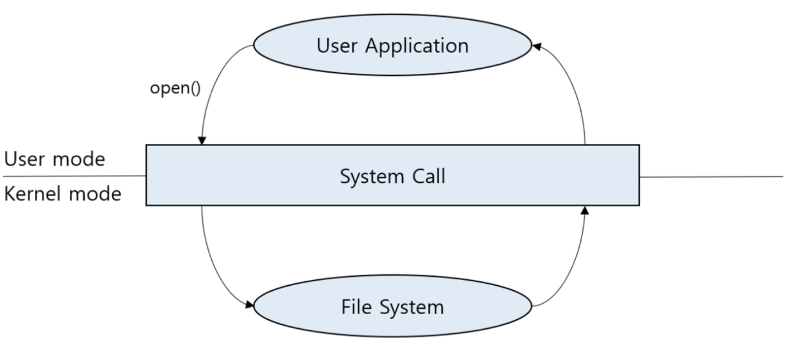
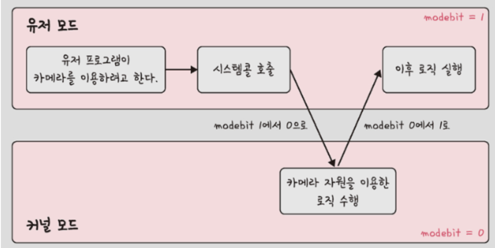
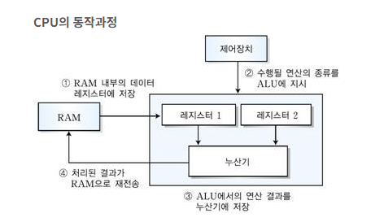

# 운영체제

## 운영체제와 컴퓨터

운영체제(OS, Operation System)은 사용자가 컴퓨터를 쉽게 다루게 해주는 인터페이스이다.

메모리나 시스템 자원을 호율적으로 분배함.

### 역할

1. CPU 스케쥴링과 프로세스 관리

2. 메모리 관리

3. 디스크 파일 관리

4. I/O 디바이스 관리

### 구조

#### 커널(Kernel)

자원에 접근하고 조작하는 기능, 프로그램이 올바르고 안전하게 실행되게 하는 기능을 담당하는 부분

---

#### OS에서 커널에 포함되지 않는 서비스

대표적으로, `사용자 인터페이스(User Interface)`는 포함되지 않는다.

##### 사용자 인터페이스의 종류

1. 그래픽 유저 인터페이스(GUI)

2. 커맨드라인 인터페이스(CLI)

---

### 이중모드

`이중모드`를 통해, CPU가 명령어를 실행하는 모드를 변경할 수 있다.

크게 `커널 모드`와 `사용자 모드`가 있다.

#### 커널 모드(Kernel Mode) , 슈퍼바이저 모드(Supervisor Mode)

운영체제 서비스를 제공받을 수 있는 실행 모드

커널 영역의 코드를 실행할 수 있는 모드이므로 CPU가 커널 모드로 명령어를 실행하면 자원에 접근하는 명령어를 비롯한 모든 명령어를 실행할 수 있음.

#### 사용자 모드(User Mode)

운영체제 서비스를 제공받을 수 없는 실행 모드

커널 영역의 코드를 실행할 수 없는 모드.

일반적인 응용프로그램 실행은 사용자모드로 실행되며, CPU는 입출력 명령어와 같이 하드웨어 자원에 접근하는 명령어를 실행할 수 없음.

---

### 시스템 호출(System Call)

사용자 모드로 실행되는 프로그램이 커널모드로 전환하여 운영체제의 서비스를 받기 위한 요청

`사용자 모드 > 커널 모드`

#### modebit

시스템 콜이 동작될때 `modebit`을 참고하여 유저모드와 커널모드를 구분한다.

1또는 0의 값을 가지는 플래그 변수이다.

0 : kernel mode

1 : user mode

---

## 컴퓨터의 요소

### CPU(Central Processing Unit)

산술논리연산장치, 제어장치, 레지스터로 구성되어 있는 컴퓨터 장치

인터럽트에 의해 단순히 메모리에 존재하는 명령어를 해석해서 실행하는 일꾼

#### 제어 장치(CU : Control Unit)

프로세스 조작을 지시하는 CPU의 한 부품

입출력장치 간 통신을 제어하고 명령어들을 읽고 해석하며 데이터 처리를 위한 순서를 결정

#### 레지스터(Register)

CPU 안에 있는 매우 빠른 임시기억장치를 가르킴

CPU와 직접 연결되어 있어 연산속도가 메모리보다 빠름

CPU는 자체적으로 데이터를 저장할 방법이 없기 때문에 레지스터를 거쳐 데이터를 전달함.

#### 산술논리 연산장치(ALU, Arithmetic Logic Unit)

덧셈, 뺼셈과 같은 산술연산과 논리합, 논리곱 같은 논리 연산을 계산하는 데이터 회로

---

### 인터럽트

어떤 신호가 들어왔을 때 CPU를 잠깐 정지시키는 것

인터럽트가 발생되면, 인터럽트 핸드러 함수가 모여있는 `인터럽트 벡터`로 가서 `인터럽트 핸들러 함수`가 실해됨.

> 인터럽트 벡터 : 인터럽트 종류마다 번호를 정하여 번호에 따라 처리해야 할 코드의 위치를 가르키틑 포인터로 구성된 자료구조

> 인터럽트 핸들러 : 인터럽트를 처리하는 루틴, 인터럽트 서비스 루틴(ISR)라고도 부른다.

#### 인터럽트의 종류

1. 하드웨어 인터럽트(외부 인터럽트)

   - 정전 및 기계적 오류에 의한 인터럽트

   - 조작원의 의도적 조작이나 타이머에 정해진 시간이 경과되었을 떄 발생하는 인터럽트

   - 조작원이나 다른 프로세서에 의해 재시작 명령이 도착했을 때 실행되는 인터럽트

   - 키보드, 마우스를 연결하는 일 등 IO 디바이스에서 발생하는 인터럽트

2. 내부 인터럽트

   - 예외(exception)

     - 프로그램의 오류로 발생하는 인터럽트, 예측하기 어렵지만 자주 발생하지는 않는다.

     - 나누기-0, 보호영역 메모리 접근, 미정의 명령어 사용, 오버플로우 등

   - 트랩(trap)

     - 명시적으로 예외조건을 생성하는 명령, 발생시점이 일정하고 동기적이다.

     - 고의적으로 운영체제를 호출하여 `사용자 모드 > 커널 모드`로 진입한다.

#### 인터럽트의 우선순위

1. 정전에 의한 인터럽트

2. 기계 오작동에 의한 인터럽트

3. 입출력 인터럽트

4. 예외 인터럽트

5. 트랩에 의한 인터럽트

#### 인터럽트의 처리(ISR)

1. 인터럽트 요청 신호 검출

2. 인터럽트 우선순위 제어 및 허용 여부 판단

3. ISR의 시작 번지 확인

4. 복귀 주소 및 레지스터 저장

5. ISR 실행

6. 인터럽트된 프로그램으로 복귀

---

### DMA 입출력

I/O 디바이스가 메모리에 직접 접근할 수 있도록 하는 하드웨어 장치

입출력 장치와 메모리 사이에 전송되는 모든 데이터가 CPU를 거치게 되면, CPU의 부담이 생기므로 CPU를 거치지 않고 상호작용할 수 있는 방식인 DMA(Direct Memory Access)가 등장함.

DMA입출력을 하기 위해서는 `DMA 컨트롤러`가 필요함.

#### DMA 입출력 과정

1. CPU는 DMA 컨트롤러에 입출력장치의 주소, 수행할 연산(읽기, 쓰기), 읽거나 쓸 메모리 주소 등과 같은 정보로 입출력 작업을 명령

2. DMA 컨트롤러는 CPU 대신 장치 컨트롤러와 상호작용하며 입출력 작업을 수행, 필요한 경우 메모리에 직접 접근하여 정보를 읽거나 씀.

3. 입출력작업이 끝나면 DMA 컨트롤러는 CPU에 인터럽트를 걸어 작업이 끝났음을 알림

---

### 메모리(Memory)

전자회로에서 데이터 상태, 명령어 등을 기록하는 장치

보통 RAM(Random Access Memory)를 일컬음.

---

### 타이머(Timer)

몇 초 안에는 작업을 끝내야 한다는 것을 정하고 특정 프로그램에 시간제한을 다는 역할

---

### 디바이스 컨트롤러(Device Controller)

컴퓨터와 연결되어 있는 IO 디바이스들의 작은 CPU를 말함
