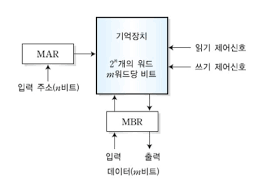
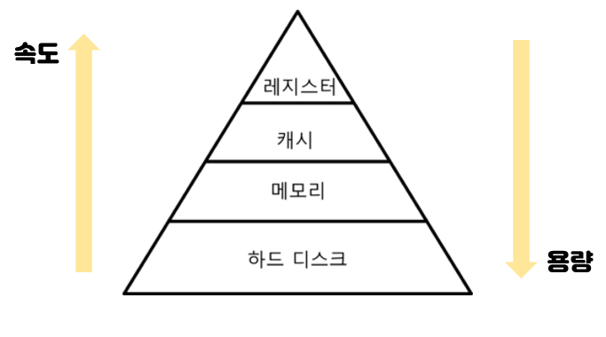

# 운영체제

## 메모리

CPU는 `메모리`에 롤라와 있는 프로그램의 명령어들을 실행할 뿐이다.

### CPU와 메모리

CPU와 메모리는 물리적으로 메인보드의 노스브릿지를 통해 연결된다.

- CPU와 노스브릿지를 연결하는 통로는 전면버스(FSB - Front Side Bus)라고 함.
- 노스브릿지와 메모리 슬롯 사이를 연결하는 통로는 메모리 버스(Memory Bus)라고 함.

노스브릿지는 CPU와 메인보드 사이의 데이터 통신을 관리하는 칩셋에 불과함.

메모리로는 주로 DRAM이 사용되며, CPU는 메모리 버퍼 레지스터(MBR)와 메모리 주소 레지스터(MAR)을 사용하여 메모리와 데이터를 교환한다.

### 메모리 계층 구조

#### 지역성 원리

프로그램의 10% 미만이 실행 시간의 90% 이상을 차지한다고 알려져 있는데, 이와 같은 경향을 지역성 원리(principle of locality) 또는 참조의 지역성(locality of references)라고 함.

##### 시간적 지역성(temporal locality)

최근에 참조된 명령어나 데이터가 가까운 미래에 다시 참조되는 경향 (시가적 국부성이라고도 함.)
> 반복문의 경우, 명령어와 데이터에 반복 접근하므로 방금 사용한 명령어와 데이터가 곧 다시 사용되는 경향이 있음.

##### 공간적 지역성(spatial locality)

최근에 참조된 명령어나 데이터의 이웃이 가까운 미래에 참조되는 경향 (공간적 국부성이라고 함)
> 순차적으로 실행되는 코드의 경우, 현재 실행된 명령어의 가까운 곳에 있는 명령어가 곧 참조될 가능성이 높다.

### 메모리 계층

CPU와 메모리의 속도차이를 계층적 메모리(hierarchical memory) 시스템을 사용하여 극복할 수 있다.

`메모리 계층 구조`는 속도와 용량이 서로 다른 다수의 계층으로 구성된 메모리 구조를 의미한다.

|메모리 계층|설명|특징|속도|기업용량|
|---|---|---|---|---|
|레지스터|CPU안에 있는 작은 메모리|휘발성|속도 가장 빠름|기억 용량이 가장 작음 |
|캐시|L1, L2 캐시를 지칭|휘발성|속도 빠름 빠름|기억 용량이 작음 |
|주기억장치|RAM을 가르킴|휘발성|속도 보통|기억 용량 보통 |
|보조기억장치|HDD, SDD를 일컬음|휘발성|속도 낮음|기억 용량이 많음 |

 

메모리 계층 구조는 다수의 계층으로 구성되지만 데이터의 전송은 한 번에 인접한 두 계층에서만 이루어진다.

각 계층간의 데이터 전송 단위가 다르며, 하위 계층 간의 전송단위가 상위 계층간의 전송 단위보다 큼

- 워드 : 최상위 계층인 CPU 레지스터와 캐시 메모리 사이의 데이터 전송 단위
- 블록 : 차상위 계층인 캐시 메모리와 메인 메모리 사이의 데이터 전송 단위로 라인이라고 함.
- 페이지 : 메인 메모리와 최하위 계층인 보조기억장치 사이의 데이터 전송 단위

---

## RAM

RAM에는 실행할 프로그램의 명령어와 데이터가 저장됨.

|저장장치|특징|예|
|---|---|---|
|휘발성 저장장치|전원을 끄면 저장된 내용이 사라짐| - |
|비휘발성 저장장치|전원을 꺼져도 저장된 내용이 유지됨| 하드디스크, SSD등 |

CPU는 보조기억장치에 직접 접ㄱ느할 수 없으므로, 비휘발성 저장 장치에는 `보관할 대상`을 저장하고, 휘발성 저장장치인 RAM에는 `실행할 대상`을 저장함.

CPU가 실행하고 싶은 프로그램이 보조기억장치에 있따면 이를 RAM으로 저장한 후 실행함.

