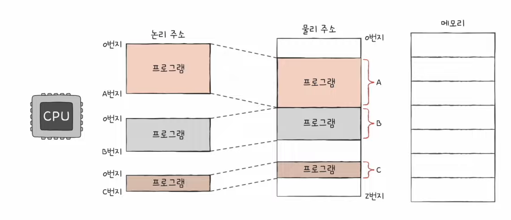
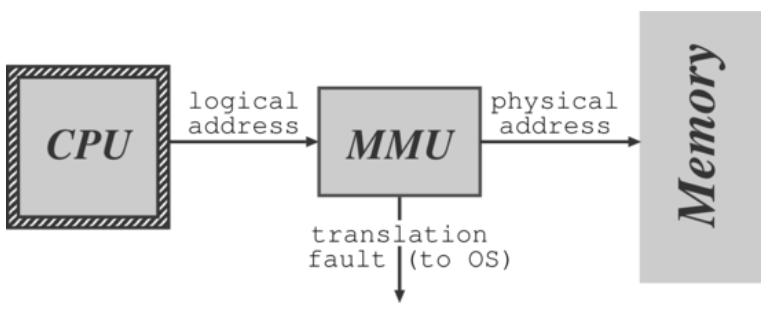
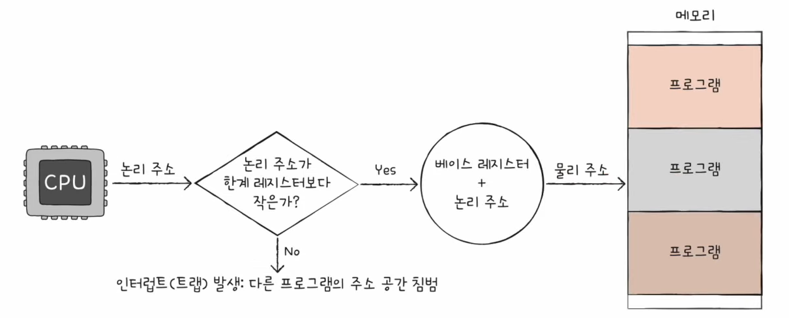

# 운영체제

## 메모리

CPU는 `메모리`에 롤라와 있는 프로그램의 명령어들을 실행할 뿐이다.

### CPU와 메모리

CPU와 메모리는 물리적으로 메인보드의 노스브릿지를 통해 연결된다.

- CPU와 노스브릿지를 연결하는 통로는 전면버스(FSB - Front Side Bus)라고 함.
- 노스브릿지와 메모리 슬롯 사이를 연결하는 통로는 메모리 버스(Memory Bus)라고 함.

노스브릿지는 CPU와 메인보드 사이의 데이터 통신을 관리하는 칩셋에 불과함.

메모리로는 주로 DRAM이 사용되며, CPU는 메모리 버퍼 레지스터(MBR)와 메모리 주소 레지스터(MAR)을 사용하여 메모리와 데이터를 교환한다.

---

## 메모리 계층 구조

### 지역성 원리

프로그램의 10% 미만이 실행 시간의 90% 이상을 차지한다고 알려져 있는데, 이와 같은 경향을 지역성 원리(principle of locality) 또는 참조의 지역성(locality of references)라고 함.

 

#### 시간적 지역성(temporal locality)

최근에 참조된 명령어나 데이터가 가까운 미래에 다시 참조되는 경향 (시가적 국부성이라고도 함.)

> 반복문의 경우, 명령어와 데이터에 반복 접근하므로 방금 사용한 명령어와 데이터가 곧 다시 사용되는 경향이 있음.

 

#### 공간적 지역성(spatial locality)

최근에 참조된 명령어나 데이터의 이웃이 가까운 미래에 참조되는 경향 (공간적 국부성이라고 함)

> 순차적으로 실행되는 코드의 경우, 현재 실행된 명령어의 가까운 곳에 있는 명령어가 곧 참조될 가능성이 높다.

---

### 메모리 계층

CPU와 메모리의 속도차이를 계층적 메모리(hierarchical memory) 시스템을 사용하여 극복할 수 있다.

`메모리 계층 구조`는 속도와 용량이 서로 다른 다수의 계층으로 구성된 메모리 구조를 의미한다.

| 메모리 계층  | 설명                     | 특징   | 속도           | 기업용량              |
| ------------ | ------------------------ | ------ | -------------- | --------------------- |
| 레지스터     | CPU안에 있는 작은 메모리 | 휘발성 | 속도 가장 빠름 | 기억 용량이 가장 작음 |
| 캐시         | L1, L2 캐시를 지칭       | 휘발성 | 속도 빠름 빠름 | 기억 용량이 작음      |
| 주기억장치   | RAM을 가르킴             | 휘발성 | 속도 보통      | 기억 용량 보통        |
| 보조기억장치 | HDD, SDD를 일컬음        | 휘발성 | 속도 낮음      | 기억 용량이 많음      |

 

메모리 계층 구조는 다수의 계층으로 구성되지만 데이터의 전송은 한 번에 인접한 두 계층에서만 이루어진다.

각 계층간의 데이터 전송 단위가 다르며, 하위 계층 간의 전송단위가 상위 계층간의 전송 단위보다 큼

- 워드 : 최상위 계층인 CPU 레지스터와 캐시 메모리 사이의 데이터 전송 단위
- 블록 : 차상위 계층인 캐시 메모리와 메인 메모리 사이의 데이터 전송 단위로 라인이라고 함.
- 페이지 : 메인 메모리와 최하위 계층인 보조기억장치 사이의 데이터 전송 단위

---

## RAM

RAM에는 실행할 프로그램의 명령어와 데이터가 저장됨.

| 저장장치          | 특징                               | 예                |
| ----------------- | ---------------------------------- | ----------------- |
| 휘발성 저장장치   | 전원을 끄면 저장된 내용이 사라짐   | -                 |
| 비휘발성 저장장치 | 전원을 꺼져도 저장된 내용이 유지됨 | 하드디스크, SSD등 |

CPU는 보조기억장치에 직접 접ㄱ느할 수 없으므로, 비휘발성 저장 장치에는 `보관할 대상`을 저장하고, 휘발성 저장장치인 RAM에는 `실행할 대상`을 저장함.

CPU가 실행하고 싶은 프로그램이 보조기억장치에 있따면 이를 RAM으로 저장한 후 실행함.

 

### RAM의 용량과 성능

CPU가 실행하고 싶은 프로그램이 보조기억장치에 있다면 이를 RAM으로 가져올 때, RAM의 용량이 적다면 보조기억장치에서 실행할 프로그램을 가져오는 일이 잦아 실행시간이 오래 걸림.

RAM 용량이 커지면 프로그램 실행 속도가 어느 정도 증가하는 것은 맞지만, 용량이 필요 이상으로 커졌을 때 속도가 그에 비례하여 증가하지는 않음.

 

### RAM의 종류

|           | DRAM            | SRAM        |
| --------- | --------------- | ----------- |
| 재충전    | 필요함          | 필요 없음   |
| 속도      | 느림            | 빠름        |
| 가격      | 저렴함          | 비쌈        |
| 집적도    | 높음            | 낮음        |
| 소비 전력 | 적음            | 높음        |
| 하용 용도 | 주기억장치(RAM) | 캐시 메모리 |

### DRAM의 성능 향상

- SDRAM(Synchoronous Dynamic RAM)

  - 클럭 신호와 동기화된, 발전횐 형태의 DRAM
  - 클럭 타이밍에 맞춰 CPU와 정보를 주고받을 수 있음

- DDR SDRAM(Double Data Rate SDRAM)
  - `대역폭`을 높여 속도를 빠르게 만든 SDRAM
  -

> 대역폭(date rate) : 데이터를 주고받는 길의 너비(자동차 도로에 비유할 수 있음.)

---

## 메모리의 주소 공간

1. 물리주소 : 메모리 하드웨어가 사용하는 주소
2. 논리주소 : CPU와 실행 중인 프로그램이 사용하는 주소

### 물리주소(Physical Address)

하드웨어상의 주소를 의미

### 논리주소(Logical Address)

실행 중인 프로그램 각각에게 부여된 0번지부터 시작되는 주소

> 논리주소와 물리 주소 간의 변환은 CPU와 주소 버스 사이에 위치한 `메모리 관리 장치(MMU : Memory Management Unit)`에 의해 수행됨.

### MMU

논리주소를 물리주소로 변환하며, 메모리를 보호하기 위해 메모리 접근 제어, 캐시 메모리 관리, 버스 중재등의 역할을 수행함.

---

## 메모리 보호 기법

다른 프로그램의 영역을 침범할 수 있는 명령어는 위험하기 때문에 논리 주소 범위를 벗어나느 명령어 실행을 방지하고 실행 중인 프로그램이 다른 프로그램에 영향을 받지 않도록 보호할 방법이 필요하다.
이를 `한계 레지스터(limit register)`가 담당한다.

접근하고자 하는 논리 주소가 한계 레지스터보다 작은지를 검사함으로써 메모리 내의 프로그램을 보호할 수 있음.

