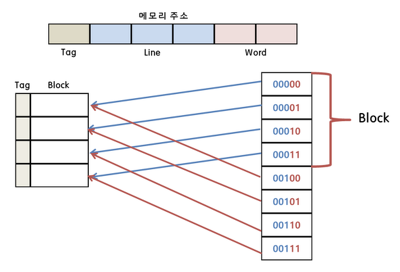
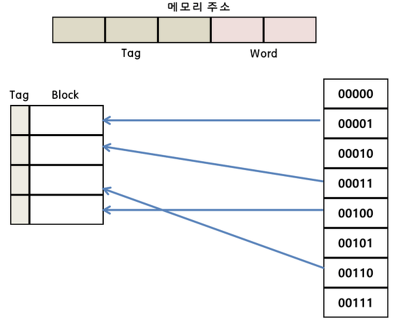
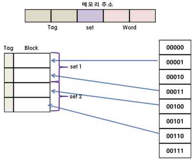
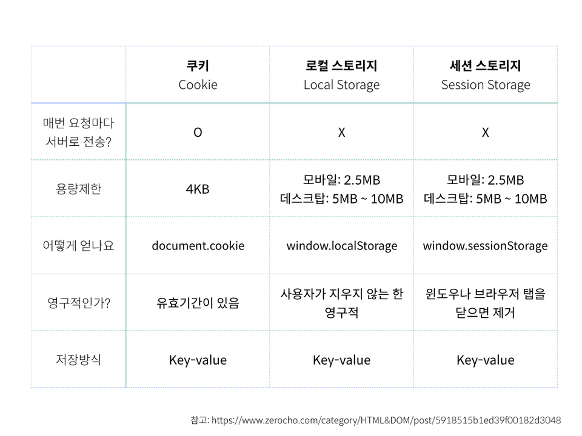
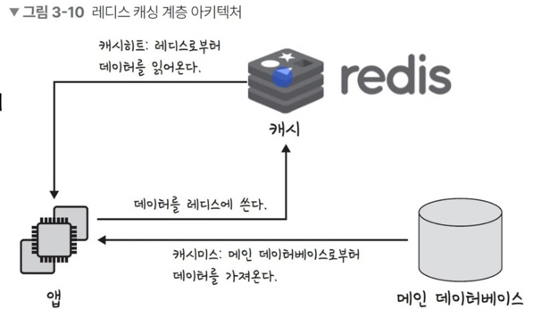

# 운영체제

## 캐시 메모리

데이터를 미리 복사해 놓는 임시 저장소이자 빠른 장치와 느린 장치의 속도 차이에 따른 병목 현상을 줄이기 위한 메모리를 말한다.

데이터를 접근하는 시간이 오래 걸리는 경우를 해결하고 다시 계산하는 시간을 절약할 수 있다.

CPU와 메모리간 속도차이가 크기 때문에, 중간에 `레지스터 계층`을 둬서 속도 차이를 해결한다.

계층과 계층 사이에 있는 계층을 `캐싱 계층`이라고 한다.

## 캐시히트와 캐시미스

캐시에서 원하는 데이터를 찾았다면 `캐시히트`라고 한다.

데이터가 캐시가 없어서 주메모리로 가서 데이터를 찾아오는 것을 `캐시미스`라고 한다.

캐시가 히트되는 비율을 `캐시 적중률(cache hit ratio)`라고 하며 다음과같이 계산한다.

> 캐시 히트 횟수 / (캐시 히트 횟수 + 캐시 미스 횟수)

---

### 지역성 원리

캐시메모리는 원칙에 따라 메모리로부터 가져올 데이터를 결정한다.

프로그램의 10% 미만이 실행 시간의 90% 이상을 차지한다고 알려져 있는데, 이와 같은 경향을 지역성 원리(principle of locality) 또는 참조의 지역성(locality of references)라고 함.

 

#### 시간적 지역성(temporal locality)

최근에 참조된 명령어나 데이터가 가까운 미래에 다시 참조되는 경향 (시가적 국부성이라고도 함.)

> 반복문의 경우, 명령어와 데이터에 반복 접근하므로 방금 사용한 명령어와 데이터가 곧 다시 사용되는 경향이 있음.

 

#### 공간적 지역성(spatial locality)

최근에 참조된 명령어나 데이터의 이웃이 가까운 미래에 참조되는 경향 (공간적 국부성이라고 함)

> 순차적으로 실행되는 코드의 경우, 현재 실행된 명령어의 가까운 곳에 있는 명령어가 곧 참조될 가능성이 높다.

---

### 캐시 매핑

캐시매핑이란, 캐시가 히트되기 위해 매핑하는 방법을 말하며 CPU의 레지스터와 주 메모리(RAM)간의 데이터를 주고받을 때를 기반으로 설명한다.

레지스터는 주 메모리에 비하면 굉장히 작고 주 메모리는 굉장히 크므로 레지스터가 캐시 계층으로서 역할을 잘 해주려면 이 매핑을 어떻게 하느냐가 중요하다.

| 이름                                         | 매핑                                                                                                                               | 특징                                                                                        |
| -------------------------------------------- | ---------------------------------------------------------------------------------------------------------------------------------- | ------------------------------------------------------------------------------------------- |
| 직접 매핑 (direction mapping)            | 메모리가 1~100, 캐시가 1~10이 있으면 1:1~20, 2:1~20과 같이 매핑하는 것을 말함.                                                     | 처리는 빠르지만, 충돌 발생이 잦음                                                           |
| 연관 매핑 (associative mapping)          | 순서를 일치시키지 않고 관련 있는 캐시와 메모리를 매핑하는 것을 말함.                                                               | 충돌이 적지만 모든 블록을 탐색해야 해서 속도가 느림                                         |
| 집합 연관 매핑 (set associative mapping) | 직접 매핑과 연관 매핑을 합쳐 놓은 것. 순서는 일치시키지만 집합을 둬서 저장하며 블록화되어 있기 때문에 검색은 좀 더 효율적이다. | 블록화가 되어있어, 병렬탐색을 줄일 수 있고, 무작위로 뽑아서 저장했기 때문에 저장공간도 절약 |

 
 

| 매핑간의 이미지                               |
| --------------------------------------------- |
| 직접 매핑                                     |
|         |
| 연관 매핑                                     |
|    |
| 집합 매핑                                     |
|  |

---

## 웹 브라우저의 캐시

## 데이터베이스 캐싱 계층

데이터베이스의 캐싱은 메인 데이터 베이스 위에 레디스(redis) 데이터 베이스 계층을 `캐싱 계층`으로 둬서 성능을 향상시키기도 한다.

