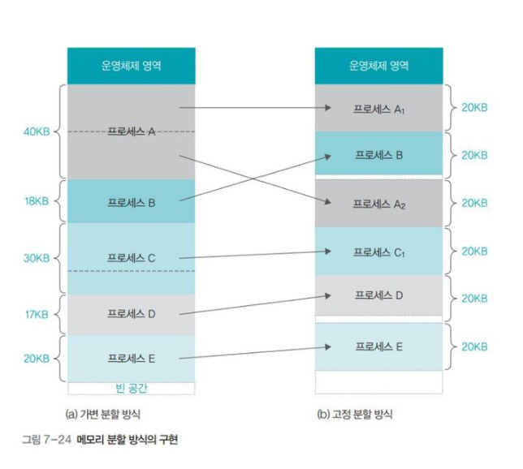

# 메모리 할당

메모리에 프로그램을 할당할 때는 시작 메모리 위치, 할당크기를 기반으로 할당한다.

## 연속할당

연속 할당은 메모리에 `연속적으로` 공간을 할당하는 것이다.

### 고정 분할 방식(fixed partition allocation)
메모리를 미리 나누어 관리하는 방법. 
메모리가 미리 나뉘어 있기 떄문에 융통성이 없으며, 내부 단편화가 발생한다.

### 가변 분할 방식(variable partition allocation)
매 시점 프로그램의 크기에 맞게 동적으로 메모리를 나눠 사용 
내부 단편화는 발생하지 않고 외부 단편화는 발생할 수 있다.

|이름|설명|
|----|----|
|최초적합|위쪽이나 아래쪽에서 시작해서 `홀`을 찾으면 바로 할당|
|최적적합|프로세스의 크기 이상인 공간 중 가장 작은 `홀`부터 할당|
|최악적합|프로세스의 크기와 가장 많이 차이가 나는 `홀`에 할당|

---

> 내부 단편화 : 메모리를 나눈 크기보다 프로그램이 작아서 들어가지 못하는 공간이 많이 발생하는 현상

> 외부 단편화 : 메모리를 나눈 크기보다 프로그램이 커서 들어가지 못하는 공간이 많이 발생하는 현상.  해결방안으로는 메모리를 압축하는 방법이 있다. 여기저기 흩어져 있는 빈 공간들을 하나로 모으는 방식으로 메모리 내에 저장된 프로세스를 적당히 재배치시켜 빈 공간들을 하나의 큰 빈 공간으로 만드는 방법이다.

> 홀 : 할당할 수 있느 비어있는 메모리 공간

---

## 불연속할당

### 페이징
동일한 크기의 페이지 단위로 나누어 메모리르의 서로 다른 위치에 프로세스를 할당한다. 
홀의 크기가 균일하지 않은 문제가 없어지지만 주소 변환이 복잡해짐.

###  세그멘테이션
페이지 단위가 아닌 의미 단위인 세그먼트로 나누는 방식이다. 
프로세스는 코드, 데이터, 스택, 힙등으로 이루어 지는데, 코드와 데이터 등 이를 기반으로 나눌 수 있으며 함수단위로도 나눌 수 있다. 
공유와 보안 측면에서 좋으며 홀 크기가 균일하지 않은 문제가 발생함.

### 페이지드 세그멘테이션
공유나 보안을 의미 단위의 세그먼트로 나누고, 물리적 메모리는 페이지로 나누는 것을 말함.

---

## 페이지 교체 알고리즘

### 오프라인 알고리즘 `(가장 좋은 방법)`

먼 미래에 참조되는 페이지와 현재 할당하는 페이지를 바꾸는 알고리즘이다. 
하지만, 미래에 사용되는 메모리를 알지 못하기 떄문에 다른 알고리즘과의 성능 비교에 대한 기준을 제공한다.

### FIFO(First In Fisrt Out)
가장 먼저 온 페이지를 교체 영역에 가장 먼저 놓는 방법

### LRU(Least Recentle Used)
참조가 가장 오래된 페이지를 바꾼다. 
오래된 것을 파악하기 위해 각 페이지마다 계수기, 스택을 두어야 하는 문제가 있음.

### NUR(Not Used Recently)
LRU에서 발전한 NUR 
일명 `clock 알고리즘`이라고 한다. 
시계 방향으로 돌면서 0을 찾고 0을 찾은 순간 해당 프로세스를 교체하고, 해당 부분을 1로 바꾸는 알고리즘이다.

### LFU(Least Frequently Used)
가장 참조 횟수가 적은 페이지를 교체한다.